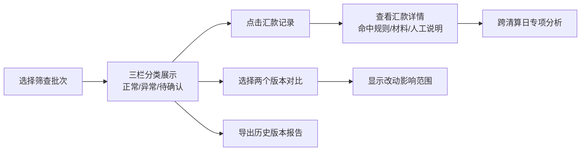

## 1. 产品概述

跨境汇款筛查回放系统，帮助财务复核员高效处理Excel台账筛查结果，清晰呈现正常、异常、待确认三类汇款记录，保留人工说明的原始痕迹，支持退款跨清算日深度分析，并提供版本对比和历史导出功能。

- 核心目标：解决财务复核员在海量Excel台账中查找筛查结果的痛点，提供结构化、可追溯的筛查回放体验
- 目标用户：财务复核员、跨境汇款业务审核人员
- 核心价值：提升复核效率、保留处理痕迹、支持审计追溯

## 2. 核心功能

### 2.1 用户角色
| 角色 | 登录方式 | 核心权限 |
|------|----------|----------|
| 财务复核员 | 系统登录 | 查看筛查结果、标记复核状态、导出历史版本、对比版本差异 |

### 2.2 功能模块
1. **筛查概览页**：三栏式布局展示正常、异常、待确认汇款记录
2. **汇款详情页**：展示完整汇款信息、命中规则、支撑材料、人工说明
3. **版本对比页**：对比两次筛查结果的差异，显示改动影响范围
4. **历史版本管理**：查看历史筛查记录，导出报告供转发

### 2.3 页面详情
| 页面名称 | 模块名称 | 功能描述 |
|---------|---------|----------|
| 筛查概览页 | 三栏分类面板 | 正常/异常/待确认三类结果分栏展示，支持搜索筛选 |
| 筛查概览页 | 统计卡片 | 显示各类别数量、总金额、筛查时间等关键指标 |
| 汇款详情页 | 基础信息区 | 展示汇款主体、金额、币种、日期等核心信息 |
| 汇款详情页 | 命中规则区 | 展示触发的筛查规则、命中材料、规则说明 |
| 汇款详情页 | 人工说明区 | 展示所有人工备注，保留矛盾说明不替用户决策 |
| 汇款详情页 | 跨清算日分析 | 针对退款跨清算日场景，展示详细的日期链路分析 |
| 版本对比页 | 差异概览 | 显示两个版本的新增、修改、删除记录统计 |
| 版本对比页 | 改动详情 | 逐条展示受影响的汇款记录及具体变更字段 |
| 历史版本页 | 版本列表 | 展示所有历史筛查版本，支持筛选和导出 |
| 历史版本页 | 导出功能 | 导出包含异常说明的报告文件，可直接转发 |

## 3. 核心流程

用户上传或选择筛查批次 → 系统展示三栏分类结果 → 用户点击查看详情 → 浏览命中规则和人工说明 → 可进行版本对比查看改动影响 → 导出历史版本供转发

## 4. 用户界面设计

### 4.1 设计风格
- 主色调：深蓝色系（#1e3a5f），体现金融专业感
- 辅助色：绿色（#10b981）表示正常，红色（#ef4444）表示异常，琥珀色（#f59e0b）表示待确认
- 字体：系统无衬线字体，标题使用中等字重，数据使用等宽字体
- 布局：卡片式布局，清晰的分区边界，充足的留白
- 图标：线性风格图标，保持简洁专业

### 4.2 页面设计概述
| 页面名称 | 模块名称 | UI 元素 |
|---------|---------|---------|
| 筛查概览页 | 顶部导航栏 | Logo、批次选择器、版本对比入口、历史版本入口 |
| 筛查概览页 | 统计卡片栏 | 四个统计卡片：总笔数、正常、异常、待确认，带动画过渡 |
| 筛查概览页 | 三栏主内容区 | 等高滚动列，每列有标题栏和记录卡片列表，悬停高亮 |
| 汇款详情页 | 侧边信息栏 | 汇款基本信息快照，固定在左侧 |
| 汇款详情页 | 主内容区 | 标签页切换：规则命中、人工说明、跨清算日分析 |
| 汇款详情页 | 底部操作栏 | 标记状态、返回列表、导出详情 |
| 版本对比页 | 版本选择器 | 两个下拉框选择对比版本，时间轴展示 |
| 版本对比页 | 差异列表 | 改动记录用颜色区分新增/修改/删除 |
| 历史版本页 | 版本卡片 | 每个版本独立卡片，显示时间、统计、操作按钮 |

### 4.3 响应式
- 桌面端优先设计，三栏布局在宽屏下并排展示
- 平板端转为两栏布局，待确认与异常合并
- 移动端转为单栏滚动，通过标签切换类别

### 4.4 动效设计
- 页面加载：统计数字从0滚动到目标值
- 卡片悬停：轻微上浮+阴影加深
- 标签切换：内容区淡入淡出过渡
- 状态标记：勾选动画反馈
