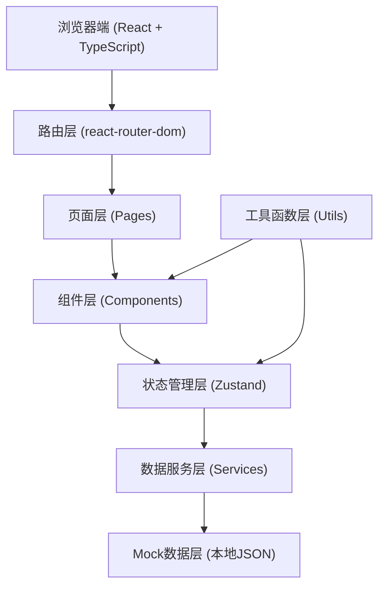

## 1. 架构设计



## 2. 技术选型说明

- 前端框架：React@18 + TypeScript
- 构建工具：Vite
- 样式方案：TailwindCSS@3
- 路由管理：react-router-dom@6
- 状态管理：zustand
- 图标库：lucide-react
- 数据处理：纯前端Mock数据，模拟Excel台账导入后的结构化数据

## 3. 路由定义

| 路由路径 | 页面名称 | 功能说明 |
|---------|---------|---------|
| / | 筛查概览页 | 三栏式展示正常/异常/待确认汇款记录 |
| /remittance/:id | 汇款详情页 | 展示单条汇款的完整信息、命中规则、人工说明 |
| /compare | 版本对比页 | 对比两个筛查版本的差异 |
| /history | 历史版本页 | 查看所有历史版本并支持导出 |

## 4. 数据模型定义

### 4.1 核心类型定义

```typescript
// 汇款状态枚举
enum RemittanceStatus {
  NORMAL = 'normal',
  ABNORMAL = 'abnormal',
  PENDING = 'pending'
}

// 筛查规则命中
interface RuleHit {
  id: string;
  ruleName: string;
  ruleDescription: string;
  matchedMaterials: string[];
  confidence: number;
  isCrossSettlement: boolean;
}

// 人工说明
interface ManualNote {
  id: string;
  author: string;
  timestamp: string;
  content: string;
  source: string;
}

// 跨清算日分析
interface CrossSettlementAnalysis {
  originalDate: string;
  refundDate: string;
  settlementDates: string[];
  daysAcross: number;
  evidenceChain: {
    type: string;
    description: string;
    reference: string;
  }[];
}

// 汇款记录
interface Remittance {
  id: string;
  transactionId: string;
  payer: string;
  payee: string;
  amount: number;
  currency: string;
  transactionDate: string;
  status: RemittanceStatus;
  ruleHits: RuleHit[];
  manualNotes: ManualNote[];
  crossSettlementAnalysis?: CrossSettlementAnalysis;
  createdAt: string;
  updatedAt: string;
}

// 筛查版本
interface ScreeningVersion {
  id: string;
  name: string;
  timestamp: string;
  totalCount: number;
  normalCount: number;
  abnormalCount: number;
  pendingCount: number;
  remittances: Remittance[];
}
```

## 5. 目录结构

```
src/
├── components/          # 公共组件
│   ├── layout/         # 布局组件
│   ├── cards/          # 卡片组件
│   ├── status/         # 状态标签组件
│   └── common/         # 通用组件
├── pages/              # 页面组件
│   ├── Overview.tsx    # 筛查概览页
│   ├── RemittanceDetail.tsx
│   ├── VersionCompare.tsx
│   └── History.tsx
├── store/              # Zustand状态管理
│   └── useScreeningStore.ts
├── types/              # TypeScript类型定义
│   └── index.ts
├── utils/              # 工具函数
│   ├── compare.ts      # 版本对比算法
│   ├── export.ts       # 导出功能
│   └── format.ts       # 格式化工具
├── data/               # Mock数据
│   └── mockData.ts
└── App.tsx             # 主应用入口
```

## 6. 核心功能实现思路

### 6.1 三栏分类展示
- 使用CSS Grid实现等高三栏布局
- 每栏独立滚动，支持虚拟滚动优化性能
- 根据status字段过滤分类渲染

### 6.2 跨清算日分析
- 不依赖单一关键词判断
- 展示完整证据链：原始交易日期、退款日期、清算日历、间隔天数
- 列出所有命中的支撑材料和规则依据

### 6.3 版本对比算法
- 基于transactionId作为主键匹配
- 深度对比字段差异，生成diff结果
- 分类统计：新增、删除、状态变更、字段修改

### 6.4 人工说明保留
- 按时间倒序展示所有人工说明
- 不做合并或消歧，完整保留原始内容
- 标记来源字段，明确说明来自哪份Excel台账

### 6.5 导出功能
- 生成结构化JSON或格式化文本
- 异常说明单独整理，可直接复制转发
- 包含版本时间戳和完整统计信息
