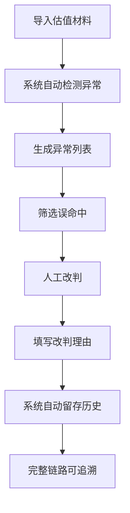

## 1. 产品概述

场外期权敞口穿透预警系统，面向清算专员，解决估值版本记录追踪链路断裂、异常处理无闭环、人工改判无追溯的核心痛点。系统实现工作流全闭环：材料导入→异常检测→人工改判→历史追溯，确保每一条记录从进入到最终结论可完整追踪。

## 2. 核心功能

### 2.1 用户角色
| 角色 | 注册方式 | 核心权限 |
|------|----------|----------|
| 清算专员 | 系统账号登录 | 导入材料、查看异常列表、人工改判、查看历史追溯、导出结果 |

### 2.2 功能模块
1. **工作台首页**：异常概览图表、今日待处理、快速导入入口
2. **材料导入页**：估值文件上传、解析预览、导入确认
3. **异常列表页**：多维度筛选、名单误命中过滤、批量处理、人工改判
4. **记录详情页**：估值版本链路追踪、临时说明聚合、历史改判回溯
5. **说明文档页**：启动指南、导入样例、人工改判操作步骤

### 2.3 页面详情
| 页面名称 | 模块名称 | 功能描述 |
|----------|----------|----------|
| 工作台首页 | 异常概览图表 | 饼图/柱状图展示异常分布，支持点击钻取到对应异常明细 |
| 工作台首页 | 待处理卡片 | 显示待处理、已处理、误命中数量统计 |
| 材料导入页 | 文件上传 | 支持拖拽上传 Excel/CSV，解析预览前20行数据 |
| 材料导入页 | 样例下载 | 提供标准导入模板下载 |
| 异常列表页 | 筛选器 | 按异常类型、估值版本、交易对手、日期范围筛选 |
| 异常列表页 | 误命中过滤 | 一键筛选/排除名单误命中标注的记录 |
| 异常列表页 | 人工改判 | 修改异常状态、填写改判理由、旧理由自动留存 |
| 记录详情页 | 版本链路 | 时间线展示估值版本演进，附带各版本说明 |
| 记录详情页 | 改判历史 | 展示所有人工改判记录，含操作人、时间、新旧理由 |
| 说明文档页 | 操作指南 | 启动步骤、导入样例说明、人工改判覆盖旧理由的操作说明 |

## 3. 核心流程

### 3.1 异常处理主流程
清算专员导入估值材料→系统自动检测异常→生成异常列表→专员筛选处理（排除误命中）→人工改判填写理由→系统自动留存历史→可随时追溯完整链路

### 3.2 版本追踪流程
同一交易记录的多个估值版本→各版本附带临时说明→聚合展示完整时间线→最终状态与所有历史说明关联

## 4. 用户界面设计

### 4.1 设计风格
- **主色调**：深蓝色系（#1e3a5f），体现金融专业稳重感
- **辅助色**：警示红（#dc2626）用于异常标记，确认绿（#16a34a）用于正常状态，警告橙（#f59e0b）用于待处理
- **按钮风格**：直角轻微圆角（2px），实心按钮为主，次要操作使用描边按钮
- **字体**：系统默认无衬线字体，数字使用等宽字体便于对齐比较
- **布局风格**：顶部导航+左侧筛选+右侧内容区的经典企业后台布局，高密度信息展示
- **图标风格**：线性简约图标，避免花哨装饰

### 4.2 页面设计概览
| 页面名称 | 模块名称 | UI元素 |
|----------|----------|--------|
| 工作台首页 | 异常概览图表 | 深色卡片背景，图表使用渐变色柱，hover高亮交互 |
| 异常列表页 | 数据表格 | 斑马纹行，异常行红色背景高亮，列宽可调整 |
| 记录详情页 | 版本时间线 | 垂直时间线，连接线使用虚线，当前版本高亮显示 |
| 记录详情页 | 改判历史 | 折叠面板，旧理由灰色斜体显示，新理由加粗 |

### 4.3 响应式
- 桌面端优先设计，最小支持宽度1280px
- 表格区域支持横向滚动
- 筛选区在小屏幕下可折叠

## 5. 非功能需求
- 数据导入支持10000行以内文件秒级解析
- 列表分页每页50条，支持快速搜索
- 所有操作留痕，改判历史不可删除
- 支持导出异常列表为Excel
