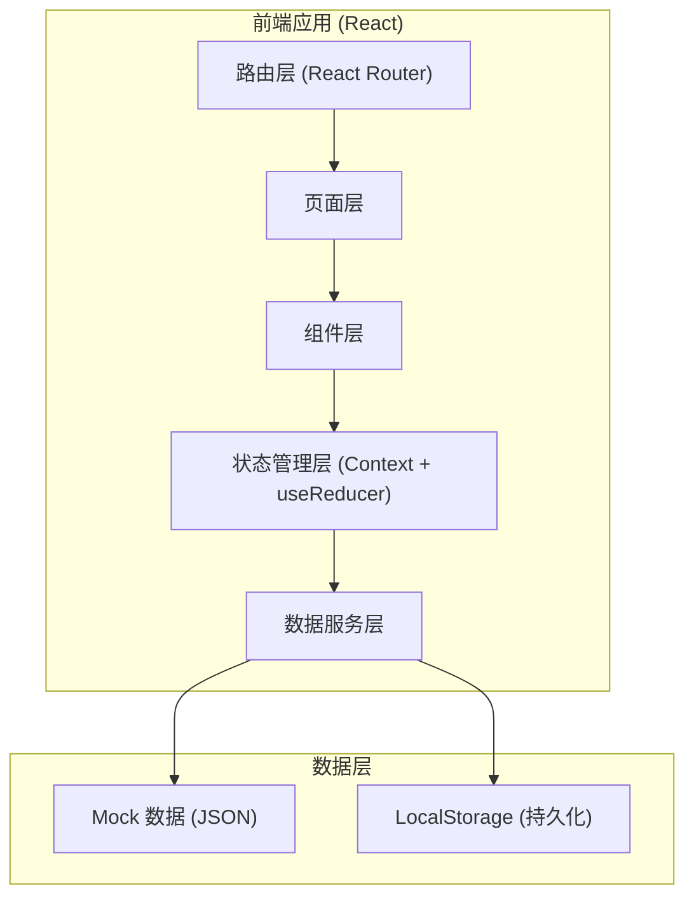
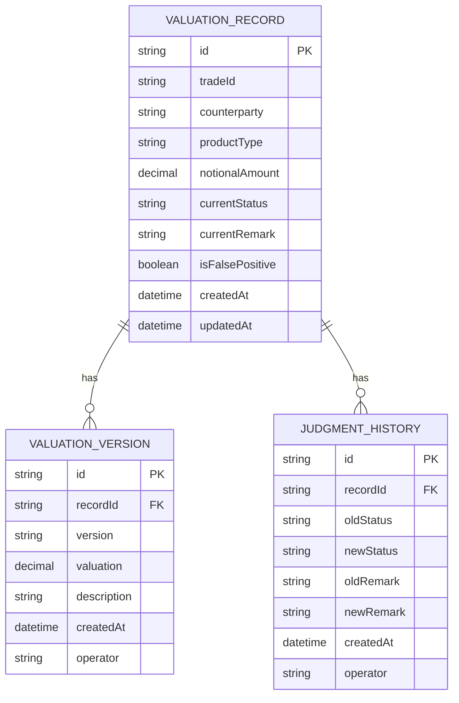

## 1. 架构设计



## 2. 技术描述

- **前端框架**：React@18 + TypeScript
- **构建工具**：Vite@5
- **样式方案**：TailwindCSS@3
- **路由管理**：React Router@6
- **图表库**：Recharts（React 图表库，轻量且交互友好）
- **UI 组件**：自定义组件 + TailwindCSS 工具类
- **数据持久化**：LocalStorage（存储改判历史和用户操作记录）
- **文件解析**：SheetJS (xlsx) 用于 Excel/CSV 解析
- **后端**：无（纯前端应用，使用 Mock 数据 + LocalStorage）

## 3. 路由定义

| 路由路径 | 页面名称 | 用途 |
|----------|----------|------|
| /dashboard | 工作台首页 | 异常概览、统计卡片、快速入口 |
| /import | 材料导入页 | 文件上传、解析预览、模板下载 |
| /exceptions | 异常列表页 | 异常列表、筛选、人工改判 |
| /record/:id | 记录详情页 | 版本链路、改判历史、完整信息 |
| /docs | 说明文档页 | 操作指南、步骤说明 |
| / | 重定向 | 重定向到 /dashboard |

## 4. 数据模型

### 4.1 数据模型 ER 图



### 4.2 核心类型定义

```typescript
// 估值记录主表
interface ValuationRecord {
  id: string;
  tradeId: string;
  counterparty: string;
  productType: string;
  notionalAmount: number;
  currentStatus: 'pending' | 'normal' | 'abnormal' | 'false_positive';
  currentRemark: string;
  isFalsePositive: boolean;
  createdAt: string;
  updatedAt: string;
  versions: ValuationVersion[];
  judgments: JudgmentHistory[];
}

// 估值版本记录
interface ValuationVersion {
  id: string;
  recordId: string;
  version: string;
  valuation: number;
  description: string;
  createdAt: string;
  operator: string;
}

// 人工改判历史
interface JudgmentHistory {
  id: string;
  recordId: string;
  oldStatus: string;
  newStatus: string;
  oldRemark: string;
  newRemark: string;
  createdAt: string;
  operator: string;
}

// 筛选条件
interface FilterParams {
  status?: string;
  counterparty?: string;
  productType?: string;
  dateRange?: [string, string];
  excludeFalsePositive?: boolean;
  keyword?: string;
}
```

## 5. 目录结构

```
src/
├── pages/
│   ├── Dashboard.tsx        # 工作台首页
│   ├── ImportPage.tsx       # 材料导入页
│   ├── ExceptionList.tsx    # 异常列表页
│   ├── RecordDetail.tsx     # 记录详情页
│   └── DocsPage.tsx         # 说明文档页
├── components/
│   ├── layout/
│   │   ├── Header.tsx
│   │   ├── Sidebar.tsx
│   │   └── Layout.tsx
│   ├── charts/
│   │   └── ExceptionChart.tsx
│   ├── table/
│   │   ├── DataTable.tsx
│   │   └── FilterBar.tsx
│   ├── timeline/
│   │   └── VersionTimeline.tsx
│   └── common/
│       ├── StatusBadge.tsx
│       └── Modal.tsx
├── context/
│   └── RecordContext.tsx    # 全局状态管理
├── data/
│   └── mockData.ts          # Mock 数据
├── types/
│   └── index.ts             # TypeScript 类型定义
├── utils/
│   ├── storage.ts           # LocalStorage 工具
│   └── fileParser.ts        # 文件解析工具
├── App.tsx
├── main.tsx
└── index.css
```

## 6. 关键实现要点

1. **工作流闭环**：导入数据 → 自动标记异常 → 人工改判 → 历史留痕 → 完整追溯
2. **版本链路追踪**：同一交易记录的多个估值版本按时间线展示，附带各版本临时说明
3. **误命中筛选**：isFalsePositive 标记，筛选器支持一键排除/仅查看误命中记录
4. **图表钻取**：点击图表区域携带筛选参数跳转到列表页，定位到对应记录
5. **改判历史留存**：每次改判自动保存旧状态和旧理由，不可删除，仅可追加
6. **本地持久化**：改判记录使用 LocalStorage 保存，刷新页面不丢失
