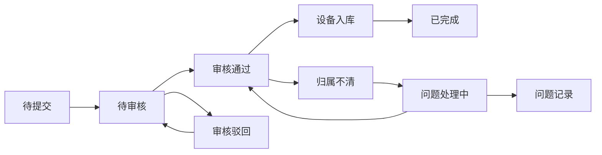

# 博物馆讲解组讲解器归还系统 PRD

## 1. 产品概述
博物馆讲解组讲解器归还管理系统，解决讲解器归还流程不统一、团队拆分后设备归属不清、设备清单一致性校验等问题。系统提供完整的状态流转机制、操作日志追踪和数据导出功能，确保归还流程标准化和可追溯。

- 核心目标：统一讲解器归还口径，明确状态流转，识别团队拆分后设备归属问题
- 目标用户：博物馆讲解员、设备管理员、运营管理人员

## 2. 核心功能

### 2.1 用户角色
| 角色 | 注册方式 | 核心权限 |
|------|----------|----------|
| 讲解员 | 系统分配 | 提交归还申请、查看个人设备 |
| 设备管理员 | 系统分配 | 审核归还、设备校验、数据导出 |
| 运营管理人员 | 系统分配 | 全功能访问、统计报表 |

### 2.2 功能模块
1. **归还管理首页**：归还记录列表、状态统计、快速操作
2. **归还申请页**：新建归还申请、设备清单录入、团队信息填写
3. **归还审核页**：状态流转操作、设备归属校验、问题处理
4. **数据导出页**：表格/JSON导出、字段筛选、导出历史

### 2.3 页面详情
| 页面名称 | 模块名称 | 功能描述 |
|-----------|-------------|---------------------|
| 归还管理首页 | 状态统计卡片 | 显示待审核、已通过、有问题、已完成数量统计 |
| 归还管理首页 | 归还记录列表 | 展示所有归还记录，支持搜索和筛选 |
| 归还申请页 | 基本信息表单 | 讲解组名称、负责人、联系电话、归还日期 |
| 归还申请页 | 设备清单表格 | 设备编号、设备类型、电量状态、借出日期、备注 |
| 归还审核页 | 状态流转面板 | 显示当前状态、允许操作、拒绝原因填写 |
| 归还审核页 | 一致性校验 | 自动检测设备归属冲突、清单数量不一致 |
| 数据导出页 | 导出配置 | 选择导出格式、字段映射、时间范围 |

## 3. 核心流程

### 讲解器归还状态流转

### 主要用户流程
1. 讲解员填写归还申请，录入讲解组信息和设备清单
2. 系统自动校验设备数量一致性和归属冲突
3. 设备管理员审核，可通过、驳回或标记归属问题
4. 归属不清时进入问题处理流程，指定归属团队
5. 设备入库后流程完成，所有操作留痕记录

## 4. 用户界面设计

### 4.1 设计风格
- 主色调：博物馆专业蓝色系 (#1e3a8a)，体现专业和信任感
- 辅助色：状态标识色（成功绿、警告橙、错误红、信息蓝）
- 按钮风格：圆角8px，hover状态有微妙阴影和颜色变化
- 字体：Inter 字体族，清晰易读的层级结构
- 布局风格：卡片式布局，顶部导航+侧边栏+主内容区
- 图标风格：Lucide 线性图标，简洁现代

### 4.2 页面设计概述
| 页面名称 | 模块名称 | UI 元素 |
|-----------|-------------|-------------|
| 归还管理首页 | 状态统计 | 渐变卡片、数字动画、图标点缀 |
| 归还管理首页 | 记录列表 | 表格展示、状态标签、操作按钮 |
| 归还申请页 | 表单设计 | 分组布局、必填标记、实时验证 |
| 归还审核页 | 状态面板 | 时间线展示、状态徽章、操作区 |
| 数据导出页 | 导出配置 | 复选框组、预览表格、导出按钮 |

### 4.3 响应式
- 桌面端优先设计（1200px+）
- 平板端（768px-1199px）侧边栏收起为图标
- 移动端（<768px）单列布局，表格横向滚动
- 触摸交互优化，按钮最小尺寸48px

## 5. 业务字段定义

### 归还申请核心字段
- 归还单号：自动生成，如 GH20240501001
- 讲解组名称：如"青铜器展厅讲解一组"
- 负责人姓名：讲解员真实姓名
- 联系电话：负责人手机号
- 归还日期：YYYY-MM-DD
- 提交来源：Web端/小程序/后台录入
- 提交时间：精确到秒
- 操作者：当前登录用户名

### 设备清单字段
- 设备编号：如 DJQ-001-A
- 设备类型：成人讲解器/儿童讲解器/团体讲解器
- 电量状态：充足(>80%)/一般(50-80%)/偏低(<50%)/需充电
- 借出日期：YYYY-MM-DD
- 借出团队：借出时所属讲解组
- 设备状态：正常/损坏/丢失
- 备注：设备问题描述

### 校验规则
- 团队拆分校验：检测设备借出团队与归还团队不一致
- 数量一致性：申请数量与实际清单数量比对
- 设备重复：同一设备号不能同时在多个归还单中
