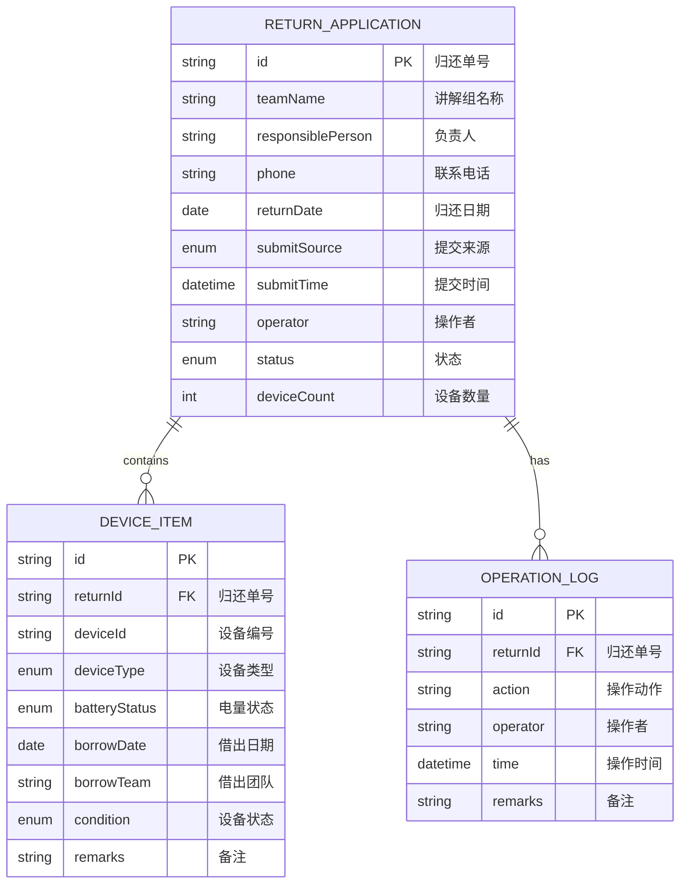

# 博物馆讲解组讲解器归还系统 技术架构

## 1. 架构设计

```mermaid
graph TB
    subgraph "前端层"
        A["React 18 + TypeScript
        B["React Router 路由管理
        C["Zustand 状态管理
        D["Tailwind CSS 样式
    end

    subgraph "后端层"
        E["Express.js API 服务
        F["状态流转引擎
        G["业务校验规则
        H["数据导出服务
    end

    subgraph "数据层"
        I["内存数据存储
        J["Mock 样例数据
    end

    A --> E
    E --> F
    E --> G
    E --> H
    E --> I
    I --> J
```

## 2. 技术描述

- **前端技术栈**：React@18 + TypeScript + Vite + TailwindCSS
- **状态管理**：Zustand
- **路由管理**：react-router-dom@6
- **后端技术**：Express.js@4 + TypeScript
- **数据存储**：内存数据库（开发环境使用内存存储，预置样例数据
- **图标库**：lucide-react
- **初始化工具**：vite-init

## 3. 路由定义

| 路由 | 页面 | 目的 |
|-------|---------|
| / | 归还管理首页 | 展示统计数据和归还记录列表 |
| /apply | 归还申请页 | 新建归还申请，录入设备清单 |
| /review/:id | 归还审核页 | 审核归还单，处理状态流转 |
| /export | 数据导出页 | 配置导出参数，下载数据 |

## 4. API 定义

### 类型定义

```typescript
// 归还状态枚举
enum ReturnStatus {
  DRAFT = 'draft',           // 待提交
  PENDING = 'pending',         // 待审核
  APPROVED = 'approved',     // 审核通过
  REJECTED = 'rejected',     // 审核驳回
  OWNERSHIP_ISSUE = 'ownership_issue', // 归属不清
  PROCESSING = 'processing', // 问题处理中
  STORED = 'stored',       // 设备入库
  COMPLETED = 'completed',   // 已完成
  ISSUE_RECORDED = 'issue_recorded' // 问题记录
}

// 设备类型
type DeviceType = 'adult' | 'child' | 'group';

// 电量状态
type BatteryStatus = 'full' | 'normal' | 'low' | 'charge';

// 设备状态
type DeviceCondition = 'normal' | 'damaged' | 'lost';

// 提交来源
type SubmitSource = 'web' | 'miniapp' | 'backend';

// 设备清单项
interface DeviceItem {
  deviceId: string;           // 设备编号
  deviceType: DeviceType;     // 设备类型
  batteryStatus: BatteryStatus; // 电量状态
  borrowDate: string;       // 借出日期
  borrowTeam: string;       // 借出团队
  condition: DeviceCondition; // 设备状态
  remarks: string;         // 备注
}

// 归还申请
interface ReturnApplication {
  id: string;              // 归还单号
  teamName: string;       // 讲解组名称
  responsiblePerson: string; // 负责人姓名
  phone: string;        // 联系电话
  returnDate: string;     // 归还日期
  submitSource: SubmitSource; // 提交来源
  submitTime: string;   // 提交时间
  operator: string;     // 操作者
  status: ReturnStatus;  // 当前状态
  deviceCount: number;    // 设备数量
  devices: DeviceItem[]; // 设备清单
  operationLogs: OperationLog[]; // 操作日志
  validationIssues: ValidationIssue[]; // 校验问题
}

// 操作日志
interface OperationLog {
  id: string;
  action: string;
  operator: string;
  time: string;
  remarks: string;
}

// 校验问题
interface ValidationIssue {
  type: 'ownership' | 'count_mismatch' | 'duplicate' | 'other';
  severity: 'warning' | 'error';
  message: string;
  deviceId?: string;
}

// 状态流转操作
interface StatusTransition {
  from: ReturnStatus;
  to: ReturnStatus;
  action: string;
  allowed: boolean;
  requiresReason: boolean;
}
```

### API 端点

```typescript
// 获取归还列表
GET /api/returns?status=&page=&pageSize=
Response: { data: ReturnApplication[], total: number }

// 获取单条归还记录
GET /api/returns/:id
Response: ReturnApplication

// 创建归还申请
POST /api/returns
Request: Omit<ReturnApplication, 'id' | 'submitTime' | 'operationLogs' | 'validationIssues'>
Response: ReturnApplication

// 更新归还状态
PUT /api/returns/:id/status
Request: { status: ReturnStatus, reason?: string }
Response: ReturnApplication

// 校验归还申请
POST /api/returns/:id/validate
Response: { valid: boolean, issues: ValidationIssue[] }

// 获取状态流转规则
GET /api/status-transitions
Response: StatusTransition[]

// 导出数据
POST /api/export
Request: { format: 'json' | 'excel', fields: string[], filters: any }
Response: 导出文件
```

## 5. 服务端架构

```mermaid
graph LR
    A[API 路由层 --> B[Controller 控制层
    B --> C[Service 服务层
    C --> D[Repository 数据层
    C --> E[状态流转引擎
    C --> F[业务校验引擎
    D --> G[内存数据库
```

## 6. 数据模型

### 6.1 数据模型 ER 图



### 6.2 初始样例数据

系统预置 10+ 条真实场景的样例数据，涵盖：
- 正常归还流程
- 团队拆分后归属不清
- 设备清单数量不一致
- 设备损坏/丢失情况
- 各状态节点的归还记录
