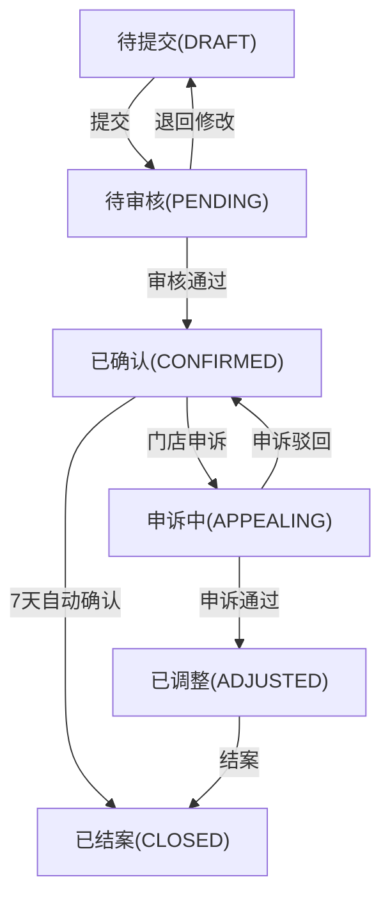

## 1. 产品概述

茶饮加盟巡店扣分系统是一套面向茶饮品牌加盟巡店团队的管理工具，解决巡店过程中扣分记录的闭环管理。系统实现完整的状态流转、照片复用检测、扣分一致性校验，以及统一口径的报表导出。

- **核心目标**：实现巡店扣分从提交、审核、申诉到结案的完整闭环
- **解决问题**：照片跨门店复用、扣分汇总不一致、状态流转不清晰
- **目标用户**：巡店督导、门店店长、区域经理、运营管理员

## 2. 核心功能

### 2.1 用户角色

| 角色 | 登录方式 | 核心权限 |
|------|----------|----------|
| 巡店督导 | 账号密码 | 提交扣分记录、上传照片、编辑待审核记录 |
| 门店店长 | 账号密码 | 查看扣分、提交申诉、确认整改 |
| 区域经理 | 账号密码 | 审核扣分、处理申诉、查看区域汇总 |
| 运营管理员 | 账号密码 | 系统配置、数据导出、全量数据查看 |

### 2.2 功能模块

1. **扣分记录列表**：分页查询、状态筛选、门店维度统计
2. **扣分详情页**：完整信息展示、状态流转历史、操作按钮
3. **扣分提交页**：表单填写、照片上传、实时预览
4. **申诉处理页**：申诉内容、审核意见、状态变更
5. **数据报表页**：扣分汇总、趋势分析、门店排名、数据导出

### 2.3 页面详情

| 页面名称 | 模块名称 | 功能描述 |
|-----------|-------------|---------------------|
| 扣分记录列表 | 顶部筛选 | 按状态、门店、时间、督导筛选 |
| 扣分记录列表 | 数据表格 | 展示扣分编号、门店、扣分项、总分、状态、操作 |
| 扣分记录列表 | 统计卡片 | 待审核、申诉中、已确认、已结案数量 |
| 扣分详情页 | 基本信息 | 门店信息、巡店时间、督导信息、提交来源 |
| 扣分详情页 | 扣分明细 | 扣分项列表、每项分数、照片、扣分标准 |
| 扣分详情页 | 状态流转 | 历史操作记录、时间、操作者、备注 |
| 扣分详情页 | 操作区 | 根据状态显示可执行操作按钮 |
| 扣分提交页 | 表单区域 | 门店选择、巡店日期、扣分项选择、分数填写 |
| 扣分提交页 | 照片上传 | 多图上传、预览、删除、照片复用检测 |
| 数据报表页 | 汇总统计 | 时间段内扣分趋势、门店排名、扣分项分布 |
| 数据报表页 | 数据导出 | Excel导出、统一计算口径 |

## 3. 核心流程

### 3.1 状态流转闭环

### 3.2 状态流转规则

| 当前状态 | 允许操作 | 目标状态 | 操作角色 |
|----------|----------|----------|----------|
| DRAFT | 提交 | PENDING | 巡店督导 |
| DRAFT | 编辑 | DRAFT | 巡店督导 |
| DRAFT | 删除 | - | 巡店督导 |
| PENDING | 审核通过 | CONFIRMED | 区域经理 |
| PENDING | 退回修改 | DRAFT | 区域经理 |
| CONFIRMED | 提交申诉 | APPEALING | 门店店长 |
| CONFIRMED | 自动结案 | CLOSED | 系统 |
| APPEALING | 申诉通过 | ADJUSTED | 区域经理 |
| APPEALING | 申诉驳回 | CONFIRMED | 区域经理 |
| ADJUSTED | 结案 | CLOSED | 区域经理 |
| CLOSED | 查看详情 | - | 所有角色 |

## 4. 用户界面设计

### 4.1 设计风格

- **主色调**：深绿色 (#0F766E) - 代表茶的自然、专业感
- **辅助色**：琥珀色 (#D97706) - 用于警示、强调
- **中性色**：锌灰色系 - 保持简洁专业
- **按钮风格**：圆角8px，悬停有阴影和颜色变化
- **字体**：Noto Sans SC - 适合中文阅读
- **布局风格**：卡片式布局，左侧导航，顶部面包屑
- **图标风格**：Lucide 线性图标，简洁现代

### 4.2 页面设计概述

| 页面名称 | 模块名称 | UI 元素 |
|-----------|-------------|-------------|
| 扣分记录列表 | 统计卡片 | 渐变背景、数字加粗、状态颜色标识 |
| 扣分记录列表 | 数据表格 | 斑马纹、状态标签色、hover行高亮 |
| 扣分详情页 | 时间线 | 状态流转时间线，带图标和颜色 |
| 扣分详情页 | 照片展示 | 网格布局，点击放大，复用警示标签 |
| 扣分提交页 | 表单项 | 分组折叠、实时校验、分数计算器 |
| 数据报表页 | 图表 | ECharts 柱状图、折线图、饼图 |

### 4.3 响应式设计

- 桌面端优先，左侧固定导航，内容区自适应
- 平板端导航折叠为侧边栏按钮
- 移动端顶部导航，内容单列布局
- 表格在小屏幕转为卡片式展示

## 5. 特殊业务规则

### 5.1 照片复用检测

- 系统对所有上传的照片计算MD5哈希值
- 提交时检测同一照片是否在其他门店使用过
- 检测到复用时显示警示："该照片已于2024-01-15在【XX门店】使用，请确认"
- 保留提交来源（APP/PC）、时间、操作者信息

### 5.2 扣分汇总一致性

- 扣分项分数与总分实时联动计算
- 保存时进行二次校验，确保总分 = 各扣分项之和
- 历史修改记录保留每次变更的分数快照
- 报表、详情、列表使用同一套计算口径

### 5.3 真实业务字段

扣分项示例（非通用字段）：
- 茶具消毒不规范：-5分
- 物料保质期检查缺失：-10分
- 员工仪容仪表不符合标准：-3分
- 操作台卫生不达标：-8分
- 茶饮制作流程错误：-15分
