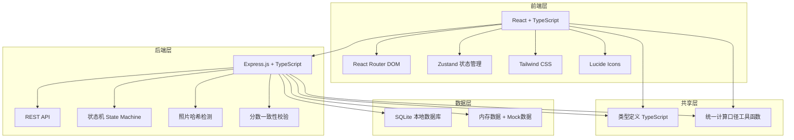
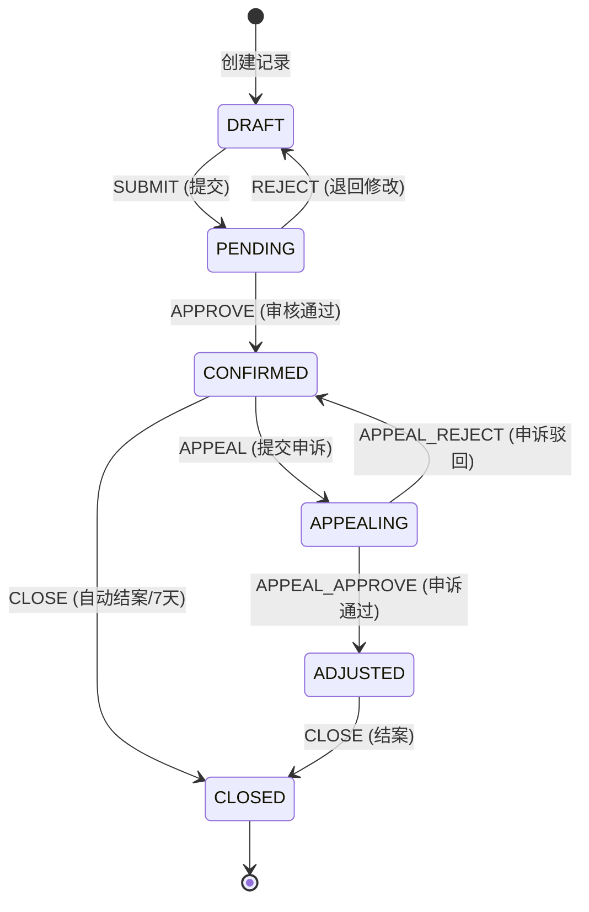

## 1. 架构设计



## 2. 技术选型

- **前端**: React@18 + TypeScript + Vite
- **后端**: Express@4 + TypeScript
- **数据库**: SQLite (本地文件数据库，无需额外安装)
- **样式**: Tailwind CSS@3
- **状态管理**: Zustand
- **路由**: React Router DOM@6
- **图标**: Lucide React
- **图表**: ECharts + echarts-for-react
- **Excel导出**: xlsx
- **HTTP客户端**: fetch API

## 3. 路由定义

### 3.1 前端路由

| 路由路径 | 页面名称 | 说明 |
|----------|----------|------|
| / | 扣分记录列表 | 首页，展示所有扣分记录 |
| /record/:id | 扣分详情页 | 查看单条记录详情及操作 |
| /create | 扣分提交页 | 新建扣分记录 |
| /edit/:id | 扣分编辑页 | 编辑待提交状态的记录 |
| /reports | 数据报表页 | 统计分析和数据导出 |

### 3.2 后端API路由

| 方法 | 路由 | 用途 |
|------|------|------|
| GET | /api/records | 获取扣分记录列表 |
| GET | /api/records/:id | 获取单条记录详情 |
| POST | /api/records | 创建扣分记录 |
| PUT | /api/records/:id | 更新扣分记录 |
| POST | /api/records/:id/actions | 执行状态流转操作 |
| GET | /api/records/:id/history | 获取状态流转历史 |
| POST | /api/photos/check | 照片复用检测 |
| GET | /api/stores | 获取门店列表 |
| GET | /api/deduction-items | 获取扣分项列表 |
| GET | /api/reports/summary | 获取汇总统计数据 |
| GET | /api/reports/export | 导出Excel报表 |

## 4. API数据模型

### 4.1 核心类型定义

```typescript
// 扣分状态枚举
export enum DeductionStatus {
  DRAFT = 'DRAFT',
  PENDING = 'PENDING',
  CONFIRMED = 'CONFIRMED',
  APPEALING = 'APPEALING',
  ADJUSTED = 'ADJUSTED',
  CLOSED = 'CLOSED',
}

// 状态标签配置
export const STATUS_LABELS: Record<DeductionStatus, string> = {
  [DeductionStatus.DRAFT]: '待提交',
  [DeductionStatus.PENDING]: '待审核',
  [DeductionStatus.CONFIRMED]: '已确认',
  [DeductionStatus.APPEALING]: '申诉中',
  [DeductionStatus.ADJUSTED]: '已调整',
  [DeductionStatus.CLOSED]: '已结案',
};

// 操作动作枚举
export enum DeductionAction {
  SUBMIT = 'SUBMIT',
  APPROVE = 'APPROVE',
  REJECT = 'REJECT',
  APPEAL = 'APPEAL',
  APPEAL_APPROVE = 'APPEAL_APPROVE',
  APPEAL_REJECT = 'APPEAL_REJECT',
  CLOSE = 'CLOSE',
}

// 门店信息
export interface Store {
  id: string;
  name: string;
  address: string;
  region: string;
  managerName: string;
  managerPhone: string;
}

// 扣分项
export interface DeductionItem {
  id: string;
  name: string;
  category: string;
  maxScore: number;
  description: string;
}

// 扣分照片
export interface DeductionPhoto {
  id: string;
  url: string;
  hash: string;
  fileName: string;
  uploadedAt: string;
  uploadSource: 'APP' | 'PC';
  reusedWarning?: {
    storeName: string;
    usedAt: string;
  };
}

// 扣分明细
export interface DeductionDetail {
  id: string;
  itemId: string;
  itemName: string;
  score: number;
  photos: DeductionPhoto[];
  remark: string;
}

// 状态流转历史
export interface StatusHistory {
  id: string;
  recordId: string;
  fromStatus: DeductionStatus | null;
  toStatus: DeductionStatus;
  action: DeductionAction;
  operatorId: string;
  operatorName: string;
  operatorRole: string;
  remark: string;
  createdAt: string;
  scoreSnapshot?: number;
}

// 扣分记录
export interface DeductionRecord {
  id: string;
  recordNo: string;
  storeId: string;
  storeName: string;
  inspectorId: string;
  inspectorName: string;
  inspectionDate: string;
  submissionSource: 'APP' | 'PC';
  status: DeductionStatus;
  details: DeductionDetail[];
  totalScore: number;
  appealContent?: string;
  appealAt?: string;
  adjustedScore?: number;
  adjustRemark?: string;
  createdAt: string;
  updatedAt: string;
  closedAt?: string;
}

// 统一计算口径 - 分数计算工具
export const calculateTotalScore = (details: DeductionDetail[]): number => {
  return details.reduce((sum, detail) => sum + detail.score, 0);
};

export const validateScoreConsistency = (
  details: DeductionDetail[],
  totalScore: number
): boolean => {
  return calculateTotalScore(details) === totalScore;
};
```

## 5. 状态机设计



## 6. 数据库设计 (SQLite)

```sql
-- 门店表
CREATE TABLE stores (
  id TEXT PRIMARY KEY,
  name TEXT NOT NULL,
  address TEXT,
  region TEXT,
  manager_name TEXT,
  manager_phone TEXT,
  created_at TEXT DEFAULT CURRENT_TIMESTAMP
);

-- 扣分项表
CREATE TABLE deduction_items (
  id TEXT PRIMARY KEY,
  name TEXT NOT NULL,
  category TEXT NOT NULL,
  max_score INTEGER NOT NULL,
  description TEXT,
  created_at TEXT DEFAULT CURRENT_TIMESTAMP
);

-- 扣分记录表
CREATE TABLE deduction_records (
  id TEXT PRIMARY KEY,
  record_no TEXT UNIQUE NOT NULL,
  store_id TEXT NOT NULL,
  store_name TEXT NOT NULL,
  inspector_id TEXT NOT NULL,
  inspector_name TEXT NOT NULL,
  inspection_date TEXT NOT NULL,
  submission_source TEXT NOT NULL,
  status TEXT NOT NULL,
  total_score INTEGER NOT NULL DEFAULT 0,
  appeal_content TEXT,
  appeal_at TEXT,
  adjusted_score INTEGER,
  adjust_remark TEXT,
  closed_at TEXT,
  created_at TEXT NOT NULL,
  updated_at TEXT NOT NULL,
  FOREIGN KEY (store_id) REFERENCES stores(id)
);

-- 扣分明细表
CREATE TABLE deduction_details (
  id TEXT PRIMARY KEY,
  record_id TEXT NOT NULL,
  item_id TEXT NOT NULL,
  item_name TEXT NOT NULL,
  score INTEGER NOT NULL,
  remark TEXT,
  FOREIGN KEY (record_id) REFERENCES deduction_records(id),
  FOREIGN KEY (item_id) REFERENCES deduction_items(id)
);

-- 扣分照片表
CREATE TABLE deduction_photos (
  id TEXT PRIMARY KEY,
  detail_id TEXT NOT NULL,
  url TEXT NOT NULL,
  hash TEXT NOT NULL,
  file_name TEXT NOT NULL,
  uploaded_at TEXT NOT NULL,
  upload_source TEXT NOT NULL,
  FOREIGN KEY (detail_id) REFERENCES deduction_details(id)
);

-- 状态流转历史表
CREATE TABLE status_history (
  id TEXT PRIMARY KEY,
  record_id TEXT NOT NULL,
  from_status TEXT,
  to_status TEXT NOT NULL,
  action TEXT NOT NULL,
  operator_id TEXT NOT NULL,
  operator_name TEXT NOT NULL,
  operator_role TEXT NOT NULL,
  remark TEXT,
  score_snapshot INTEGER,
  created_at TEXT NOT NULL,
  FOREIGN KEY (record_id) REFERENCES deduction_records(id)
);

-- 照片哈希索引（用于快速检测复用）
CREATE INDEX idx_photos_hash ON deduction_photos(hash);
```

## 7. 项目目录结构

```
/
├── src/                          # 前端源码
│   ├── components/               # 公共组件
│   │   ├── Layout.tsx           # 布局组件
│   │   ├── StatusBadge.tsx      # 状态标签
│   │   ├── PhotoGallery.tsx     # 照片展示
│   │   └── Timeline.tsx         # 时间线
│   ├── pages/                    # 页面组件
│   │   ├── RecordList.tsx       # 列表页
│   │   ├── RecordDetail.tsx     # 详情页
│   │   ├── RecordForm.tsx       # 表单页
│   │   └── Reports.tsx          # 报表页
│   ├── hooks/                    # 自定义hooks
│   ├── store/                    # Zustand状态
│   ├── utils/                    # 工具函数
│   │   ├── scoreCalculator.ts   # 统一分数计算
│   │   └── statusMachine.ts     # 状态机
│   ├── types/                    # 类型定义
│   ├── api/                      # API客户端
│   ├── App.tsx
│   └── main.tsx
├── api/                          # 后端源码
│   ├── index.ts                  # 入口文件
│   ├── routes/                   # 路由
│   ├── services/                 # 业务逻辑
│   │   ├── stateMachine.ts      # 状态机服务
│   │   ├── photoDetector.ts     # 照片检测服务
│   │   └── scoreValidator.ts    # 分数校验服务
│   ├── models/                   # 数据模型
│   ├── db/                       # 数据库
│   └── mock/                     # Mock数据
├── shared/                       # 前后端共享
│   └── types.ts
├── vite.config.ts
├── tailwind.config.js
├── tsconfig.json
└── package.json
```
