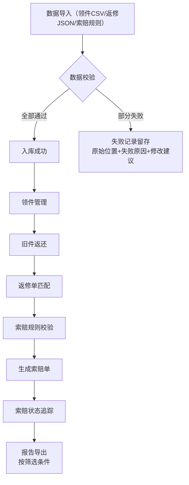

## 1. 产品概述
家电售后仓管理系统，解决工程师领件、旧件返还、厂商索赔数据不一致问题，提升售后索赔成功率。
- 面向一线家电售后仓储管理人员、工程师、索赔专员
- 实现领件-返修-索赔全流程数据贯通，异常记录可追溯，提升运营效率

## 2. 核心功能

### 2.1 用户角色
| 角色 | 说明 | 核心权限 |
|------|------|----------|
| 仓储管理员 | 仓库管理人员 | 领件管理、旧件返还管理、数据导入、查看所有记录 |
| 工程师 | 上门服务人员 | 查看个人领件记录、提交旧件返还 |
| 索赔专员 | 负责厂商索赔 | 索赔管理、数据筛选、报告导出 |

### 2.2 功能模块
1. **仪表盘**: 数据概览、异常统计、操作快捷入口
2. **领件管理**: 领件单列表、筛选、详情查看、CSV导入
3. **返修管理**: 返修单列表、状态追踪、JSON导入
4. **索赔管理**: 索赔规则配置、索赔单生成、状态管理
5. **数据导入**: 多格式数据导入、错误记录处理、批量重试
6. **报告中心**: 多维度筛选、数据导出、审计日志

### 2.3 页面详情
| 页面名称 | 模块名称 | 功能描述 |
|---------|---------|----------|
| 仪表盘 | 数据概览 | 展示领件数、返修数、索赔成功率、异常统计卡片 |
| 仪表盘 | 快捷操作 | 快速进入导入、新建领件/返修/索赔功能 |
| 领件管理 | 列表筛选 | 按负责人、时间、状态、异常类型多维度筛选 |
| 领件管理 | 导入功能 | CSV文件导入、坏记录展示（原始位置、失败原因、修改建议） |
| 返修管理 | 状态追踪 | 返修单全流程状态管理、关联领件单 |
| 索赔管理 | 规则配置 | 索赔规则导入、索赔条件匹配校验 |
| 数据导入 | 批量处理 | 批量操作结果（成功/失败明细）、失败重试机制 |
| 报告中心 | 数据导出 | 与查询结果一致的Excel/CSV报告导出 |
| 报告中心 | 审计日志 | 所有操作记录（操作人、角色、时间、内容） |

## 3. 核心流程

## 4. 用户界面设计

### 4.1 设计风格
- **主色调**: 工业蓝 (#165DFF) - 专业、可信赖
- **辅助色**: 成功绿 (#00B42A)、警告橙 (#FF7D00)、错误红 (#F53F3F)
- **按钮风格**: 圆角设计，悬停有微妙阴影和颜色渐变
- **字体**: 思源黑体，清晰易读，层级分明
- **布局风格**: 卡片式布局，左侧导航，顶部搜索筛选栏
- **图标风格**: Linear风格，简洁专业

### 4.2 页面设计概览
| 页面名称 | 模块名称 | UI 元素 |
|---------|---------|---------|
| 仪表盘 | 数据概览 | 统计卡片、环形图进度条、趋势折线图、网格布局 |
| 领件管理 | 数据表格 | 斑马纹表格、行悬停高亮、状态标签、操作按钮组 |
| 数据导入 | 错误提示 | 错误列表、可展开详情、建议修改框、重试按钮 |
| 报告中心 | 筛选区域 | 下拉选择器、日期范围、多选标签组、导出按钮 |

### 4.3 响应式
- Desktop-first 设计，优先保证桌面端操作体验
- 平板端自适应表格列数，导航可折叠
- 移动端简化视图，核心功能优先展示

### 4.4 交互细节
- 表格行悬停显示操作按钮
- 批量操作时顶部显示进度条和实时统计
- 错误记录可展开查看详情和修改建议
- 导入过程显示进度动画，完成后展示成功/失败汇总
