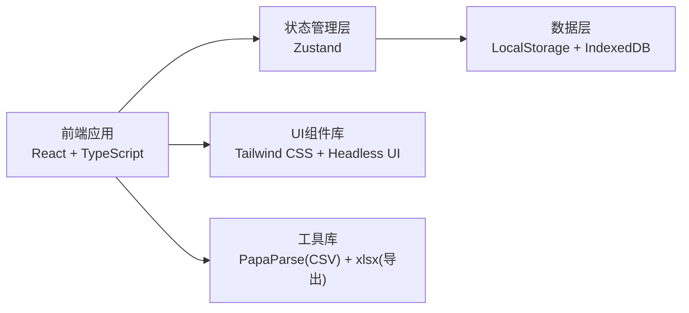
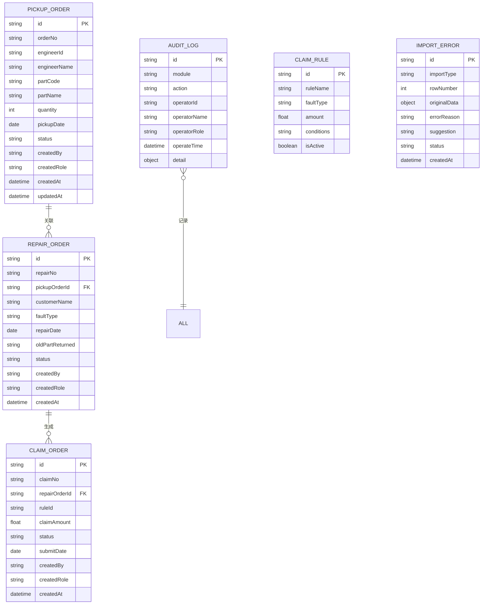

## 1. 架构设计



## 2. 技术栈说明

- **前端框架**: React@18 + TypeScript@5
- **构建工具**: Vite@5
- **样式方案**: Tailwind CSS@3
- **状态管理**: Zustand
- **UI组件**: Headless UI + Heroicons
- **数据存储**: LocalStorage + IndexedDB (本地持久化)
- **数据处理**: 
  - PapaParse (CSV解析)
  - xlsx (Excel导出)
- **图表库**: Recharts

## 3. 路由定义

| 路由 | 页面 | 说明 |
|------|------|------|
| / | 仪表盘 | 数据概览、快捷操作 |
| /pickup | 领件管理 | 领件单列表、筛选、详情 |
| /repair | 返修管理 | 返修单列表、状态管理 |
| /claim | 索赔管理 | 索赔单生成、规则配置 |
| /import | 数据导入 | 多格式导入、错误处理、重试 |
| /report | 报告中心 | 数据筛选、导出、审计日志 |

## 4. 数据模型

### 4.1 数据模型定义



### 4.2 类型定义

```typescript
// 基础类型
interface BaseEntity {
  id: string;
  createdAt: string;
  updatedAt?: string;
  createdBy: string;
  createdRole: string;
}

// 领件单
interface PickupOrder extends BaseEntity {
  orderNo: string;
  engineerId: string;
  engineerName: string;
  partCode: string;
  partName: string;
  quantity: number;
  pickupDate: string;
  status: 'pending' | 'picked' | 'returned' | 'abnormal';
  remark?: string;
}

// 返修单
interface RepairOrder extends BaseEntity {
  repairNo: string;
  pickupOrderId?: string;
  customerName: string;
  customerPhone?: string;
  faultType: string;
  faultDescription?: string;
  repairDate: string;
  engineerId: string;
  engineerName: string;
  oldPartReturned: 'yes' | 'no' | 'partial';
  status: 'pending' | 'processing' | 'completed' | 'abnormal';
}

// 索赔单
interface ClaimOrder extends BaseEntity {
  claimNo: string;
  repairOrderId: string;
  ruleId: string;
  claimAmount: number;
  status: 'draft' | 'submitted' | 'approved' | 'rejected' | 'paid';
  submitDate?: string;
  approveDate?: string;
  rejectReason?: string;
}

// 导入错误记录
interface ImportError {
  id: string;
  importType: 'pickup' | 'repair' | 'claim-rule';
  rowNumber: number;
  originalData: Record<string, any>;
  errorReason: string;
  suggestion: string;
  status: 'pending' | 'fixed' | 'ignored';
  createdAt: string;
}

// 批量操作结果
interface BatchResult<T> {
  success: number;
  failed: number;
  total: number;
  successItems: T[];
  failedItems: { item: T; error: string; suggestion?: string }[];
}

// 筛选条件
interface FilterParams {
  operator?: string;
  startDate?: string;
  endDate?: string;
  status?: string;
  abnormalType?: string;
}
```

## 5. 核心功能实现方案

### 5.1 数据导入机制
- **CSV解析**: 使用PapaParse解析领件单CSV，保留原始行号
- **JSON导入**: 直接解析返修单JSON，支持批量导入
- **错误处理**: 校验失败记录保留原始数据、行号、错误原因、修改建议
- **批量重试**: 仅重试失败记录，成功记录不重复处理

### 5.2 审计日志
- 所有操作自动记录：操作人、角色、时间、操作内容
- 不可修改，仅可查询
- 支持按模块、操作人、时间范围筛选

### 5.3 数据导出
- 使用xlsx库生成Excel报告
- 导出内容与当前筛选结果完全一致
- 支持导出筛选条件说明

### 5.4 状态管理
- 使用Zustand管理全局状态
- 数据本地持久化到IndexedDB
- 支持离线操作，数据自动同步
