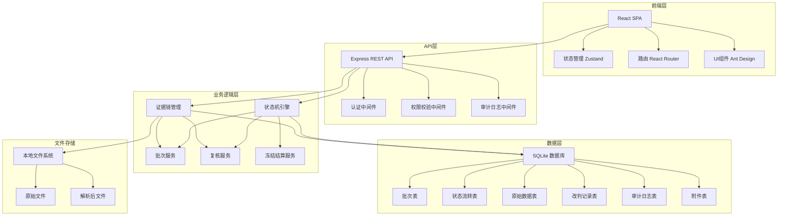
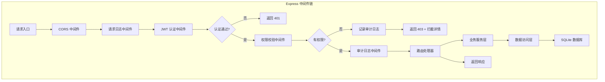
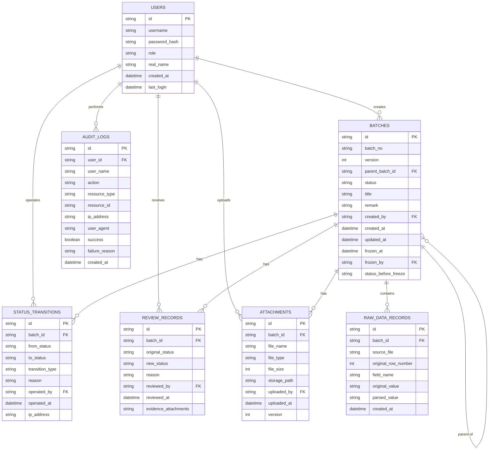

# 物业维修派单异常回执状态机 - 技术架构文档

## 1. 架构设计



## 2. 技术描述

- **前端**：React@18 + TypeScript + Vite + Zustand + React Router + Ant Design
- **后端**：Express@4 + TypeScript
- **数据库**：SQLite（本地文件存储，便于部署）
- **状态机**：xstate 状态机库
- **文件处理**：xlsx（Excel解析）+ multer（文件上传）
- **导出**：xlsx + pdfmake
- **认证**：JWT + bcrypt

## 3. 路由定义

### 前端路由

| 路由 | 页面 | 权限要求 |
|------|------|----------|
| /login | 登录页 | 公开 |
| /dashboard | 仪表盘 | 已登录 |
| /batches | 批次列表 | 客服/复核/项目经理 |
| /batches/create | 创建批次 | 客服 |
| /batches/:id | 批次详情 | 客服/复核/项目经理 |
| /review | 复核工作台 | 复核专员/项目经理 |
| /settlement | 冻结结算 | 项目经理/财务 |
| /audit | 审计日志 | 项目经理 |
| /reports | 报表中心 | 项目经理 |

### API 路由

| 方法 | 路由 | 描述 | 权限 |
|------|------|------|------|
| POST | /api/auth/login | 登录 | 公开 |
| GET | /api/batches | 获取批次列表 | 客服+ |
| POST | /api/batches | 创建批次 | 客服 |
| GET | /api/batches/:id | 获取批次详情 | 客服+ |
| POST | /api/batches/:id/submit | 提交批次 | 客服 |
| POST | /api/batches/:id/withdraw | 撤回批次 | 客服 |
| POST | /api/batches/:id/attachments | 补传附件 | 客服 |
| POST | /api/review/:id/approve | 复核通过 | 复核+ |
| POST | /api/review/:id/reject | 复核驳回 | 复核+ |
| POST | /api/settlement/:id/freeze | 冻结结算 | 项目经理 |
| POST | /api/settlement/:id/unfreeze | 解冻 | 项目经理 |
| POST | /api/settlement/:id/settle | 执行结算 | 财务 |
| GET | /api/audit | 获取审计日志 | 项目经理 |
| GET | /api/reports/summary | 获取汇总报表 | 项目经理 |
| GET | /api/reports/export | 导出报表 | 项目经理 |

## 4. API 定义

### 4.1 类型定义

```typescript
// 批次状态枚举
enum BatchStatus {
  PENDING_SUBMIT = 'pending_submit',
  PROCESSING = 'processing',
  PENDING_REVIEW = 'pending_review',
  REVIEW_APPROVED = 'review_approved',
  REVIEW_REJECTED = 'review_rejected',
  FROZEN = 'frozen',
  SETTLED = 'settled',
  ARCHIVED = 'archived',
  WITHDRAWN = 'withdrawn'
}

// 角色枚举
enum Role {
  CUSTOMER_SERVICE = 'customer_service',
  TECHNICIAN = 'technician',
  REVIEWER = 'reviewer',
  PROJECT_MANAGER = 'project_manager',
  FINANCE = 'finance'
}

// 批次信息
interface Batch {
  id: string;
  batchNo: string;
  version: number;
  parentBatchId?: string;
  status: BatchStatus;
  title: string;
  remark: string;
  createdBy: string;
  createdAt: Date;
  updatedAt: Date;
  frozenAt?: Date;
  frozenBy?: string;
  statusBeforeFreeze?: BatchStatus;
}

// 原始数据记录
interface RawDataRecord {
  id: string;
  batchId: string;
  sourceFile: string;
  originalRowNumber: number;
  originalValue: string;
  parsedValue: string;
  fieldName: string;
  createdAt: Date;
}

// 状态流转记录
interface StatusTransition {
  id: string;
  batchId: string;
  fromStatus: BatchStatus;
  toStatus: BatchStatus;
  transitionType: 'auto' | 'manual';
  reason?: string;
  operatedBy: string;
  operatedAt: Date;
  ipAddress: string;
}

// 改判记录
interface ReviewRecord {
  id: string;
  batchId: string;
  originalStatus: BatchStatus;
  newStatus: BatchStatus;
  reason: string;
  reviewedBy: string;
  reviewedAt: Date;
  evidence?: string[];
}

// 审计日志
interface AuditLog {
  id: string;
  userId: string;
  userName: string;
  action: string;
  resourceType: string;
  resourceId?: string;
  ipAddress: string;
  userAgent: string;
  success: boolean;
  failureReason?: string;
  createdAt: Date;
}

// 附件
interface Attachment {
  id: string;
  batchId: string;
  fileName: string;
  fileType: 'image' | 'excel' | 'pdf' | 'other';
  fileSize: number;
  storagePath: string;
  uploadedBy: string;
  uploadedAt: Date;
  version: number;
}
```

### 4.2 请求/响应示例

#### 创建批次请求
```typescript
interface CreateBatchRequest {
  title: string;
  remark: string;
  files: File[];  // 报修截图、回执、领用表等
}

interface CreateBatchResponse {
  success: boolean;
  batchId: string;
  batchNo: string;
  parsedRecords: number;
  failedRecords: {
    rowNumber: number;
    reason: string;
    originalValue: string;
  }[];
}
```

#### 复核改判请求
```typescript
interface ReviewRequest {
  batchId: string;
  action: 'approve' | 'reject';
  reason: string;
  evidenceAttachments?: string[];
}

interface ReviewResponse {
  success: boolean;
  batchId: string;
  previousStatus: BatchStatus;
  newStatus: BatchStatus;
  reviewRecordId: string;
}
```

#### 权限拦截响应
```typescript
interface PermissionDeniedResponse {
  success: boolean;
  error: string;
  errorCode: 'PERMISSION_DENIED';
  message: string;  // 详细说明不能做什么
  requiredRole: Role;
  userRole: Role;
  auditLogId: string;  // 关联审计日志
}
```

## 5. 服务器架构图



## 6. 数据模型

### 6.1 ER 图



### 6.2 DDL 语句

```sql
-- 用户表
CREATE TABLE users (
  id TEXT PRIMARY KEY,
  username TEXT UNIQUE NOT NULL,
  password_hash TEXT NOT NULL,
  role TEXT NOT NULL,
  real_name TEXT NOT NULL,
  created_at DATETIME DEFAULT CURRENT_TIMESTAMP,
  last_login DATETIME
);

-- 批次表
CREATE TABLE batches (
  id TEXT PRIMARY KEY,
  batch_no TEXT UNIQUE NOT NULL,
  version INTEGER DEFAULT 1,
  parent_batch_id TEXT,
  status TEXT NOT NULL,
  title TEXT NOT NULL,
  remark TEXT,
  created_by TEXT NOT NULL,
  created_at DATETIME DEFAULT CURRENT_TIMESTAMP,
  updated_at DATETIME DEFAULT CURRENT_TIMESTAMP,
  frozen_at DATETIME,
  frozen_by TEXT,
  status_before_freeze TEXT,
  FOREIGN KEY (parent_batch_id) REFERENCES batches(id),
  FOREIGN KEY (created_by) REFERENCES users(id),
  FOREIGN KEY (frozen_by) REFERENCES users(id)
);

-- 原始数据表
CREATE TABLE raw_data_records (
  id TEXT PRIMARY KEY,
  batch_id TEXT NOT NULL,
  source_file TEXT NOT NULL,
  original_row_number INTEGER NOT NULL,
  field_name TEXT NOT NULL,
  original_value TEXT NOT NULL,
  parsed_value TEXT,
  created_at DATETIME DEFAULT CURRENT_TIMESTAMP,
  FOREIGN KEY (batch_id) REFERENCES batches(id)
);

-- 状态流转表
CREATE TABLE status_transitions (
  id TEXT PRIMARY KEY,
  batch_id TEXT NOT NULL,
  from_status TEXT NOT NULL,
  to_status TEXT NOT NULL,
  transition_type TEXT NOT NULL,
  reason TEXT,
  operated_by TEXT NOT NULL,
  operated_at DATETIME DEFAULT CURRENT_TIMESTAMP,
  ip_address TEXT,
  FOREIGN KEY (batch_id) REFERENCES batches(id),
  FOREIGN KEY (operated_by) REFERENCES users(id)
);

-- 改判记录表
CREATE TABLE review_records (
  id TEXT PRIMARY KEY,
  batch_id TEXT NOT NULL,
  original_status TEXT NOT NULL,
  new_status TEXT NOT NULL,
  reason TEXT NOT NULL,
  reviewed_by TEXT NOT NULL,
  reviewed_at DATETIME DEFAULT CURRENT_TIMESTAMP,
  evidence_attachments TEXT,
  FOREIGN KEY (batch_id) REFERENCES batches(id),
  FOREIGN KEY (reviewed_by) REFERENCES users(id)
);

-- 附件表
CREATE TABLE attachments (
  id TEXT PRIMARY KEY,
  batch_id TEXT NOT NULL,
  file_name TEXT NOT NULL,
  file_type TEXT NOT NULL,
  file_size INTEGER NOT NULL,
  storage_path TEXT NOT NULL,
  uploaded_by TEXT NOT NULL,
  uploaded_at DATETIME DEFAULT CURRENT_TIMESTAMP,
  version INTEGER DEFAULT 1,
  FOREIGN KEY (batch_id) REFERENCES batches(id),
  FOREIGN KEY (uploaded_by) REFERENCES users(id)
);

-- 审计日志表
CREATE TABLE audit_logs (
  id TEXT PRIMARY KEY,
  user_id TEXT NOT NULL,
  user_name TEXT NOT NULL,
  action TEXT NOT NULL,
  resource_type TEXT,
  resource_id TEXT,
  ip_address TEXT,
  user_agent TEXT,
  success BOOLEAN NOT NULL,
  failure_reason TEXT,
  created_at DATETIME DEFAULT CURRENT_TIMESTAMP,
  FOREIGN KEY (user_id) REFERENCES users(id)
);

-- 索引
CREATE INDEX idx_batches_status ON batches(status);
CREATE INDEX idx_batches_created_by ON batches(created_by);
CREATE INDEX idx_raw_data_batch_id ON raw_data_records(batch_id);
CREATE INDEX idx_transitions_batch_id ON status_transitions(batch_id);
CREATE INDEX idx_review_batch_id ON review_records(batch_id);
CREATE INDEX idx_attachments_batch_id ON attachments(batch_id);
CREATE INDEX idx_audit_user_id ON audit_logs(user_id);
CREATE INDEX idx_audit_created_at ON audit_logs(created_at);
```

### 6.3 初始数据

```sql
-- 初始用户（密码均为 123456）
INSERT INTO users (id, username, password_hash, role, real_name) VALUES
('u001', 'cs001', '$2b$10$N9qo8uLOickgx2ZMRZoMyeIjZAgcfl7p92ldGxad68LJZdL17lhWy', 'customer_service', '客服小王'),
('u002', 'tech001', '$2b$10$N9qo8uLOickgx2ZMRZoMyeIjZAgcfl7p92ldGxad68LJZdL17lhWy', 'technician', '李师傅'),
('u003', 'review001', '$2b$10$N9qo8uLOickgx2ZMRZoMyeIjZAgcfl7p92ldGxad68LJZdL17lhWy', 'reviewer', '复核专员老张'),
('u004', 'pm001', '$2b$10$N9qo8uLOickgx2ZMRZoMyeIjZAgcfl7p92ldGxad68LJZdL17lhWy', 'project_manager', '项目经理刘总'),
('u005', 'finance001', '$2b$10$N9qo8uLOickgx2ZMRZoMyeIjZAgcfl7p92ldGxad68LJZdL17lhWy', 'finance', '财务小陈');
```
