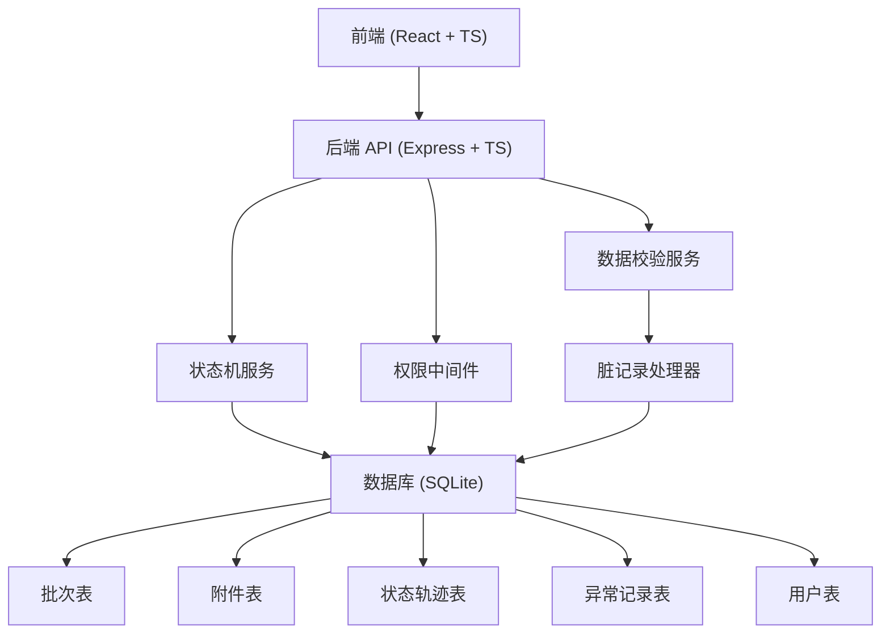
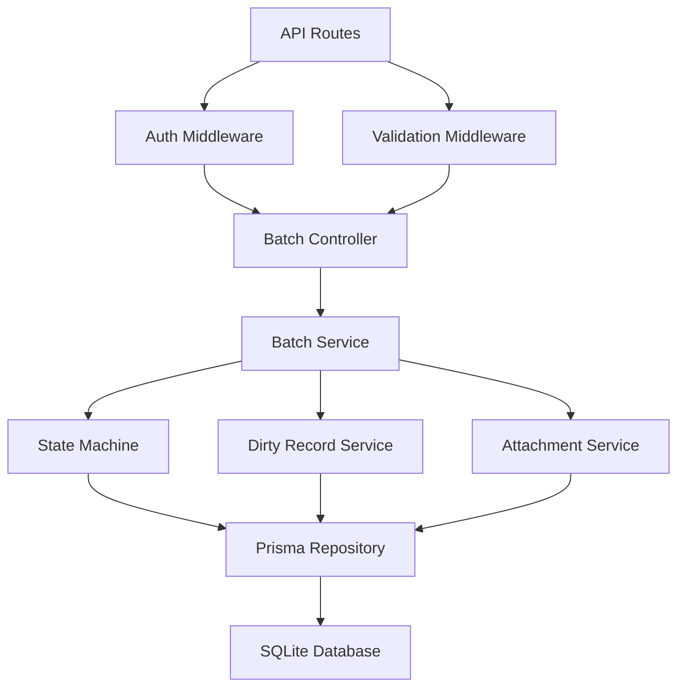
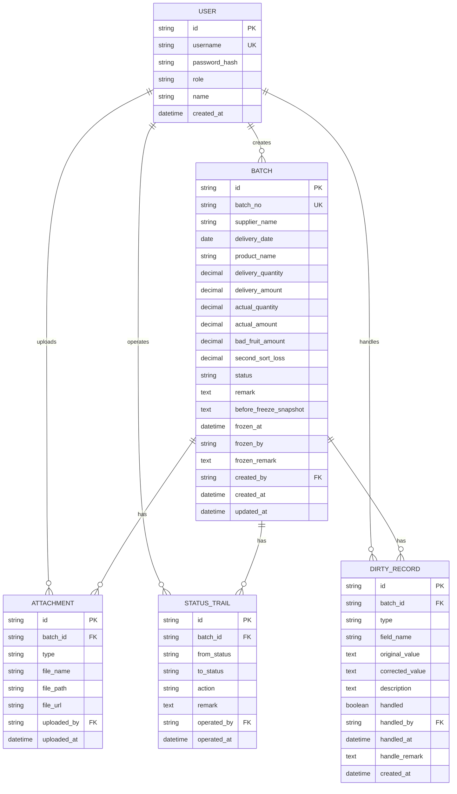

## 1. 架构设计



## 2. 技术描述

- 前端：React@18 + TypeScript + Vite + TailwindCSS + Zustand + Lucide React
- 后端：Express@4 + TypeScript
- 数据库：SQLite3 (本地文件，无需额外安装)
- ORM：Prisma
- 测试：Vitest + Supertest
- 文件上传：Multer

## 3. 前端路由定义

| 路由 | 页面 | 权限要求 |
|-------|---------|----------|
| / | 批次列表页 | 登录用户 |
| /batches/create | 创建批次页 | 录入员、复核员、主管 |
| /batches/:id | 批次详情页 | 登录用户 |
| /batches/:id/review | 复核改判页 | 复核员、主管 |
| /batches/:id/freeze | 冻结结算页 | 主管 |
| /reports | 报表导出页 | 主管 |
| /login | 登录页 | 公开 |

## 4. API 定义

### 4.1 认证接口

```typescript
// POST /api/auth/login
interface LoginRequest {
  username: string;
  password: string;
}

interface LoginResponse {
  token: string;
  user: {
    id: string;
    username: string;
    role: 'ENTRY' | 'REVIEWER' | 'MANAGER' | 'VIEWER';
    name: string;
  };
}
```

### 4.2 批次接口

```typescript
// 批次状态枚举
enum BatchStatus {
  DRAFT = 'DRAFT',
  PENDING_REVIEW = 'PENDING_REVIEW',
  REVIEWED = 'REVIEWED',
  NEEDS_FIX = 'NEEDS_FIX',
  FROZEN = 'FROZEN',
  ARCHIVED = 'ARCHIVED',
  CANCELLED = 'CANCELLED'
}

// 脏记录类型
enum DirtyType {
  MISSING_FIELD = 'MISSING_FIELD',
  CROSS_DATE = 'CROSS_DATE',
  NAME_MISMATCH = 'NAME_MISMATCH',
  AMOUNT_CONFLICT = 'AMOUNT_CONFLICT',
  QUANTITY_CONFLICT = 'QUANTITY_CONFLICT'
}

// 附件类型
enum AttachmentType {
  DELIVERY_NOTE = 'DELIVERY_NOTE',
  WEIGHT_RECORD = 'WEIGHT_RECORD',
  BASKET_PHOTO = 'BASKET_PHOTO',
  EXTERNAL_RECEIPT = 'EXTERNAL_RECEIPT'
}

// POST /api/batches - 创建批次
interface CreateBatchRequest {
  supplierName: string;
  deliveryDate: string;
  productName: string;
  deliveryQuantity?: number;
  deliveryAmount?: number;
  actualQuantity?: number;
  actualAmount?: number;
  badFruitAmount?: number;
  secondSortLoss?: number;
  remark?: string;
}

// GET /api/batches - 批次列表
interface BatchListResponse {
  items: {
    id: string;
    batchNo: string;
    supplierName: string;
    deliveryDate: string;
    productName: string;
    status: BatchStatus;
    hasDirtyRecords: boolean;
    createdAt: string;
    createdBy: string;
  }[];
  total: number;
}

// GET /api/batches/:id - 批次详情
interface BatchDetailResponse {
  id: string;
  batchNo: string;
  supplierName: string;
  deliveryDate: string;
  productName: string;
  deliveryQuantity?: number;
  deliveryAmount?: number;
  actualQuantity?: number;
  actualAmount?: number;
  badFruitAmount?: number;
  secondSortLoss?: number;
  status: BatchStatus;
  remark?: string;
  frozenAt?: string;
  frozenBy?: string;
  frozenRemark?: string;
  // 冻结前快照
  beforeFreezeSnapshot?: {
    deliveryQuantity?: number;
    deliveryAmount?: number;
    actualQuantity?: number;
    actualAmount?: number;
    badFruitAmount?: number;
    secondSortLoss?: number;
  };
  attachments: {
    id: string;
    type: AttachmentType;
    fileName: string;
    fileUrl: string;
    uploadedAt: string;
    uploadedBy: string;
  }[];
  statusTrails: {
    id: string;
    fromStatus?: BatchStatus;
    toStatus: BatchStatus;
    action: string;
    remark?: string;
    operatedBy: string;
    operatedAt: string;
  }[];
  dirtyRecords: {
    id: string;
    type: DirtyType;
    fieldName?: string;
    originalValue?: string;
    correctedValue?: string;
    description: string;
    handled: boolean;
    handledBy?: string;
    handledAt?: string;
    handleRemark?: string;
  }[];
}

// POST /api/batches/:id/attachments - 上传附件
interface UploadAttachmentRequest {
  type: AttachmentType;
  file: File;
}

// POST /api/batches/:id/submit - 提交复核
interface SubmitReviewRequest {
  remark?: string;
}

// POST /api/batches/:id/review - 复核改判
interface ReviewRequest {
  action: 'APPROVE' | 'REJECT';
  remark?: string;
  corrections?: {
    fieldName: string;
    newValue: string | number;
  }[];
}

// POST /api/batches/:id/freeze - 冻结结算
interface FreezeRequest {
  remark: string;
}

// POST /api/batches/:id/unfreeze - 解冻
interface UnfreezeRequest {
  remark: string;
}

// POST /api/batches/:id/archive - 撤回归档
interface ArchiveRequest {
  remark: string;
}

// POST /api/batches/:id/cancel - 取消批次
interface CancelRequest {
  remark: string;
}
```

### 4.3 报表接口

```typescript
// GET /api/reports/summary - 汇总报表
interface SummaryReportRequest {
  startDate?: string;
  endDate?: string;
  supplierName?: string;
  status?: BatchStatus;
}

interface SummaryReportResponse {
  items: {
    batchNo: string;
    supplierName: string;
    deliveryDate: string;
    productName: string;
    deliveryQuantity?: number;
    actualQuantity?: number;
    deliveryAmount?: number;
    actualAmount?: number;
    badFruitAmount?: number;
    secondSortLoss?: number;
    totalDeduction?: number;
    status: BatchStatus;
    frozenAt?: string;
    frozenRemark?: string;
  }[];
  summary: {
    totalDeliveryAmount: number;
    totalActualAmount: number;
    totalBadFruitAmount: number;
    totalSecondSortLoss: number;
    totalDeduction: number;
  };
}

// GET /api/reports/export - 导出Excel
```

## 5. 后端架构图



## 6. 数据模型

### 6.1 ER 图



### 6.2 数据库初始化脚本

```sql
-- 用户表
CREATE TABLE IF NOT EXISTS users (
  id TEXT PRIMARY KEY,
  username TEXT UNIQUE NOT NULL,
  password_hash TEXT NOT NULL,
  role TEXT NOT NULL CHECK (role IN ('ENTRY', 'REVIEWER', 'MANAGER', 'VIEWER')),
  name TEXT NOT NULL,
  created_at DATETIME DEFAULT CURRENT_TIMESTAMP
);

-- 批次表
CREATE TABLE IF NOT EXISTS batches (
  id TEXT PRIMARY KEY,
  batch_no TEXT UNIQUE NOT NULL,
  supplier_name TEXT NOT NULL,
  delivery_date DATE NOT NULL,
  product_name TEXT NOT NULL,
  delivery_quantity DECIMAL(10,2),
  delivery_amount DECIMAL(10,2),
  actual_quantity DECIMAL(10,2),
  actual_amount DECIMAL(10,2),
  bad_fruit_amount DECIMAL(10,2),
  second_sort_loss DECIMAL(10,2),
  status TEXT NOT NULL DEFAULT 'DRAFT',
  remark TEXT,
  before_freeze_snapshot TEXT,
  frozen_at DATETIME,
  frozen_by TEXT REFERENCES users(id),
  frozen_remark TEXT,
  created_by TEXT REFERENCES users(id),
  created_at DATETIME DEFAULT CURRENT_TIMESTAMP,
  updated_at DATETIME DEFAULT CURRENT_TIMESTAMP
);

-- 附件表
CREATE TABLE IF NOT EXISTS attachments (
  id TEXT PRIMARY KEY,
  batch_id TEXT REFERENCES batches(id),
  type TEXT NOT NULL CHECK (type IN ('DELIVERY_NOTE', 'WEIGHT_RECORD', 'BASKET_PHOTO', 'EXTERNAL_RECEIPT')),
  file_name TEXT NOT NULL,
  file_path TEXT NOT NULL,
  file_url TEXT NOT NULL,
  uploaded_by TEXT REFERENCES users(id),
  uploaded_at DATETIME DEFAULT CURRENT_TIMESTAMP
);

-- 状态轨迹表
CREATE TABLE IF NOT EXISTS status_trails (
  id TEXT PRIMARY KEY,
  batch_id TEXT REFERENCES batches(id),
  from_status TEXT,
  to_status TEXT NOT NULL,
  action TEXT NOT NULL,
  remark TEXT,
  operated_by TEXT REFERENCES users(id),
  operated_at DATETIME DEFAULT CURRENT_TIMESTAMP
);

-- 脏记录表
CREATE TABLE IF NOT EXISTS dirty_records (
  id TEXT PRIMARY KEY,
  batch_id TEXT REFERENCES batches(id),
  type TEXT NOT NULL CHECK (type IN ('MISSING_FIELD', 'CROSS_DATE', 'NAME_MISMATCH', 'AMOUNT_CONFLICT', 'QUANTITY_CONFLICT')),
  field_name TEXT,
  original_value TEXT,
  corrected_value TEXT,
  description TEXT NOT NULL,
  handled BOOLEAN DEFAULT FALSE,
  handled_by TEXT REFERENCES users(id),
  handled_at DATETIME,
  handle_remark TEXT,
  created_at DATETIME DEFAULT CURRENT_TIMESTAMP
);

-- 索引
CREATE INDEX IF NOT EXISTS idx_batches_status ON batches(status);
CREATE INDEX IF NOT EXISTS idx_batches_supplier ON batches(supplier_name);
CREATE INDEX IF NOT EXISTS idx_batches_date ON batches(delivery_date);
CREATE INDEX IF NOT EXISTS idx_attachments_batch ON attachments(batch_id);
CREATE INDEX IF NOT EXISTS idx_status_trails_batch ON status_trails(batch_id);
CREATE INDEX IF NOT EXISTS idx_dirty_records_batch ON dirty_records(batch_id);
```

## 7. 状态机实现

### 7.1 状态流转规则

```typescript
const stateTransitions = {
  [BatchStatus.DRAFT]: {
    allowedActions: ['submit', 'cancel'],
    allowedTo: [BatchStatus.PENDING_REVIEW, BatchStatus.CANCELLED]
  },
  [BatchStatus.PENDING_REVIEW]: {
    allowedActions: ['approve', 'reject'],
    allowedTo: [BatchStatus.REVIEWED, BatchStatus.NEEDS_FIX]
  },
  [BatchStatus.NEEDS_FIX]: {
    allowedActions: ['submit'],
    allowedTo: [BatchStatus.PENDING_REVIEW]
  },
  [BatchStatus.REVIEWED]: {
    allowedActions: ['freeze'],
    allowedTo: [BatchStatus.FROZEN]
  },
  [BatchStatus.FROZEN]: {
    allowedActions: ['unfreeze', 'archive'],
    allowedTo: [BatchStatus.PENDING_REVIEW, BatchStatus.ARCHIVED]
  },
  [BatchStatus.ARCHIVED]: {
    allowedActions: [],
    allowedTo: []
  },
  [BatchStatus.CANCELLED]: {
    allowedActions: [],
    allowedTo: []
  }
};
```

### 7.2 权限矩阵

```typescript
const rolePermissions = {
  ENTRY: {
    canCreateBatch: true,
    canEditBatch: ['DRAFT', 'NEEDS_FIX'],
    canUploadAttachment: ['DRAFT', 'NEEDS_FIX'],
    canSubmitReview: ['DRAFT', 'NEEDS_FIX'],
    canReview: false,
    canFreeze: false,
    canArchive: false,
    canExport: false,
    canViewAll: false
  },
  REVIEWER: {
    canCreateBatch: true,
    canEditBatch: ['DRAFT', 'NEEDS_FIX', 'PENDING_REVIEW'],
    canUploadAttachment: ['DRAFT', 'NEEDS_FIX', 'PENDING_REVIEW'],
    canSubmitReview: ['DRAFT', 'NEEDS_FIX'],
    canReview: ['PENDING_REVIEW'],
    canFreeze: false,
    canArchive: false,
    canExport: false,
    canViewAll: true
  },
  MANAGER: {
    canCreateBatch: true,
    canEditBatch: ['DRAFT', 'NEEDS_FIX', 'PENDING_REVIEW', 'REVIEWED'],
    canUploadAttachment: ['DRAFT', 'NEEDS_FIX', 'PENDING_REVIEW', 'REVIEWED'],
    canSubmitReview: ['DRAFT', 'NEEDS_FIX'],
    canReview: ['PENDING_REVIEW'],
    canFreeze: ['REVIEWED'],
    canUnfreeze: ['FROZEN'],
    canArchive: ['FROZEN'],
    canExport: true,
    canViewAll: true
  },
  VIEWER: {
    canCreateBatch: false,
    canEditBatch: [],
    canUploadAttachment: [],
    canSubmitReview: [],
    canReview: false,
    canFreeze: false,
    canArchive: false,
    canExport: false,
    canViewAll: true
  }
};
```
