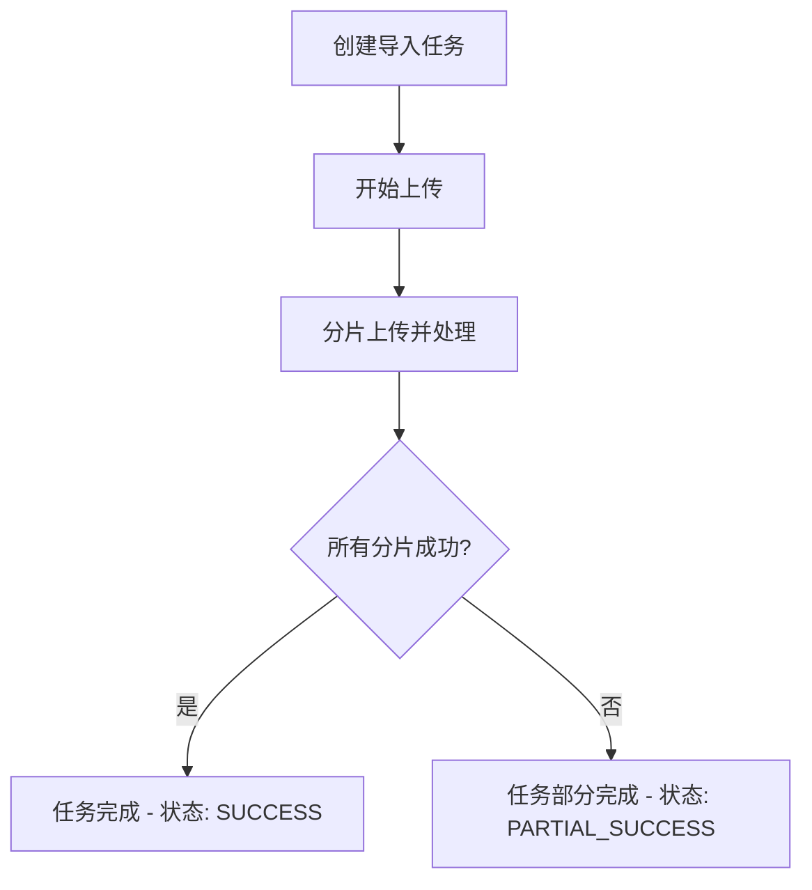
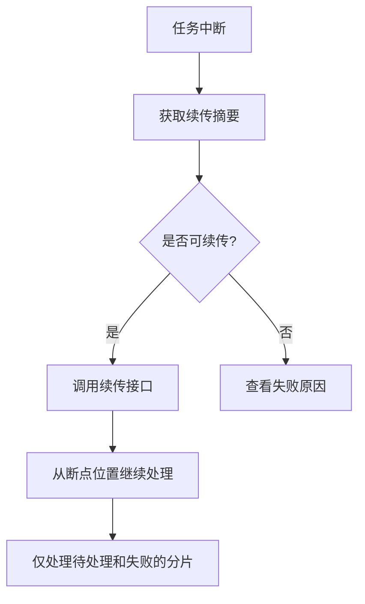
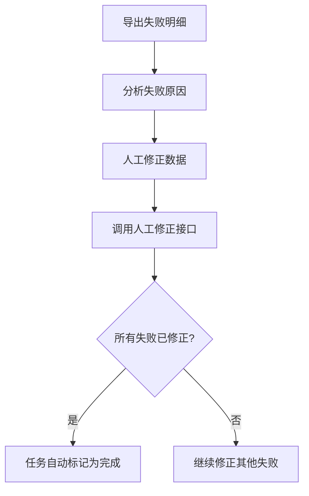

# 文件导入断点续传 API 使用说明

## 快速开始

### 1. 安装依赖
```bash
npm install
```

### 2. 启动服务
```bash
npm run dev
```

服务启动后访问 http://localhost:3000

---

## 核心功能

### ✅ 分片追踪
- 文件自动分片处理
- 每个分片独立记录状态
- 支持重试计数

### ✅ 行级幂等
- 已处理的行不会重复处理
- 通过任务ID + 行号唯一标识
- 断点续传时自动跳过成功行

### ✅ 断点续传
- 记录最后成功处理的行号
- 续传时从失败位置继续
- 无需重新上传整个文件

### ✅ 失败保留
- 保留所有失败记录的原始数据
- 记录错误代码和详细信息
- 保留堆栈信息便于排查

### ✅ 业务友好导出
- 所有字段使用中文名称
- 包含任务摘要、成功明细、失败明细
- 提供续传指南和操作建议

---

## API 接口详解

### 1. 创建导入任务

**POST** `/api/import/tasks`

请求体：
```json
{
  "fileName": "用户数据.xlsx",
  "fileSize": 10485760,
  "fileType": "application/vnd.openxmlformats-officedocument.spreadsheetml.sheet",
  "totalRows": 1000,
  "chunkSize": 100,
  "createdBy": "张三",
  "businessType": "用户批量导入",
  "description": "2024年Q1新用户批量导入"
}
```

响应：
```json
{
  "success": true,
  "data": {
    "taskId": "uuid-xxx",
    "fileName": "用户数据.xlsx",
    "status": "PENDING",
    "totalChunks": 10,
    "chunkSize": 100
  },
  "message": "导入任务创建成功"
}
```

---

### 2. 处理分片数据

**POST** `/api/import/tasks/{taskId}/chunks/{chunkId}/process`

请求体：
```json
{
  "rowsData": [
    { "rowNumber": 1, "rowData": "{\"name\":\"张三\",\"email\":\"zhang@example.com\"}" },
    { "rowNumber": 2, "rowData": "{\"name\":\"李四\",\"email\":\"li@example.com\"}" }
  ]
}
```

> 💡 **业务集成提示**：在 `importService.ts` 的 `processChunk` 方法中，替换模拟的处理逻辑为实际的业务处理代码。

---

### 3. 获取续传摘要

**GET** `/api/import/tasks/{taskId}/resume-summary`

响应：
```json
{
  "success": true,
  "data": {
    "taskId": "uuid-xxx",
    "lastSuccessfulRow": 850,
    "totalSuccessRows": 842,
    "totalFailedRows": 8,
    "canResume": true,
    "resumeFromRow": 851,
    "estimatedRemainingRows": 150,
    "pendingChunks": [8, 9],
    "failedChunks": [7]
  }
}
```

---

### 4. 续传任务

**POST** `/api/import/tasks/{taskId}/resume`

响应包含续传摘要信息，服务端会自动标记任务状态为续传中，并为失败分片增加重试计数。

---

### 5. 人工修正失败记录

**POST** `/api/import/tasks/{taskId}/failures/{rowNumber}/fix`

请求体：
```json
{
  "fixedBy": "李四",
  "fixNote": "数据格式有误，已手动修正并重新入库"
}
```

---

### 6. 导出业务数据（最常用）

**GET** `/api/import/tasks/{taskId}/export`

响应示例（业务友好格式）：
```json
{
  "success": true,
  "data": {
    "taskSummary": {
      "任务ID": "uuid-xxx",
      "文件名": "用户数据.xlsx",
      "业务类型": "用户批量导入",
      "任务状态": "部分成功",
      "创建时间": "2024/5/17 14:30:00",
      "最后更新": "2024/5/17 14:35:22",
      "总行数": 1000,
      "成功行数": 842,
      "失败行数": 8,
      "完成进度": "85%"
    },
    "successRecords": [
      {
        "行号": 1,
        "业务主键": "BK-1",
        "处理时间": "2024/5/17 14:30:05",
        "生成记录ID": "REC-1234567890-1",
        "原始数据": "{\"name\":\"张三\",\"email\":\"zhang@example.com\"}"
      }
    ],
    "failedRecords": [
      {
        "行号": 10,
        "业务主键": "BK-10",
        "错误代码": "VALIDATION_ERROR",
        "错误描述": "邮箱格式不正确",
        "失败时间": "2024/5/17 14:30:10",
        "是否已人工修正": "否",
        "原始数据": "{\"name\":\"王五\",\"email\":\"invalid-email\"}"
      }
    ],
    "resumeGuide": {
      "是否可续传": "是",
      "续传起始行": 851,
      "待处理分片": "第9片、第10片",
      "失败分片": "第8片",
      "剩余待处理行数": 150,
      "续传说明": "可以从第 851 行开始续传，无需重复上传已成功的 842 行数据"
    }
  },
  "message": "导出成功"
}
```

---

## 典型使用场景

### 场景一：首次导入流程



### 场景二：中断后续传



### 场景三：失败数据人工修正



---

## 数据模型说明

### ImportTask（导入任务）
- `taskId`: 任务唯一标识
- `fileName`: 文件名
- `fileSize`: 文件大小
- `totalRows`: 总行数
- `totalChunks`: 总分片数
- `status`: 任务状态（PENDING/UPLOADING/PROCESSING/PARTIAL_SUCCESS/SUCCESS/FAILED/NEEDS_MANUAL_FIX/RESUMING）

### FileChunk（文件分片）
- `chunkId`: 分片唯一标识
- `chunkIndex`: 分片序号
- `startRow`: 起始行号
- `endRow`: 结束行号
- `status`: 分片状态（PENDING/UPLOADED/PROCESSING/SUCCESS/FAILED）
- `retryCount`: 重试次数

### SuccessDetail（成功明细）
- `rowNumber`: 行号
- `businessKey`: 业务主键
- `processedAt`: 处理时间
- `recordId`: 生成的记录ID
- `rawData`: 原始数据

### FailureDetail（失败明细）
- `rowNumber`: 行号
- `businessKey`: 业务主键
- `errorCode`: 错误代码
- `errorMessage`: 错误描述
- `failedAt`: 失败时间
- `rawData`: 原始数据
- `stackTrace`: 堆栈信息
- `isManualFixed`: 是否已人工修正
- `fixedBy`: 修正人
- `fixedAt`: 修正时间
- `fixNote`: 修正说明

---

## 关键规则说明

1. **行级幂等保证**：通过 `taskId + rowNumber` 作为唯一键，确保同一行不会被重复处理。

2. **断点精准定位**：记录最后成功处理的行号，续传时从下一行开始。

3. **失败数据完整保留**：所有失败记录都保留原始数据和错误上下文，便于问题追溯。

4. **状态自动流转**：分片处理完成后自动更新任务状态，全部成功则标记为 SUCCESS。

5. **人工修正闭环**：支持对失败记录进行人工修正，所有失败修正完成后任务自动完成。

---

## 注意事项

1. **分片大小建议**：根据数据特性选择合适的分片大小，通常 100-500 行/分片比较合适。

2. **业务主键必填**：成功明细和失败明细都需要业务主键，便于后续数据核对。

3. **原始数据保留**：系统保留所有行的原始数据，便于出现问题时进行回溯。

4. **重试策略**：失败分片支持重试，重试次数会被记录，可根据需要调整重试逻辑。

---

## 后续扩展方向

- [ ] 支持多种文件格式自动解析（CSV, Excel等）
- [ ] 支持异步处理和进度推送
- [ ] 支持导入模板配置和数据校验规则
- [ ] 支持失败数据批量导出/导入修正
- [ ] 支持导入任务对比和审计日志
