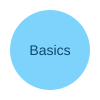

# 第二章：基础概念

## 变量与数据类型

在编程中，变量是存储数据的容器。让我们了解基本的数据类型。

### 数字类型

```javascript
// 整数
let age = 25;

// 浮点数
let price = 19.99;

// 计算
let total = age + price;
console.log(`Total: ${total}`);
```

### 字符串

```python
# 字符串定义
name = "John"
greeting = 'Hello'

# 字符串拼接
message = greeting + ", " + name + "!"
print(message)
```

## 参考资源

- 返回 [第一章](01-intro.md)
- 查看 [第三章](03-practice.md)

## 本章图片


