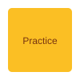

# 第三章：实践练习

## 练习 1：数组操作

### 任务

编写一个函数，计算数组中所有数字的总和。

### 解决方案

```javascript
// 计算数组总和
function sumArray(numbers) {
  return numbers.reduce((acc, num) => acc + num, 0);
}

const result = sumArray([1, 2, 3, 4, 5]);
console.log(`Sum: ${result}`);
```

## 练习 2：字符串反转

### Python 实现

```python
# 反转字符串
def reverse_string(s):
    return s[::-1]

original = "Hello World"
reversed_str = reverse_string(original)
print(f"Original: {original}")
print(f"Reversed: {reversed_str}")
```

## 上一章/下一章

- [上一章：基础概念](02-basics.md)
- [下一章：总结](04-summary.md)

## 练习图示


