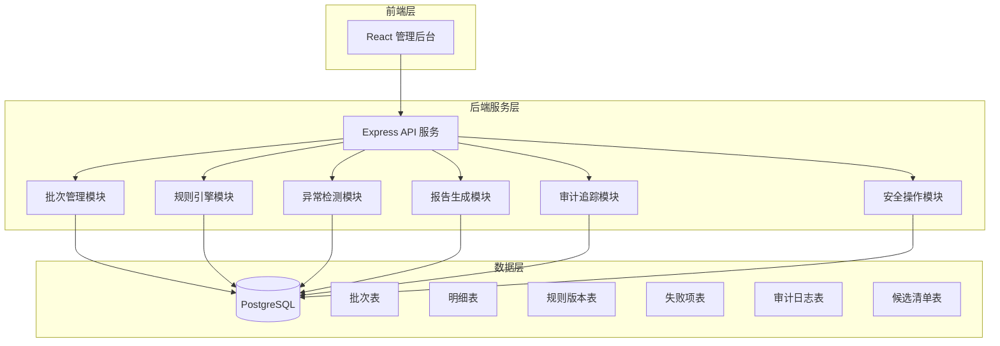
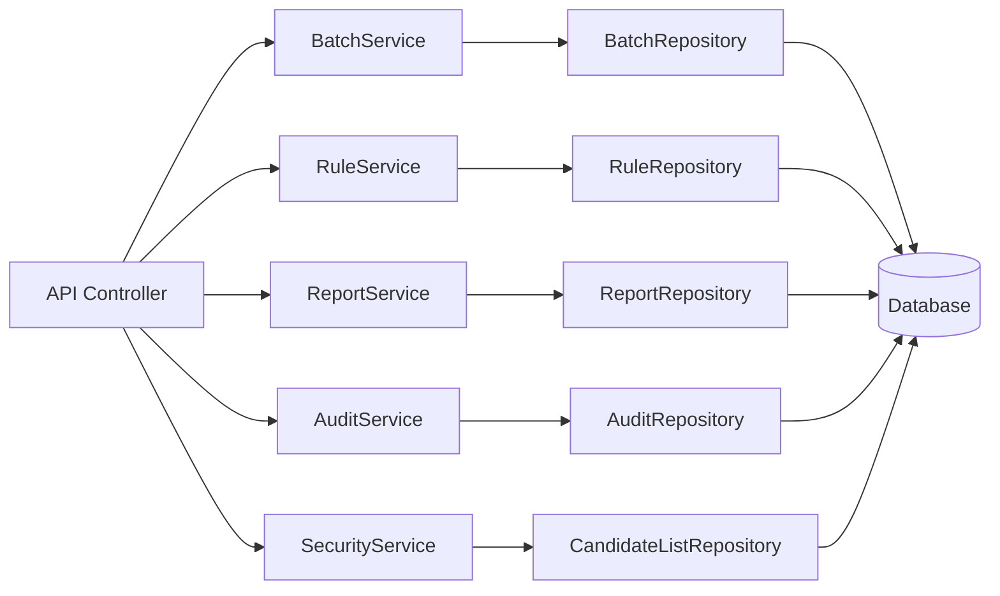
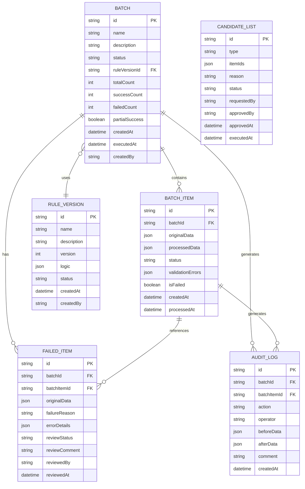

## 1. 架构设计



## 2. 技术选型

- **前端**: React@18 + TypeScript + Ant Design + Vite
- **后端**: Node.js + Express@4 + TypeScript
- **数据库**: PostgreSQL 15
- **ORM**: Prisma
- **文档**: Swagger/OpenAPI
- **日志**: Winston
- **测试**: Jest + Supertest

## 3. 目录结构

```
sla-log-service/
├── backend/
│   ├── src/
│   │   ├── controllers/      # 控制器层
│   │   ├── services/         # 业务逻辑层
│   │   ├── repositories/     # 数据访问层
│   │   ├── models/           # 数据模型
│   │   ├── middleware/       # 中间件
│   │   ├── utils/            # 工具函数
│   │   ├── config/           # 配置文件
│   │   ├── routes/           # 路由定义
│   │   └── index.ts          # 入口文件
│   ├── prisma/
│   │   └── schema.prisma     # 数据库 Schema
│   └── package.json
├── frontend/
│   ├── src/
│   │   ├── pages/
│   │   ├── components/
│   │   ├── services/
│   │   └── utils/
│   └── package.json
└── docs/
```

## 4. API 定义

### 4.1 批次管理 API

```typescript
// 创建批次
POST /api/batches
Request: {
  name: string;
  description?: string;
  inputData: TrainingEnvironmentItem[];
  createdBy: string;
}
Response: Batch

// 获取批次列表
GET /api/batches?page=1&pageSize=20&status=PENDING
Response: {
  data: Batch[];
  total: number;
  page: number;
  pageSize: number;
}

// 获取批次详情
GET /api/batches/:id
Response: BatchDetail

// 执行批次处理
POST /api/batches/:id/execute
Response: BatchExecutionResult
```

### 4.2 规则管理 API

```typescript
// 获取规则列表
GET /api/rules
Response: Rule[]

// 创建规则版本
POST /api/rules
Request: {
  name: string;
  description: string;
  logic: RuleLogic;
  createdBy: string;
}
Response: Rule

// 启用/停用规则
PUT /api/rules/:id/status
Request: { status: 'ACTIVE' | 'INACTIVE' }
```

### 4.3 报告 API

```typescript
// 生成处理报告
GET /api/batches/:id/report
Response: {
  batchId: string;
  beforeProcessing: ProcessingItem[];
  afterProcessing: ProcessingItem[];
  executionTime: number;
  successCount: number;
  failedCount: number;
  partialSuccess: boolean;
  nextSteps: string[];
  failedItems: FailedItem[];
}

// 导出失败项
GET /api/batches/:id/failed-items/export
Response: CSV File
```

### 4.4 审计 API

```typescript
// 获取审计日志
GET /api/audit?batchId=:batchId
Response: AuditLog[]

// 提交复核意见
POST /api/batches/:id/review
Request: {
  itemId: string;
  reviewComment: string;
  reviewedBy: string;
  decision: 'APPROVE' | 'REJECT' | 'NEED_MORE_INFO';
}
```

### 4.5 安全操作 API

```typescript
// 生成候选清单
POST /api/candidate-lists
Request: {
  type: 'CLEANUP' | 'ROLLBACK';
  batchIds: string[];
  reason: string;
  requestedBy: string;
}
Response: CandidateList

// 审核候选清单
PUT /api/candidate-lists/:id/approve
Request: {
  approved: boolean;
  approvedBy: string;
  comment?: string;
}

// 执行候选清单操作
POST /api/candidate-lists/:id/execute
```

## 5. 服务层架构



## 6. 数据模型

### 6.1 ER 图



### 6.2 核心数据类型定义

```typescript
type BatchStatus = 'PENDING' | 'PROCESSING' | 'SUCCESS' | 'PARTIAL_SUCCESS' | 'FAILED' | 'REVIEWED';

interface Batch {
  id: string;
  name: string;
  description?: string;
  status: BatchStatus;
  ruleVersionId: string;
  totalCount: number;
  successCount: number;
  failedCount: number;
  partialSuccess: boolean;
  executionTimeMs?: number;
  createdAt: Date;
  executedAt?: Date;
  createdBy: string;
}

interface BatchItem {
  id: string;
  batchId: string;
  originalData: TrainingEnvironmentItem;
  processedData?: TrainingEnvironmentItem;
  status: 'PENDING' | 'SUCCESS' | 'FAILED';
  validationErrors?: ValidationError[];
  isFailed: boolean;
  createdAt: Date;
  processedAt?: Date;
}

interface TrainingEnvironmentItem {
  courseId: string;
  courseName: string;
  traineeId: string;
  traineeName: string;
  submissionId: string;
  approvalStatus: string;
  approvalComment?: string;
  approvalDate?: Date;
  submittedAt: Date;
}

interface ValidationError {
  field: string;
  code: string;
  message: string;
  severity: 'ERROR' | 'WARNING' | 'BLOCKER';
}

interface FailedItem {
  id: string;
  batchId: string;
  batchItemId: string;
  originalData: TrainingEnvironmentItem;
  failureReason: string;
  errorDetails: ValidationError[];
  reviewStatus: 'PENDING' | 'APPROVED' | 'REJECTED';
  reviewComment?: string;
  reviewedBy?: string;
  reviewedAt?: Date;
}

interface RuleLogic {
  conditions: RuleCondition[];
  actions: RuleAction[];
  approvalRequired: boolean;
}
```

## 7. 核心业务规则

### 7.1 审批意见丢失检测规则

```typescript
function checkApprovalCommentMissing(item: TrainingEnvironmentItem): ValidationError | null {
  // 如果审批状态为已通过/已拒绝，但审批意见为空
  if (['APPROVED', 'REJECTED'].includes(item.approvalStatus)) {
    if (!item.approvalComment || item.approvalComment.trim() === '') {
      return {
        field: 'approvalComment',
        code: 'APPROVAL_COMMENT_MISSING',
        message: '审批意见为空，流程被拦截',
        severity: 'BLOCKER'
      };
    }
  }
  return null;
}
```

### 7.2 部分成功处理规则

```typescript
function calculateBatchStatus(items: BatchItem[]): BatchStatus {
  const successCount = items.filter(i => i.status === 'SUCCESS').length;
  const failedCount = items.filter(i => i.status === 'FAILED').length;
  
  if (failedCount === 0) return 'SUCCESS';
  if (successCount === 0) return 'FAILED';
  return 'PARTIAL_SUCCESS';
}
```
