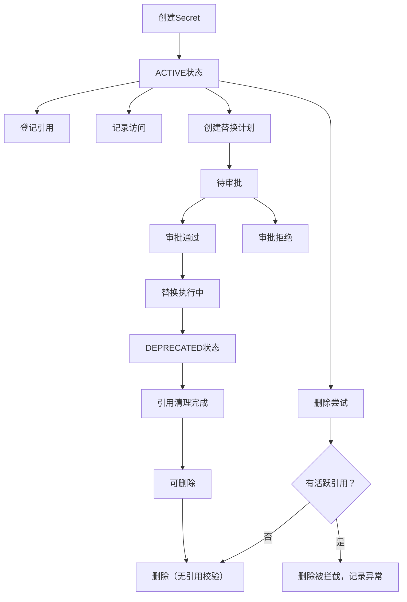

## 1. 产品概述
Secret引用血缘API是一个后端服务，用于管理Secret的引用关系、访问记录、替换计划和血缘报告，解决删除旧Secret前无法确认引用关系的痛点问题。
- 核心目标：建立Secret全生命周期的血缘追踪，确保接口、状态和报告数据一致性
- 目标用户：运维工程师、安全团队、后端开发人员

## 2. 核心功能

### 2.1 用户角色
| 角色 | 说明 | 核心权限 |
|------|------|----------|
| 系统管理员 | 系统维护人员 | 全部权限，包括删除保护绕过 |
| 普通用户 | 开发/运维人员 | 查询、登记、状态推进、导出 |
| 审批人员 | 安全负责人 | 替换审批权限 |

### 2.2 功能模块
1. **Secret管理**：创建、查询、更新Secret基本信息
2. **引用登记**：记录Secret引用位置、运行环境
3. **访问留痕**：自动记录每次访问时间、调用方
4. **状态推进**：Secret生命周期状态流转
5. **替换管理**：替换计划创建、审批、执行
6. **删除保护**：删除前校验引用状态
7. **异常处理**：失败路径记录原始输入、处理依据、最终结论
8. **血缘报告**：生成并导出完整血缘关系报告

### 2.3 接口详情
| 接口名称 | 功能描述 | 关键规则 |
|----------|----------|----------|
| 创建Secret | 新增Secret基础信息 | 自动初始化状态为ACTIVE |
| 查询Secret | 按名称/环境/状态查询 | 支持模糊搜索和分页 |
| 登记引用 | 记录Secret引用位置 | 自动更新最后引用时间 |
| 记录访问 | 每次API调用自动记录 | 保留完整访问链路 |
| 状态推进 | 变更Secret生命周期状态 | 状态机校验，不可逆操作保护 |
| 创建替换计划 | 规划Secret替换方案 | 需要审批流程 |
| 审批替换 | 审批替换计划 | 记录审批人和审批意见 |
| 人工修正 | 手动修正数据异常 | 记录修正原因和操作人 |
| 删除Secret | 删除Secret记录 | 引用校验，有活跃引用则拦截 |
| 导出报告 | 导出血缘报告 | 支持JSON/CSV格式 |

## 3. 核心流程

### 3.1 Secret生命周期流程


### 3.2 异常处理流程
1. 操作失败时捕获原始输入参数
2. 记录处理依据（规则校验结果）
3. 保存最终结论和错误信息
4. 支持人工修正和重试机制

## 4. 接口设计
### 4.1 设计风格
- RESTful API设计规范
- 统一错误响应格式，错误信息直接可懂
- HTTP状态码与业务错误码结合
- 请求/响应使用JSON格式

### 4.2 错误响应格式
```json
{
  "code": "SECRET_HAS_ACTIVE_REFERENCES",
  "message": "无法删除：该Secret有3个活跃引用",
  "details": {
    "raw_input": {"secret_name": "DB_PASSWORD"},
    "processing_basis": "删除保护规则：有活跃引用时禁止删除",
    "conclusion": "操作被拦截",
    "references": [
      {"service": "order-service", "env": "prod", "last_access": "2026-05-10T08:30:00Z"}
    ]
  }
}
```

### 4.3 数据一致性
- 接口返回数据与数据库状态实时同步
- 状态推进记录完整审计日志
- 血缘报告数据与接口查询结果一致
