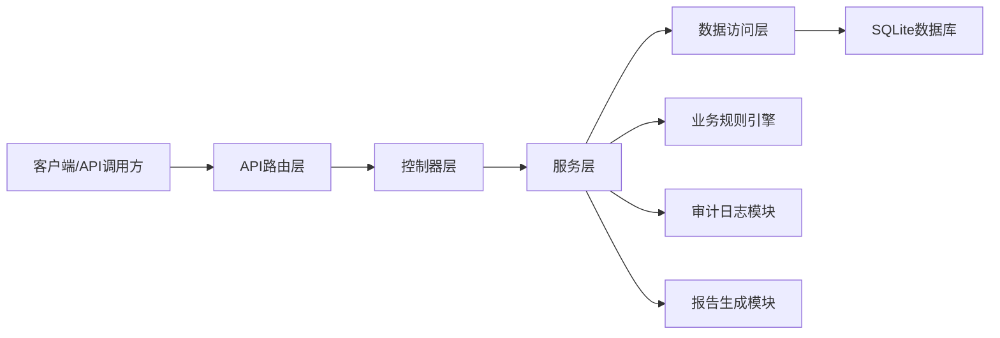
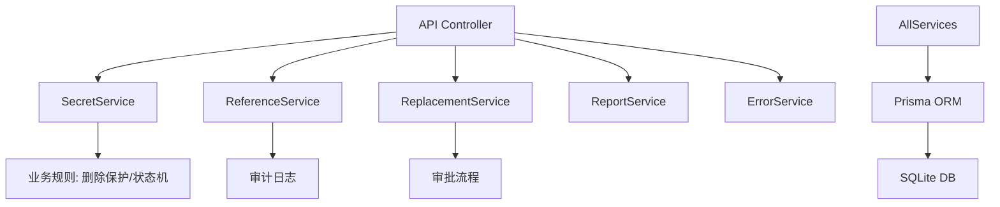
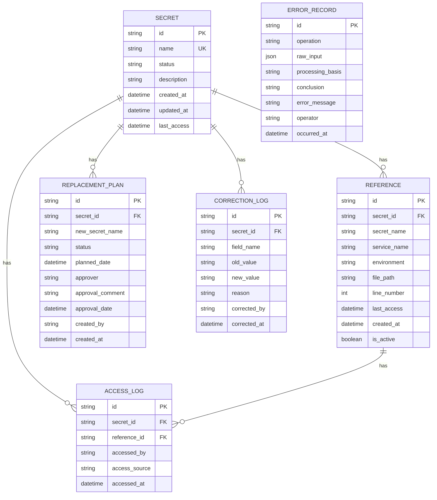

## 1. 架构设计


## 2. 技术选型
- 后端框架: Express@4 + TypeScript
- 数据库: SQLite (内置，无需额外服务)
- ORM: Prisma
- 数据校验: Zod
- 日志: Winston
- 初始化工具: npm init

## 3. 路由定义
| HTTP方法 | 路由 | 用途 |
|----------|------|------|
| POST | /api/secrets | 创建Secret |
| GET | /api/secrets | 查询Secret列表 |
| GET | /api/secrets/:name | 查询单个Secret详情 |
| POST | /api/secrets/:name/references | 登记引用 |
| GET | /api/secrets/:name/references | 查询引用列表 |
| POST | /api/secrets/:name/access | 记录访问 |
| PUT | /api/secrets/:name/status | 状态推进 |
| POST | /api/secrets/:name/replacements | 创建替换计划 |
| PUT | /api/replacements/:id/approve | 审批替换计划 |
| POST | /api/secrets/:name/corrections | 人工修正 |
| DELETE | /api/secrets/:name | 删除Secret（受保护） |
| GET | /api/secrets/:name/report | 导出血缘报告 |
| GET | /api/errors | 查询异常记录 |

## 4. API响应定义
```typescript
// 通用响应
interface ApiResponse<T> {
  success: boolean;
  data?: T;
  error?: ApiError;
}

interface ApiError {
  code: string;
  message: string;
  details: {
    raw_input: any;
    processing_basis: string;
    conclusion: string;
    references?: any[];
  };
}

// Secret数据模型
interface Secret {
  id: string;
  name: string;
  status: 'ACTIVE' | 'DEPRECATED' | 'PENDING_DELETION';
  description: string;
  created_at: Date;
  updated_at: Date;
  last_access: Date | null;
}

// 引用数据模型
interface Reference {
  id: string;
  secret_id: string;
  secret_name: string;
  service_name: string;
  environment: 'dev' | 'test' | 'staging' | 'prod';
  file_path?: string;
  line_number?: number;
  last_access: Date | null;
  created_at: Date;
  is_active: boolean;
}

// 替换计划模型
interface ReplacementPlan {
  id: string;
  secret_id: string;
  new_secret_name: string;
  status: 'PENDING_APPROVAL' | 'APPROVED' | 'REJECTED' | 'EXECUTED';
  planned_date: Date;
  approver?: string;
  approval_comment?: string;
  approval_date?: Date;
  created_by: string;
  created_at: Date;
}

// 异常记录模型
interface ErrorRecord {
  id: string;
  operation: string;
  raw_input: any;
  processing_basis: string;
  conclusion: string;
  error_message: string;
  occurred_at: Date;
  operator?: string;
}

// 血缘报告
interface LineageReport {
  secret: Secret;
  references: Reference[];
  replacement_history: ReplacementPlan[];
  access_logs: AccessLog[];
  summary: {
    total_references: number;
    active_references: number;
    environments: string[];
    last_access: Date | null;
  };
}
```

## 5. 服务层架构


## 6. 数据模型

### 6.1 ER图


### 6.2 Prisma Schema
```prisma
model Secret {
  id           String        @id @default(uuid())
  name         String        @unique
  status       String        @default("ACTIVE")
  description  String?
  created_at   DateTime      @default(now())
  updated_at   DateTime      @updatedAt
  last_access  DateTime?
  references   Reference[]
  replacements ReplacementPlan[]
  access_logs  AccessLog[]
  corrections  CorrectionLog[]
}

model Reference {
  id           String     @id @default(uuid())
  secret_id    String
  secret_name  String
  service_name String
  environment  String
  file_path    String?
  line_number  Int?
  last_access  DateTime?
  created_at   DateTime   @default(now())
  is_active    Boolean    @default(true)
  secret       Secret     @relation(fields: [secret_id], references: [id], onDelete: Cascade)
  access_logs  AccessLog[]
}

model ReplacementPlan {
  id               String   @id @default(uuid())
  secret_id        String
  new_secret_name  String
  status           String   @default("PENDING_APPROVAL")
  planned_date     DateTime
  approver         String?
  approval_comment String?
  approval_date    DateTime?
  created_by       String
  created_at       DateTime @default(now())
  secret           Secret   @relation(fields: [secret_id], references: [id], onDelete: Cascade)
}

model AccessLog {
  id            String    @id @default(uuid())
  secret_id     String
  reference_id  String?
  accessed_by   String?
  access_source String?
  accessed_at   DateTime  @default(now())
  secret        Secret    @relation(fields: [secret_id], references: [id], onDelete: Cascade)
  reference     Reference? @relation(fields: [reference_id], references: [id], onDelete: SetNull)
}

model CorrectionLog {
  id            String   @id @default(uuid())
  secret_id     String
  field_name    String
  old_value     String?
  new_value     String?
  reason        String
  corrected_by  String
  corrected_at  DateTime @default(now())
  secret        Secret   @relation(fields: [secret_id], references: [id], onDelete: Cascade)
}

model ErrorRecord {
  id               String   @id @default(uuid())
  operation        String
  raw_input        String
  processing_basis String
  conclusion       String
  error_message    String
  operator         String?
  occurred_at      DateTime @default(now())
}
```

## 7. 核心业务规则实现
1. **删除保护规则**: 删除前校验是否有活跃引用，有则拦截并记录ErrorRecord
2. **状态机规则**: ACTIVE -> DEPRECATED -> PENDING_DELETION，不可逆
3. **引用自动更新**: 登记引用时自动更新Secret的last_access时间
4. **审批规则**: 替换计划必须审批通过才能执行
5. **审计规则**: 所有修改操作记录操作人和时间
