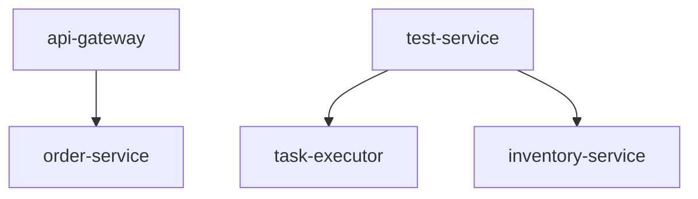

# Trace 链路排查报告: 4a3b2c1d0e9f8g7h

**生成时间**: 2026-05-19 16:05:44
**日志条目总数**: 13
**涉及服务数**: 5

## 一、链路概览

| 序号 | 时间戳 | 服务名 | 级别 | Span ID | 父 Span ID | 消息摘要 | 来源文件 |
|------|--------|--------|------|---------|------------|----------|----------|
| 1 | 10:00:00.000 | test-service | INFO | 00000005 | nonexistent | 缺失父Span | dirty_data.log |
| 2 | 10:00:00.000 | test-service | ERROR | 00000002 | - | 重复的SpanID | dirty_data.log |
| 3 | 10:00:00.123 | api-gateway | INFO | 00000001 | - | 请求进入网关 | gateway.log |
| 4 | 10:00:00.156 | api-gateway | INFO | 00000001 | null | 路由到订单服务 | gateway.log |
| 5 | 10:00:00.200 | order-service | INFO | 00000002 | 00000001 | 创建订单开始 | app.log |
| 6 | 10:00:00.350 | order-service | INFO | 00000002 | 00000001 | 调用库存服务 | app.log |
| 7 | 10:00:00.500 | inventory-service | INFO | 00000003 | 00000002 | 扣减库存 | app.log |
| 8 | 10:00:00.650 | inventory-service | INFO | 00000003 | 00000002 | 库存扣减成功 | app.log |
| 9 | 10:00:00.800 | order-service | INFO | 00000002 | 00000001 | 订单创建成功 | app.log |
| 10 | 10:00:01.000 | task-executor | INFO | 00000004 | 00000002 | 异步任务开始执行 | task.log |
| 11 | 10:00:02.500 | task-executor | INFO | 00000004 | 00000002 | 发送通知邮件 | task.log |
| 12 | 10:00:04.000 | task-executor | INFO | 00000004 | 00000002 | 异步任务完成 | task.log |
| 13 | 10:00:06.200 | api-gateway | INFO | 00000001 | - | 响应返回客户端 | gateway.log |

## 二、时序分析

- **开始时间**: 2026-05-19 10:00:00.000
- **结束时间**: 2026-05-19 10:00:06.200
- **总耗时**: 6200.00 ms

## 三、问题检测

### 3.1 时间缺口检测
✅ 未检测到异常时间缺口

### 3.2 缺失 Span 检测
⚠️  **发现 1 个缺失的父 Span:**

| 序号 | 缺失 Span ID | 子 Span ID | 服务名 | 消息 |
|------|--------------|------------|--------|------|
| 1 | nonexistent | 00000005 | test-service | 缺失父Span |

### 3.3 重复 Span 检测
⚠️  **发现 4 个重复 Span:**

- **Span ID**: 00000002, **出现次数**: 4
  - 涉及服务: test-service, order-service, order-service, order-service
- **Span ID**: 00000001, **出现次数**: 3
  - 涉及服务: api-gateway, api-gateway, api-gateway
- **Span ID**: 00000003, **出现次数**: 2
  - 涉及服务: inventory-service, inventory-service
- **Span ID**: 00000004, **出现次数**: 3
  - 涉及服务: task-executor, task-executor, task-executor

## 四、服务调用关系



## 五、原始日志

### 10:00:00.000 - test-service
```
2026-05-19 10:00:00 INFO [test-service] traceId=4a3b2c1d0e9f8g7h spanId=00000005 parentSpanId=nonexistent message=缺失父Span
```

### 10:00:00.000 - test-service
```
2026-05-19 10:00:00 ERROR [test-service] traceId=4a3b2c1d0e9f8g7h spanId=00000002 message=重复的SpanID
```

### 10:00:00.123 - api-gateway
```
2026-05-19 10:00:00.123 INFO [api-gateway] traceId=4a3b2c1d0e9f8g7h, spanId=00000001, message=请求进入网关
```

### 10:00:00.156 - api-gateway
```
2026-05-19 10:00:00.156 INFO [api-gateway] traceId=4a3b2c1d0e9f8g7h, spanId=00000001, parentSpanId=null, message=路由到订单服务
```

### 10:00:00.200 - order-service
```
2026-05-19T10:00:00.200Z INFO serviceName=order-service traceId=4a3b2c1d0e9f8g7h spanId=00000002 parentSpanId=00000001 message=创建订单开始
```

### 10:00:00.350 - order-service
```
2026-05-19T10:00:00.350Z INFO serviceName=order-service traceId=4a3b2c1d0e9f8g7h spanId=00000002 parentSpanId=00000001 message=调用库存服务
```

### 10:00:00.500 - inventory-service
```
2026-05-19T10:00:00.500Z INFO serviceName=inventory-service traceId=4a3b2c1d0e9f8g7h spanId=00000003 parentSpanId=00000002 message=扣减库存
```

### 10:00:00.650 - inventory-service
```
2026-05-19T10:00:00.650Z INFO serviceName=inventory-service traceId=4a3b2c1d0e9f8g7h spanId=00000003 parentSpanId=00000002 message=库存扣减成功
```

### 10:00:00.800 - order-service
```
2026-05-19T10:00:00.800Z INFO serviceName=order-service traceId=4a3b2c1d0e9f8g7h spanId=00000002 parentSpanId=00000001 message=订单创建成功
```

### 10:00:01.000 - task-executor
```
2026-05-19 10:00:01.000 INFO [task-executor] traceId=4a3b2c1d0e9f8g7h, spanId=00000004, parentSpanId=00000002, message=异步任务开始执行
```

### 10:00:02.500 - task-executor
```
2026-05-19 10:00:02.500 INFO [task-executor] traceId=4a3b2c1d0e9f8g7h, spanId=00000004, parentSpanId=00000002, message=发送通知邮件
```

### 10:00:04.000 - task-executor
```
2026-05-19 10:00:04.000 INFO [task-executor] traceId=4a3b2c1d0e9f8g7h, spanId=00000004, parentSpanId=00000002, message=异步任务完成
```

### 10:00:06.200 - api-gateway
```
2026-05-19 10:00:06.200 INFO [api-gateway] traceId=4a3b2c1d0e9f8g7h, spanId=00000001, message=响应返回客户端
```
