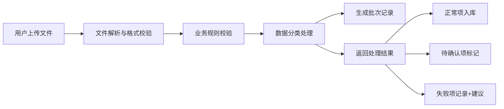

## 1. 产品概述

便利店运营数据统一API服务，解决货架盘点、补货单、销售数据口径不一致导致的导入混乱问题。

- 核心目的：统一便利店运营数据的标准化处理，将不同来源的数据进行校验、去重、分类
- 目标用户：便利店运营人员、数据管理人员
- 产品价值：提高数据准确性，减少人工核对成本，确保同一批材料重复提交

## 2. 核心功能

### 2.1 用户角色

| 角色 | 注册方式 | 核心权限 |
|------|----------|----------|
| 运营人员 | 系统分配 | 上传数据、查看处理结果、导出报告 |

### 2.2 功能模块

1. **数据导入API**: 支持CSV盘点数据、JSON销售数据、补货单上传
2. **数据校验引擎**: 实现业务规则校验（少补多补、临期品、SKU别名）
3. **结果分类**: 返回正常项、待确认项、失败项
4. **幂等处理**: 同一批材料再次提交不重复生效

### 2.3 页面详情

| 页面名称 | 模块名称 | 功能描述 |
|----------|----------|----------|
| 数据上传页面 | 文件上传区域 | 支持拖拽上传CSV/JSON文件 |
| 数据上传页面 | 结果展示 | 分栏展示正常/待确认/失败数据 |
| 数据上传页面 | 失败详情 | 显示失败记录原始字段和建议处理方式 |

## 3. 核心流程

用户上传盘点CSV、销售JSON、补货单文件 → 系统进行文件解析 → 业务规则校验 → 数据分类（正常/待确认/失败） → 返回处理结果，失败项保留原始字段和建议处理方式 → 记录批次号防止重复提交

## 4. 用户界面设计

### 4.1 设计风格

- 主色调：深蓝色 (#165DFF)，体现专业、可靠
- 辅助色：绿色 (#00B42A) 成功，橙色 (#FF7D00) 待确认，红色 (#F53F3F) 失败
- 按钮风格：圆角矩形，简洁现代
- 字体：系统无衬线字体，清晰易读
- 布局风格：卡片式布局，分区明确
- 图标风格：线性图标，简洁明了

### 4.2 页面设计概述

| 页面名称 | 模块名称 | UI元素 |
|----------|----------|--------|
| 数据上传页面 | 上传区域 | 拖拽框、文件选择按钮、批次号显示 |
| 数据上传页面 | 结果统计 | 三个统计卡片（正常/待确认/失败数量） |
| 数据上传页面 | 数据表格 | 可展开表格行显示详情 |

### 4.3 响应式

桌面优先设计，适配平板和移动端，表格支持横向滚动

### 4.4 点位编号示例

样例数据中包含点位编号字段（如：STORE-001），以及至少一条需要人工修正的记录
