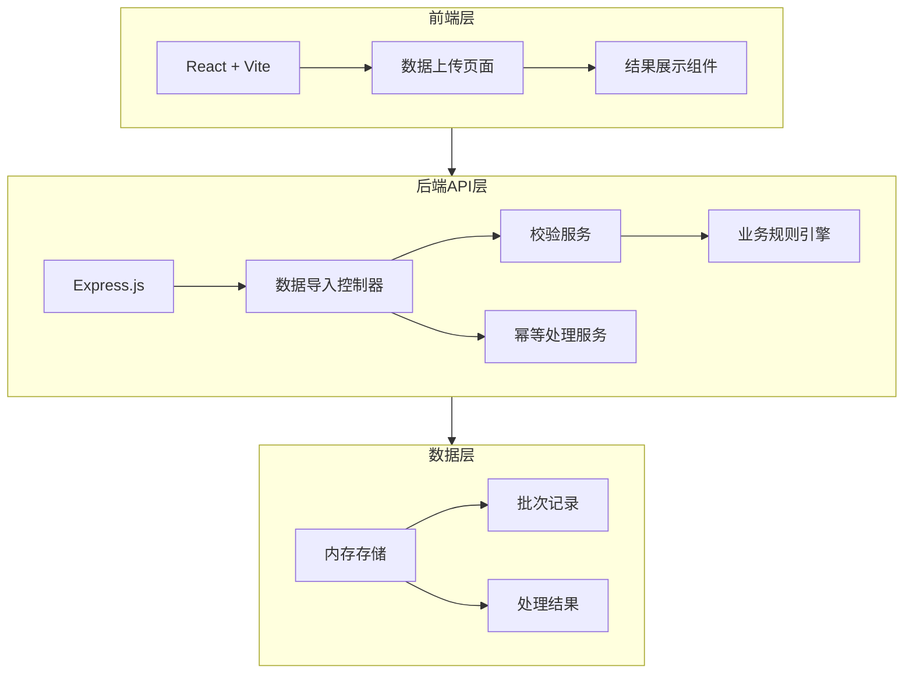
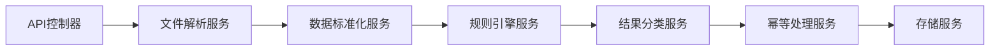
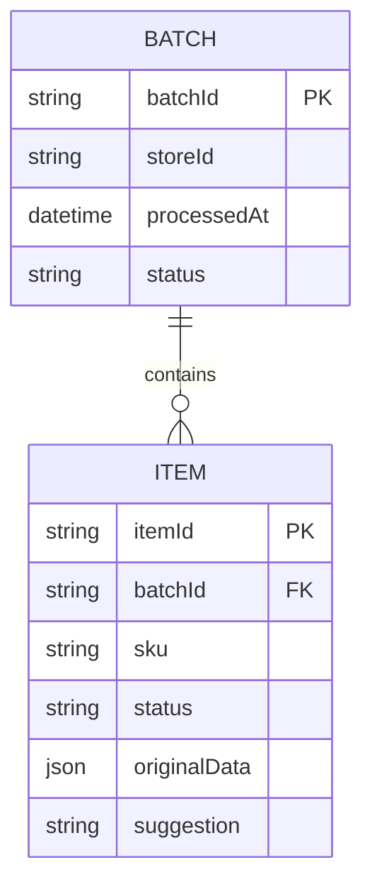

## 1. 架构设计



## 2. 技术选型

- 前端：React@18 + TypeScript + Vite + TailwindCSS@3
- 后端：Node.js + Express@4
- 文件解析：csv-parser、papaparse
- 数据校验：自定义规则引擎
- 存储：内存存储（演示用）

## 3. 路由定义

| 路由 | 方法 | 用途 |
|------|------|------|
| /api/import | POST | 上传盘点CSV、销售JSON、补货单 |
| /api/batch/:batchId | GET | 查询批次处理结果 |
| /api/batches | GET | 获取所有批次列表 |

## 4. API定义

### 4.1 数据导入请求

```typescript
interface ImportRequest {
  batchId: string;           // 批次号，用于幂等
  storeId: string;           // 点位编号
  inventoryCsv?: File;       // 盘点CSV文件
  salesJson?: File;          // 销售JSON文件
  replenishmentForm?: File;  // 补货单文件
}

interface ImportResponse {
  batchId: string;
  storeId: string;
  processedAt: string;
  summary: {
    total: number;
    normal: number;
    pending: number;
    failed: number;
  };
  data: {
    normal: NormalItem[];
    pending: PendingItem[];
    failed: FailedItem[];
  };
}

interface NormalItem {
  id: string;
  sku: string;
  skuName: string;
  quantity: number;
  source: 'inventory' | 'sales' | 'replenishment';
}

interface PendingItem {
  id: string;
  sku: string;
  skuName: string;
  quantity: number;
  source: string;
  reason: string;
  confidence: number;
}

interface FailedItem {
  id: string;
  originalData: Record<string, any>;
  source: string;
  errorType: string;
  errorMessage: string;
  suggestion: string;
}
```

### 4.2 业务规则

1. **少补多补校验**: 补货量与实际销量差异超过阈值时标记
2. **临期品校验**: 距过期日期小于30天的商品
3. **SKU别名校验**: 同一商品不同SKU名称的映射

## 5. 后端架构



## 6. 数据模型

### 6.1 ER图



### 6.2 样例数据

```json
{
  "batchId": "BATCH-20240520-001",
  "storeId": "STORE-001",
  "items": [
    {
      "sku": "SKU001",
      "skuName": "可口可乐500ml",
      "quantity": 50,
      "status": "normal"
    },
    {
      "sku": "SKU002",
      "skuName": "百事可乐500ml",
      "quantity": 200,
      "status": "pending",
      "reason": "补货量超出预期销量3倍，需确认"
    },
    {
      "sku": "SKU-UNKNOWN",
      "skuName": "未知商品",
      "status": "failed",
      "originalData": { "商品编码": "XXX", "数量": "abc" },
      "suggestion": "请核对商品编码是否正确，或在SKU别名表中添加映射"
    }
  ]
}
```
