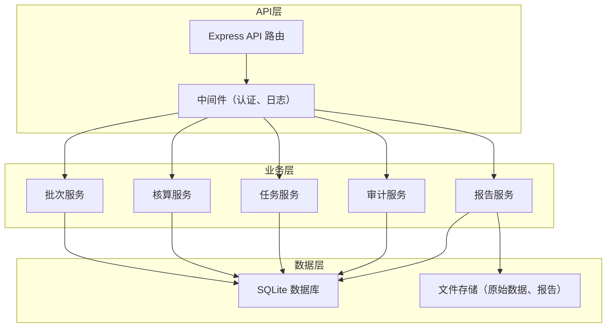
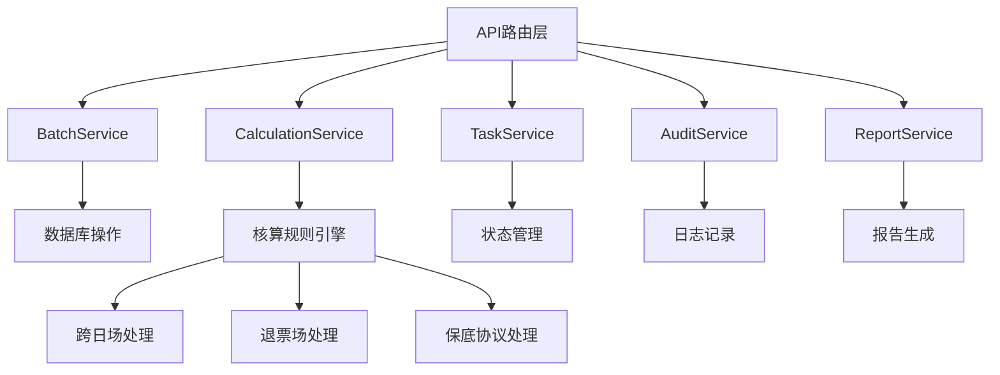
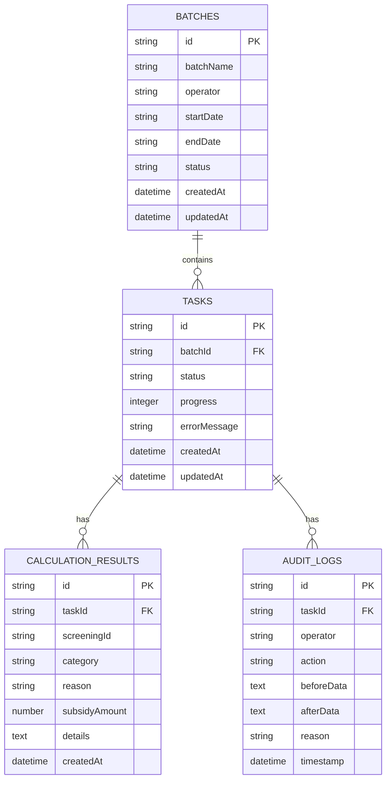

## 1. 架构设计



## 2. 技术描述

* 后端：Node.js + Express\@4

* 数据库：SQLite + better-sqlite3

* 文件存储：本地文件系统

* 初始化工具：npm init

* API测试：curl 脚本

## 3. 路由定义

| 路由                        | 方法   | 用途     |
| ------------------------- | ---- | ------ |
| /api/batches              | POST | 创建批次   |
| /api/batches              | GET  | 查询批次列表 |
| /api/batches/:id          | GET  | 查询批次详情 |
| /api/batches/:id/process  | POST | 触发核算   |
| /api/tasks/:id            | GET  | 查询任务状态 |
| /api/tasks/:id/confirm    | POST | 人工确认   |
| /api/tasks/:id/conclusion | PUT  | 修改结论   |
| /api/audit/:taskId        | GET  | 查询审计日志 |
| /api/reports/:batchId     | GET  | 导出报告   |

## 4. API 定义

```typescript
// 批次创建请求
interface CreateBatchRequest {
  batchName: string;
  operator: string;
  period: {
    startDate: string;
    endDate: string;
  };
  rawData: ScreeningData[];
}

// 排片原始数据
interface ScreeningData {
  screeningId: string;
  cinemaId: string;
  cinemaName: string;
  filmId: string;
  filmName: string;
  startTime: string;
  endTime: string;
  totalBoxOffice: number;
  refundAmount: number;
  audienceCount: number;
  hasMinimumGuarantee: boolean;
  guaranteeAmount?: number;
  isCrossDay: boolean;
}

// 核算结果
interface CalculationResult {
  screeningId: string;
  category: 'normal' | 'pending' | 'blocked';
  reason?: string;
  subsidyAmount: number;
  calculationDetails: {
    isCrossDay: boolean;
    crossDaySplit?: { date: string; amount: number }[];
    refundDeduction: number;
    guaranteeApplied: boolean;
    guaranteeAmount?: number;
    finalBoxOffice: number;
  };
}

// 任务状态
interface TaskStatus {
  taskId: string;
  batchId: string;
  status: 'processing' | 'failed' | 'pending_confirmation' | 'exported';
  progress: number;
  errorMessage?: string;
  createdAt: string;
  updatedAt: string;
}

// 审计记录
interface AuditLog {
  id: string;
  taskId: string;
  operator: string;
  action: string;
  beforeData?: any;
  afterData?: any;
  reason?: string;
  timestamp: string;
}
```

## 5. 服务层架构



## 6. 数据模型

### 6.1 数据模型定义



### 6.2 数据库初始化脚本

```sql
CREATE TABLE batches (
  id TEXT PRIMARY KEY,
  batchName TEXT NOT NULL,
  operator TEXT NOT NULL,
  startDate TEXT NOT NULL,
  endDate TEXT NOT NULL,
  status TEXT NOT NULL DEFAULT 'created',
  rawData TEXT,
  createdAt TEXT NOT NULL,
  updatedAt TEXT NOT NULL
);

CREATE TABLE tasks (
  id TEXT PRIMARY KEY,
  batchId TEXT NOT NULL,
  status TEXT NOT NULL DEFAULT 'processing',
  progress INTEGER NOT NULL DEFAULT 0,
  errorMessage TEXT,
  createdAt TEXT NOT NULL,
  updatedAt TEXT NOT NULL,
  FOREIGN KEY (batchId) REFERENCES batches(id)
);

CREATE TABLE calculation_results (
  id TEXT PRIMARY KEY,
  taskId TEXT NOT NULL,
  screeningId TEXT NOT NULL,
  cinemaId TEXT NOT NULL,
  cinemaName TEXT NOT NULL,
  filmId TEXT NOT NULL,
  filmName TEXT NOT NULL,
  category TEXT NOT NULL,
  reason TEXT,
  subsidyAmount REAL NOT NULL,
  details TEXT NOT NULL,
  createdAt TEXT NOT NULL,
  FOREIGN KEY (taskId) REFERENCES tasks(id)
);

CREATE TABLE audit_logs (
  id TEXT PRIMARY KEY,
  taskId TEXT NOT NULL,
  operator TEXT NOT NULL,
  action TEXT NOT NULL,
  beforeData TEXT,
  afterData TEXT,
  reason TEXT,
  timestamp TEXT NOT NULL,
  FOREIGN KEY (taskId) REFERENCES tasks(id)
);

CREATE INDEX idx_tasks_batchId ON tasks(batchId);
CREATE INDEX idx_results_taskId ON calculation_results(taskId);
CREATE INDEX idx_audit_taskId ON audit_logs(taskId);
```

