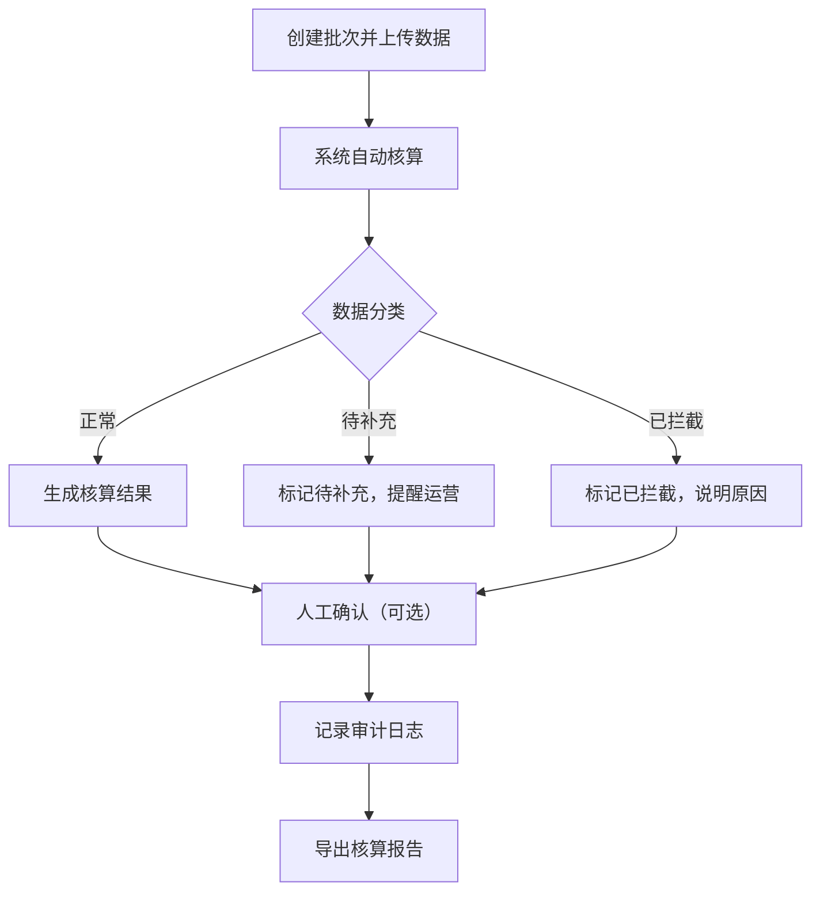

## 1. 产品概述
影院排片补贴核算API服务，为院线运营提供自动化的补贴核算处理能力，解决人工核算效率低、追溯困难的问题。
- 核心目标：实现排片补贴的自动化分类、核算、审计和报告导出
- 目标用户：院线运营人员、财务审核人员、系统管理员
- 价值：提升核算效率，确保数据可追溯，减少人工错误

## 2. 核心功能

### 2.1 用户角色
| 角色 | 注册方式 | 核心权限 |
|------|----------|----------|
| 院线运营 | 系统账号 | 创建批次、上传材料、查看任务、下载报告 |
| 审核人员 | 系统账号 | 人工确认、修改结论、查看审计日志 |
| 系统管理员 | 系统账号 | 全功能权限、系统配置 |

### 2.2 功能模块
1. **批次管理**：创建核算批次、上传原始数据、查看批次状态
2. **数据处理**：自动分类（正常/待补充/已拦截）、核算逻辑、状态流转
3. **任务管理**：任务状态跟踪、人工确认、异常处理
4. **审计追溯**：操作日志、修改记录、字段溯源
5. **报告导出**：核算报告生成、下载、历史查询

### 2.3 接口详情
| 接口名称 | 模块名称 | 功能描述 |
|----------|----------|----------|
| 创建批次 | 批次管理 | 创建新的核算批次，上传原始排片数据 |
| 查询批次 | 批次管理 | 查看批次列表和详情 |
| 触发核算 | 数据处理 | 启动批次的核算处理 |
| 任务状态 | 任务管理 | 查询任务处理状态 |
| 人工确认 | 任务管理 | 对异常任务进行人工确认 |
| 修改结论 | 任务管理 | 修改核算结论并记录原因 |
| 审计日志 | 审计追溯 | 查看操作历史和修改记录 |
| 导出报告 | 报告导出 | 生成并下载核算报告 |

## 3. 核心流程
院线运营创建批次并上传排片数据，系统自动核算并分类，正常数据生成报告，待补充数据提醒运营完善，异常数据拦截。审核人员可人工确认并修改结论，所有操作记录审计日志，最终导出核算报告。

## 4. 技术设计
### 4.1 技术选型
- 后端框架：Node.js + Express
- 数据库：SQLite（文件型，便于部署）
- 数据持久化：文件存储 + 数据库
- API风格：RESTful

### 4.2 核心核算逻辑
- 跨日场：按实际放映日期拆分核算
- 退票场：扣除退票金额后计算
- 保底协议：按保底金额与实际票房取高值计算

### 4.3 状态管理
- 处理中：任务正在进行核算
- 处理失败：核算过程出现错误
- 人工确认：等待审核人员确认
- 已导出：报告已生成并可下载

### 4.4 审计功能
- 记录操作人、操作时间
- 保存修改前后的数据快照
- 支持字段级追溯
