# K8s PVC Orphan Analysis Report

**Generated:** 2026-05-24 21:55:38

## Executive Summary

| Metric | Value |
|--------|-------|
| Total PVCs analyzed | 7 |
| Orphan PVCs found | **5** |
| Referenced PVCs | 2 |
| Total resources scanned | 13 |
| References tracked | 14 |
| Errors | 0 |
| Warnings | 0 |

## Resource Graph Explanation

The tool builds a resource reference graph by tracking:

- **Direct references**: Pod → PVC via `spec.volumes[].persistentVolumeClaim.claimName`
- **CronJob references**: CronJob → Pod template → PVC (indirect reference)
- **Job references**: Job → Pod template → PVC, plus ownerReferences to CronJob
- **StatefulSet references**:
  - Direct volume claims
  - VolumeClaimTemplates (pattern matching: `{tmpl}-{sts-name}-{ordinal}`)
- **Workload references**: Deployment/DaemonSet/ReplicaSet → Pod template → PVC

## Reference Types Tracked

| Reference Type | Description |
|----------------|-------------|
| `direct` | Direct Pod to PVC reference |
| `cronjob-template` | CronJob's job template references PVC |
| `job-template` | Job's pod template references PVC |
| `sts-volumeclaimtemplate` | StatefulSet VolumeClaimTemplate (pattern match) |
| `sts-direct` | StatefulSet direct volume reference |
| `deployment-template` | Deployment pod template reference |

## Retention Rules

The following rules are checked to determine if a PVC should be kept:

1. **Namespace Protection**: PVCs in protected namespaces (kube-system, etc.)
2. **Retention Labels**: `pvc-orphan/retention-policy=retain`
3. **Expiry Labels**: `pvc-orphan/expires-at=YYYY-MM-DD`
4. **Protected Labels**: Common app labels like `app.kubernetes.io/name`
5. **Storage Class**: StorageClass name containing 'retain'
6. **Retention Annotations**: Annotations containing 'retain'

## Cleanup Recommendations

| Recommendation | Meaning | Action |
|----------------|---------|--------|
| `keep` | PVC is actively referenced | Keep |
| `keep-protected` | Orphan but has active retention rules | Review, keep if needed |
| `delete-expired` | Orphan with expired retention | Safe to delete |
| `review-delete` | Orphan, no protection | Review carefully, delete if unused |

## 🚨 Orphan PVC Details

### default/orphan-with-retention

| Field | Value |
|-------|-------|
| Namespace | default |
| Name | orphan-with-retention |
| Source | `testdata/pvcs.yaml:29-42` |
| Cleanup Recommendation | **KEEP-PROTECTED** |

**Labels:**

- `pvc-orphan/retention-policy=retain`

**Retention Rules:**

- ✅ **retention-label**: PVC has retention label 'pvc-orphan/retention-policy=retain'

**Storage Request:** 20Gi

### default/orphan-expired

| Field | Value |
|-------|-------|
| Namespace | default |
| Name | orphan-expired |
| Source | `testdata/pvcs.yaml:43-56` |
| Cleanup Recommendation | **DELETE-EXPIRED** |

**Labels:**

- `pvc-orphan/expires-at=2020-01-01`

**Issues:**

- ⚠️ Has expired retention rules

**Retention Rules:**

- ❌ **expiry-label**: PVC expiry label 'pvc-orphan/expires-at=2020-01-01'

**Storage Request:** 15Gi

### default/cross-ns-same-name

| Field | Value |
|-------|-------|
| Namespace | default |
| Name | cross-ns-same-name |
| Source | `testdata/pvcs.yaml:57-68` |
| Cleanup Recommendation | **REVIEW-DELETE** |

**Issues:**

- ⚠️ Cross-namespace PVC with same name exists - verify correct namespace

**Storage Request:** 8Gi

### other-ns/cross-ns-same-name

| Field | Value |
|-------|-------|
| Namespace | other-ns |
| Name | cross-ns-same-name |
| Source | `testdata/pvcs.yaml:69-80` |
| Cleanup Recommendation | **REVIEW-DELETE** |

**Issues:**

- ⚠️ Cross-namespace PVC with same name exists - verify correct namespace

**Storage Request:** 8Gi

### kube-system/kube-db-pvc

| Field | Value |
|-------|-------|
| Namespace | kube-system |
| Name | kube-db-pvc |
| Source | `testdata/pvcs.yaml:81-92` |
| Cleanup Recommendation | **KEEP-PROTECTED** |

**Retention Rules:**

- ✅ **namespace-protection**: Namespace 'kube-system' matches protected pattern 'kube-system'

**Storage Request:** 100Gi

## ✅ Referenced PVCs

| PVC | References | Source |
|-----|------------|--------|
| default/active-pvc | default/Pod/my-app-pod | testdata/pvcs.yaml:1-15 |
| default/orphan-unprotected | default/CronJob/backup-cronjob | testdata/pvcs.yaml:16-28 |

## Reference Graph

```mermaid
graph TD

    PVC_default_active_pvc["default/active-pvc"]
    style PVC_default_active_pvc fill:#e0e0e0,fill:#ccffcc
    PVC_default_orphan_unprotected["default/orphan-unprotected"]
    style PVC_default_orphan_unprotected fill:#e0e0e0,fill:#ccffcc
    PVC_default_orphan_with_retention["default/orphan-with-retention"]
    style PVC_default_orphan_with_retention fill:#e0e0e0,fill:#ffcccc
    PVC_default_orphan_expired["default/orphan-expired"]
    style PVC_default_orphan_expired fill:#e0e0e0,fill:#ffcccc
    PVC_default_cross_ns_same_name["default/cross-ns-same-name"]
    style PVC_default_cross_ns_same_name fill:#e0e0e0,fill:#ffcccc
    PVC_other_ns_cross_ns_same_name["other-ns/cross-ns-same-name"]
    style PVC_other_ns_cross_ns_same_name fill:#e0e0e0,fill:#ffcccc
    PVC_kube_system_kube_db_pvc["kube-system/kube-db-pvc"]
    style PVC_kube_system_kube_db_pvc fill:#e0e0e0,fill:#ffcccc

    default_Pod_my_app_pod -.-> default_PersistentVolumeClaim_active_pvc
    default_CronJob_backup_cronjob -.-> default_PersistentVolumeClaim_orphan_unprotected
    default_Deployment_web_app -.-> default_PersistentVolumeClaim_non_existent_pvc
    default_StatefulSet_database -.-> default_PersistentVolumeClaim_db_data_database_0
    default_StatefulSet_database -.-> default_PersistentVolumeClaim_db_data_database_1
    default_StatefulSet_database -.-> default_PersistentVolumeClaim_db_data_database_2
    default_StatefulSet_database -.-> default_PersistentVolumeClaim_db_data_database_3
    default_StatefulSet_database -.-> default_PersistentVolumeClaim_db_data_database_4
    default_StatefulSet_database -.-> default_PersistentVolumeClaim_db_data_database_5
    default_StatefulSet_database -.-> default_PersistentVolumeClaim_db_data_database_6
    default_StatefulSet_database -.-> default_PersistentVolumeClaim_db_data_database_7
    default_StatefulSet_database -.-> default_PersistentVolumeClaim_db_data_database_8
    default_StatefulSet_database -.-> default_PersistentVolumeClaim_db_data_database_9
    default_Job_one_time_job --> default_CronJob_backup_cronjob
```

---

*Report generated by pvc-orphan-finder*