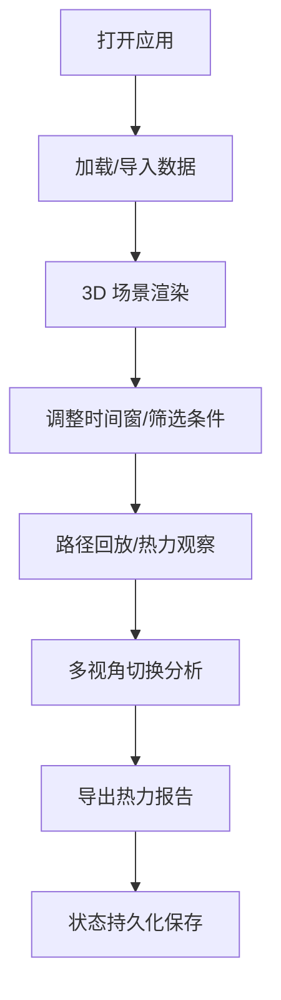

# 仓库巷道拣货热力图 - 产品需求文档 (PRD)

## 1. 产品概述

面向仓库主管的 3D 交互式拣货路径分析工具，通过可视化热力图直观展示巷道拥堵情况和拣货效率问题，帮助优化仓库布局和拣货路线。

- 解决问题：传统纸面表格无法直观展示窄巷拥堵、货位绕路等空间问题
- 目标用户：仓库主管、运营分析人员、物流优化工程师
- 核心价值：将一周拣货数据转化为可交互的 3D 热力图，支持路径复盘和效率优化

## 2. 核心功能

### 2.1 用户角色

| 角色 | 使用方式 | 核心需求 |
|------|----------|----------|
| 仓库主管 | 浏览器访问 | 快速查看拥堵热点、导出分析报告 |
| 运营分析 | 深度交互 | 时间窗筛选、多视角切换、路径回放 |

### 2.2 功能模块

1. **3D 仓库场景**：货架、巷道、叉车路径的真实比例渲染
2. **路径回放系统**：按时间轴播放拣货员/叉车移动轨迹
3. **热力聚合图层**：基于通行频率和停留时间的热力图叠加
4. **时间筛选面板**：按日期、时段、拣货单筛选数据
5. **报告导出模块**：生成包含热力图和统计数据的分析报告
6. **状态持久化**：刷新页面保留筛选条件和关键状态

### 2.3 页面详情

| 页面名称 | 模块名称 | 功能描述 |
|---------|----------|----------|
| 主工作台 | 3D 视口 | Three.js 渲染仓库场景，支持拖拽旋转、缩放、平移 |
| 主工作台 | 顶部工具栏 | 导入样例、视角切换、重置状态、导出报告 |
| 主工作台 | 左侧面板 | 货架列表、拣货单筛选、巷道信息 |
| 主工作台 | 底部时间轴 | 时间范围选择、播放控制、进度拖拽 |
| 主工作台 | 右侧面板 | 热力图例、统计指标、拥堵排名 |

## 3. 核心流程

### 3.1 用户操作流程

用户打开页面后，可直接加载样例数据，通过时间轴和筛选器调整查看范围，在 3D 场景中观察热力分布，最后导出分析报告。

### 3.2 数据处理流程

## 4. 用户界面设计

### 4.1 设计风格

- **主色调**：工业蓝 (#165DFF) 作为主色，深灰 (#1D2129) 背景
- **辅助色**：热力渐变从蓝 → 绿 → 黄 → 橙 → 红
- **按钮风格**：直角矩形，轻微悬浮效果，工业风
- **字体**：JetBrains Mono 等宽字体 + Roboto 无衬线字体
- **布局风格**：深色仪表盘风格，面板半透明毛玻璃效果
- **图标风格**：线性图标，简洁专业

### 4.2 页面设计概览

| 页面名称 | 模块名称 | UI 元素 |
|---------|----------|---------|
| 主工作台 | 3D 视口 | 悬浮操作提示、视角指示器、坐标系辅助线 |
| 主工作台 | 顶部工具栏 | 图标按钮组、下拉菜单、状态指示器 |
| 主工作台 | 侧边面板 | 可折叠、标签页切换、滚动容器 |
| 主工作台 | 时间轴 | 滑块、播放按钮、时间刻度、热力预览条 |

### 4.3 响应式

- Desktop-first 设计，优先支持 1920×1080 及以上分辨率
- 侧边面板可折叠以适应小屏幕
- 时间轴在窄屏时自动调整高度

### 4.4 3D 场景指引

- **环境**：深色工业风格仓库，顶面和地面采用网格纹理
- **光照**：主光源 + 环境光 + 补光，确保货架和路径清晰可见
- **相机**：默认 45° 俯视视角，支持轨道控制、正交/透视切换
- **交互**：鼠标拖拽旋转，滚轮缩放，右键平移，双击聚焦
- **动画**：路径回放平滑动画，热力图渐入效果，视角切换过渡
- **后处理**：轻微泛光效果，增强科技感，FPS 优化确保 60fps
- **资源**：程序化生成所有几何体，无外部模型依赖

