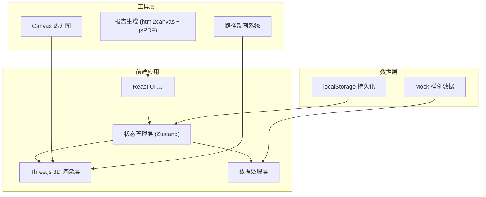
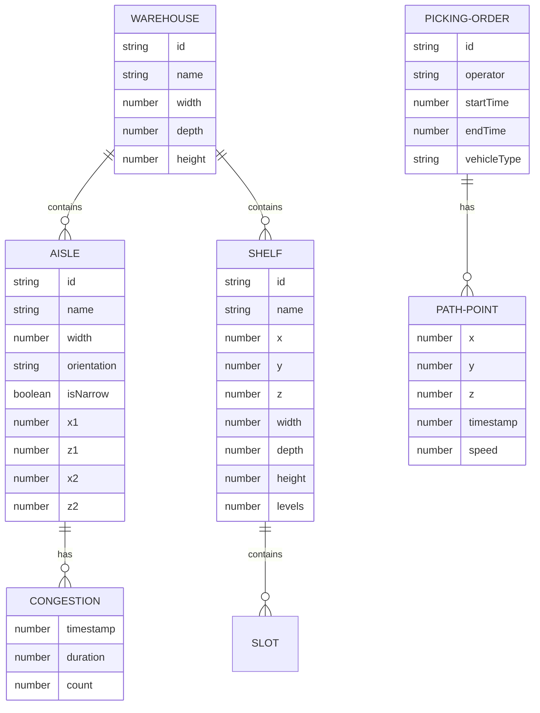

# 仓库巷道拣货热力图 - 技术架构文档

## 1. 架构设计



## 2. 技术选型说明

### 2.1 核心技术栈
- **前端框架**: React 18 + TypeScript
- **构建工具**: Vite 5
- **样式方案**: Tailwind CSS 3
- **3D 渲染**: Three.js 0.160
- **状态管理**: Zustand (轻量、支持持久化)
- **图标**: Lucide React

### 2.2 关键库
- `three`: 3D 场景渲染核心
- `@types/three`: TypeScript 类型支持
- `zustand`: 全局状态管理 + 持久化中间件
- `lucide-react`: 图标库
- `html2canvas`: 截图生成报告
- `jspdf`: PDF 报告导出

## 3. 目录结构

```
src/
├── components/           # React 组件
│   ├── Toolbar.tsx       # 顶部工具栏
│   ├── SidebarLeft.tsx   # 左侧筛选面板
│   ├── SidebarRight.tsx  # 右侧热力面板
│   ├── Timeline.tsx      # 底部时间轴
│   └── Viewport3D.tsx    # 3D 视口容器
├── store/                # 状态管理
│   └── useStore.ts       # Zustand store + 持久化
├── three/                # Three.js 相关
│   ├── WarehouseScene.ts # 仓库场景类
│   ├── Shelf.ts          # 货架组件
│   ├── PathRenderer.ts   # 路径渲染器
│   └── HeatmapLayer.ts   # 热力图层
├── data/                 # 数据和类型
│   ├── mockData.ts       # 样例数据
│   └── types.ts          # TypeScript 类型定义
├── utils/                # 工具函数
│   ├── heatmap.ts        # 热力计算
│   ├── path.ts           # 路径处理
│   └── export.ts         # 报告导出
├── App.tsx
├── main.tsx
└── index.css
```

## 4. 状态管理设计

### 4.1 Zustand Store 结构

```typescript
interface AppState {
  // 数据状态
  warehouseData: Warehouse | null;
  pickingOrders: PickingOrder[];
  selectedOrders: string[];
  
  // 时间筛选
  timeRange: { start: number; end: number };
  currentTime: number;
  isPlaying: boolean;
  playbackSpeed: number;
  
  // 视角状态
  cameraPosition: Vector3Tuple;
  cameraTarget: Vector3Tuple;
  viewMode: 'perspective' | 'top' | 'front' | 'side';
  
  // 显示选项
  showHeatmap: boolean;
  showPaths: boolean;
  showShelves: boolean;
  heatmapIntensity: number;
  
  // 操作方法
  setTimeRange: (start: number, end: number) => void;
  setCurrentTime: (time: number) => void;
  togglePlay: () => void;
  selectOrder: (id: string) => void;
  setViewMode: (mode: string) => void;
  resetState: () => void;
}
```

### 4.2 持久化配置
- 使用 `zustand/middleware/persist`
- 持久化字段：`timeRange`, `selectedOrders`, `viewMode`, `showHeatmap`, `heatmapIntensity`
- Storage：`localStorage`
- Version：1.0（支持后续迁移）

## 5. 数据模型

### 5.1 核心数据结构



### 5.2 坐标系规范
- **统一右手坐标系**：X-横轴，Y-高度，Z-纵深
- **单位**：米
- **原点**：仓库左下角地面
- **巷道方向**：沿 Z 轴为主通道，X 轴为副通道

## 6. 热力图算法

### 6.1 热力值计算
```typescript
// 每个路径点贡献的热力值 = 基础权重 × 停留时间系数 × 巷道宽度系数
heatValue = baseWeight * (1 + dwellTimeFactor) * aisleWidthFactor

// 窄巷（宽度 < 2.5m）系数 2.0，普通巷道 1.0
aisleWidthFactor = aisle.width < 2.5 ? 2.0 : 1.0
```

### 6.2 热力渲染方式
1. **Canvas 2D 预渲染**：在离屏 Canvas 绘制热力圆斑，使用径向渐变
2. **Three.js 纹理叠加**：将 Canvas 作为 AlphaMap 应用到地面平面
3. **颜色映射**：通过着色器将灰度值映射到蓝-绿-黄-橙-红色谱

## 7. 性能优化策略

1. **实例化渲染 (InstancedMesh)**：货架统一使用 InstancedMesh 绘制
2. **路径简化**：使用 Ramer-Douglas-Peucker 算法简化路径点
3. **LOD 策略**：远距离货架降低细节
4. **热力图更新节流**：时间轴拖拽时 60fps，静态时按需更新
5. **WebWorker 计算**：大数据量时热力计算移至 Worker

