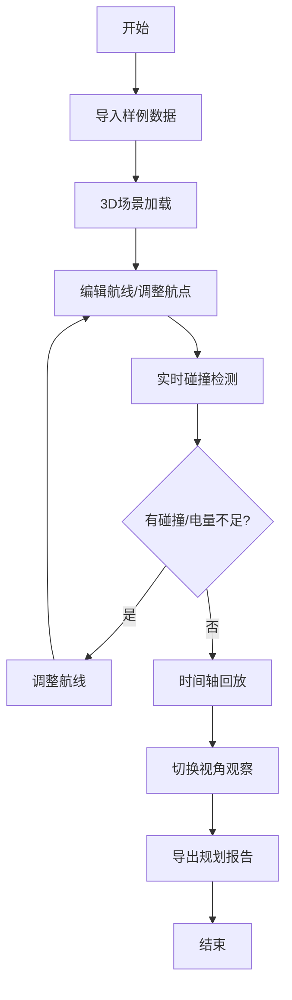

## 1. 产品概述
无人机禁飞走廊规划系统，为测绘队提供交互式3D航线规划与复盘工具，解决新人理解高楼、禁飞区和返航电量关系的培训需求。
- 核心价值：通过可视化交互降低培训成本，减少航线穿越禁飞区、返航电量不足、高度单位混用等常见错误
- 目标用户：测绘队新人、无人机操作员、航线规划师

## 2. 核心功能

### 2.1 用户角色
| 角色 | 注册方式 | 核心权限 |
|------|----------|----------|
| 测绘队员 | 无需注册 | 使用所有规划和复盘功能 |

### 2.2 功能模块
1. **3D城市主场景**：楼体渲染、禁飞区可视化、无人机航线展示
2. **航线编辑器**：航点拖拽、高度调整、航线预览
3. **碰撞检测系统**：禁飞区穿越预警、高楼碰撞提示
4. **电量模拟系统**：实时电量曲线、返航电量计算、低电量告警
5. **时间轴控制器**：任务回放、视角切换、速度调节
6. **数据导入导出**：样例导入、筛选、规划报告导出

### 2.3 页面详情
| 页面名称 | 模块名称 | 功能描述 |
|----------|----------|----------|
| 主规划页面 | 3D视窗 | WebGL渲染城市、航线、禁飞区，支持视角控制 |
| 主规划页面 | 左侧控制面板 | 样例导入、任务批次管理、筛选条件 |
| 主规划页面 | 底部时间轴 | 播放/暂停、进度拖拽、视角切换 |
| 主规划页面 | 右侧信息面板 | 电量曲线、碰撞告警、当前状态 |
| 报告预览弹窗 | 报告导出 | 基于当前视角和状态生成PDF报告 |

## 3. 核心流程
用户导入样例数据 → 在3D场景中编辑航点 → 系统实时检测碰撞和电量 → 通过时间轴回放任务 → 确认无误后导出规划报告

## 4. 用户界面设计

### 4.1 设计风格
- 主色调：深蓝科技感 (#0F172A) 配亮青高亮 (#06B6D4)
- 辅助色：警告橙 (#F59E0B)、危险红 (#EF4444)、成功绿 (#10B981)
- 按钮风格：扁平化圆角，悬浮有发光效果
- 字体：JetBrains Mono（等宽科技感）+ Noto Sans SC（中文）
- 布局：暗黑模式，三栏布局（左控制面板 + 中3D视窗 + 右信息面板）
- 图标风格：线条型SVG图标，统一24px尺寸

### 4.2 页面设计概述
| 页面名称 | 模块名称 | UI元素 |
|----------|----------|--------|
| 主规划页面 | 3D视窗 | 全屏WebGL画布、鼠标滚轮缩放、右键旋转、中键平移 |
| 主规划页面 | 左侧面板 | 折叠式菜单、导入按钮、任务列表、筛选复选框 |
| 主规划页面 | 底部时间轴 | 进度条、播放控制、速度选择、视角切换按钮组 |
| 主规划页面 | 右侧面板 | 电量曲线图、告警列表、实时数据指标卡 |
| 报告弹窗 | 导出界面 | 报告预览、导出按钮、视角快照、数据摘要 |

### 4.3 响应性
- Desktop-first设计，最小支持1280px宽度
- 面板可拖拽调整宽度，支持折叠隐藏
- 3D视窗自适应剩余空间

### 4.4 3D场景指导
- **环境**：城市日景，HDRI环境贴图，柔和漫反射
- **光照**：主方向光模拟太阳光 + 环境光补光 + 楼体边缘高光
- **相机设置**：Perspective相机，fov=60，初始俯视角45度
- **相机运动**：OrbitControls支持环绕、缩放、平移，支持第一人称飞行视角切换
- **构图**：城市居中，航线用发光线条突出，禁飞区半透明红色覆盖
- **交互**：航点可拖拽，悬停显示详细信息，点击选中
- **后处理**：Bloom效果增强发光线条，FXAA抗锯齿，轻微景深
- **性能**：LOD动态降质，实例化渲染楼体，目标帧率60fps
