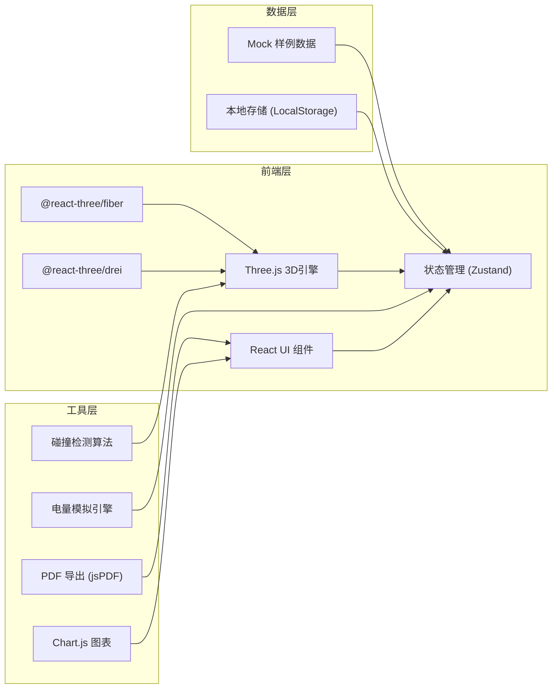
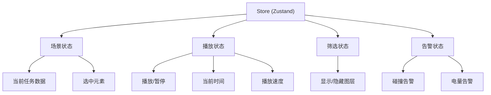

## 1. 架构设计



## 2. 技术描述

- **前端框架**: React@18 + TypeScript
- **构建工具**: Vite@5
- **样式方案**: TailwindCSS@3
- **3D引擎**: Three.js + @react-three/fiber + @react-three/drei
- **后处理**: @react-three/postprocessing
- **状态管理**: Zustand
- **图表库**: Chart.js + react-chartjs-2
- **PDF导出**: jsPDF + html2canvas
- **后端**: 无（纯前端应用）
- **数据库**: LocalStorage + Mock数据

## 3. 核心目录结构

```
src/
├── components/          # React组件
│   ├── ui/             # 基础UI组件
│   ├── panels/         # 控制面板组件
│   ├── timeline/       # 时间轴组件
│   └── report/         # 报告导出组件
├── store/              # Zustand状态管理
├── scenes/             # 3D场景相关
│   ├── CityScene.tsx   # 城市主场景
│   ├── Buildings.tsx   # 楼体组件
│   ├── NoFlyZone.tsx   # 禁飞区组件
│   ├── FlightPath.tsx  # 航线组件
│   └── Drone.tsx       # 无人机组件
├── utils/              # 工具函数
│   ├── collision.ts    # 碰撞检测
│   ├── battery.ts      # 电量模拟
│   └── export.ts       # 导出功能
├── data/               # Mock数据
├── types/              # TypeScript类型定义
└── App.tsx             # 主应用入口
```

## 4. 路由定义

| 路由 | 用途 |
|------|------|
| / | 主规划页面（唯一页面，单页应用） |

## 5. 数据模型

### 5.1 核心类型定义

```typescript
// 3D坐标点
interface Point3D {
  x: number;
  y: number;  // 高度
  z: number;
  unit: 'meter' | 'feet';  // 高度单位
}

// 楼体
interface Building {
  id: string;
  name: string;
  position: Point3D;
  width: number;
  depth: number;
  height: number;
  color: string;
}

// 禁飞区
interface NoFlyZone {
  id: string;
  name: string;
  type: 'polygon' | 'circle';
  coordinates: Point3D[];  // 多边形顶点
  radius?: number;         // 圆形半径
  minHeight: number;
  maxHeight: number;
  color: string;
}

// 航点
interface Waypoint {
  id: string;
  position: Point3D;
  speed: number;      // 飞行速度 m/s
  stayTime: number;   // 停留时间 s
}

// 航线
interface FlightPath {
  id: string;
  name: string;
  waypoints: Waypoint[];
  color: string;
}

// 电量记录点
interface BatteryPoint {
  time: number;       // 时间点 s
  percentage: number; // 电量百分比
  distance: number;   // 已飞行距离 m
  altitude: number;   // 当前高度 m
}

// 告警信息
interface Alert {
  id: string;
  type: 'collision' | 'battery' | 'height_unit';
  severity: 'warning' | 'danger';
  message: string;
  time?: number;
  position?: Point3D;
}

// 任务批次
interface Mission {
  id: string;
  name: string;
  description: string;
  buildings: Building[];
  noFlyZones: NoFlyZone[];
  flightPaths: FlightPath[];
  batteryCurve: BatteryPoint[];
  createdAt: string;
}

// 应用状态
interface AppState {
  currentMission: Mission | null;
  selectedWaypoint: string | null;
  isPlaying: boolean;
  currentTime: number;
  playbackSpeed: number;
  cameraView: 'orbit' | 'firstPerson' | 'topDown';
  filters: {
    showBuildings: boolean;
    showNoFlyZones: boolean;
    showFlightPath: boolean;
    showBatteryCurve: boolean;
  };
  alerts: Alert[];
}
```

### 5.2 状态管理划分



## 6. 核心算法

### 6.1 碰撞检测
1. **线段与多边形相交检测**：判断航线是否穿越禁飞区
2. **AABB包围盒检测**：判断无人机是否与楼体碰撞
3. **高度范围检测**：判断是否在禁飞区高度范围内

### 6.2 电量模拟
1. 基础耗电量 = 飞行距离 × 单位距离耗电
2. 高度变化耗电 = |Δ高度| × 单位高度耗电
3. 返航电量预估 = 剩余距离 × 单位距离耗电 × 安全系数(1.2)

### 6.3 单位转换
- 米转英尺：`feet = meter × 3.28084`
- 英尺转米：`meter = feet × 0.3048`
