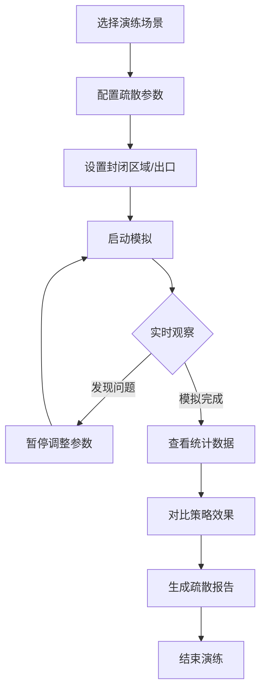

## 1. 产品概述

地铁站客流疏散模拟系统是一款基于Three.js的交互式3D可视化工具，专为地铁运营演练设计。解决传统平面图无法直观展示楼梯瓶颈、闸机排队、人流冲突等问题。通过动态粒子模拟和时间轴控制，实现疏散过程的可视化复盘与策略优化。

### 核心价值
- 直观展示疏散过程中的瓶颈位置和人流冲突
- 支持多场景对比演练，验证不同疏散策略的有效性
- 导出标准化疏散报告，辅助运营决策

## 2. 核心功能

### 2.1 用户角色
| 角色 | 核心权限 |
|------|----------|
| 运营演练人员 | 导入样例、运行模拟、调整参数、导出报告 |
| 管理人员 | 查看历史演练、对比策略效果 |

### 2.2 功能模块
1. **主控面板**：场景选择、时间轴控制、状态重置
2. **3D视口**：地铁站模型、客流粒子、瓶颈标记
3. **参数设置**：客流批次、封闭区域、出口配置
4. **数据分析**：实时统计、策略对比、报告导出

### 2.3 页面详情
| 页面名称 | 模块名称 | 功能描述 |
|---------|---------|----------|
| 主控页面 | 场景选择器 | 内置3类样例场景（正常疏散/冲突场景/空结果） |
| 主控页面 | 时间轴控制 | 播放/暂停/快进/逐帧，时间刻度显示 |
| 主控页面 | 视角切换 | 预设视角（俯视/斜45°/第一人称）、自由旋转 |
| 3D视口 | 视图切换 | 3D/2D平面图一键切换 |
| 3D视口 | 客流粒子 | 颜色编码状态（正常/拥堵/滞留） |
| 3D视口 | 瓶颈标记 | 实时高亮拥堵区域（楼梯/闸机） |
| 参数面板 | 客流配置 | 批次设置、人数调整、到达时间 |
| 参数面板 | 区域设置 | 封闭区域拖拽选择、出口临时关闭 |
| 分析面板 | 实时统计 | 疏散人数、平均时间、瓶颈排名 |
| 分析面板 | 策略对比 | 多方案并列对比、差异高亮 |
| 分析面板 | 报告导出 | PDF/JSON格式、包含可视化图表 |

## 3. 核心流程

## 4. 用户界面设计

### 4.1 设计风格
- **主色调**：深蓝色(#1e3a5f)代表专业可靠，配合橙色(#ff6b35)作为警示高亮
- **辅助色**：绿色(#2ecc71)正常状态，黄色(#f1c40f)警告状态，红色(#e74c3c)危险状态
- **按钮风格**：微圆角(4px)、轻微阴影、hover状态有微妙缩放效果
- **字体**：标题使用"Noto Sans SC Bold"，正文使用"Noto Sans SC Regular"
- **布局**：深色科技感Dashboard，左侧控制面板+中央3D视口+右侧数据面板
- **图标**：线性简约图标，保持与数据可视化风格一致

### 4.2 页面设计概述
| 页面名称 | 模块名称 | UI元素 |
|---------|---------|--------|
| 主控页面 | 顶部导航 | 系统标题、场景下拉选择、视图切换按钮、重置按钮 |
| 主控页面 | 左侧面板 | 客流配置折叠面板、区域设置折叠面板 |
| 主控页面 | 中央视口 | Three.js渲染画布、视角切换浮动按钮组 |
| 主控页面 | 右侧面板 | 实时统计卡片、瓶颈排行榜、策略对比标签页 |
| 主控页面 | 底部时间轴 | 进度条、播放控制按钮、时间刻度、关键事件标记 |

### 4.3 响应性
- 桌面端优先设计(≥1440px)
- 支持1920×1080标准分辨率
- 面板可折叠收起，最大化3D视口空间
- 时间轴在窗口缩放时自适应宽度

### 4.4 3D场景指导
- **环境**：深色背景配合柔和环境光，地铁站内部使用冷白色荧光灯效果
- **光照**：主方向光+多点补光，确保模型细节可见，粒子有适当高光
- **相机**：默认PerspectiveCamera，正交相机用于2D模式
- **交互**：OrbitControls支持旋转/缩放/平移，双击重置视角
- **动画**：粒子平滑移动，瓶颈区域脉冲高亮，状态切换有过渡动画
- **后处理**：Bloom效果增强警示标记的视觉冲击力
- **性能**：使用InstancedMesh批量渲染粒子，目标帧率≥30fps
