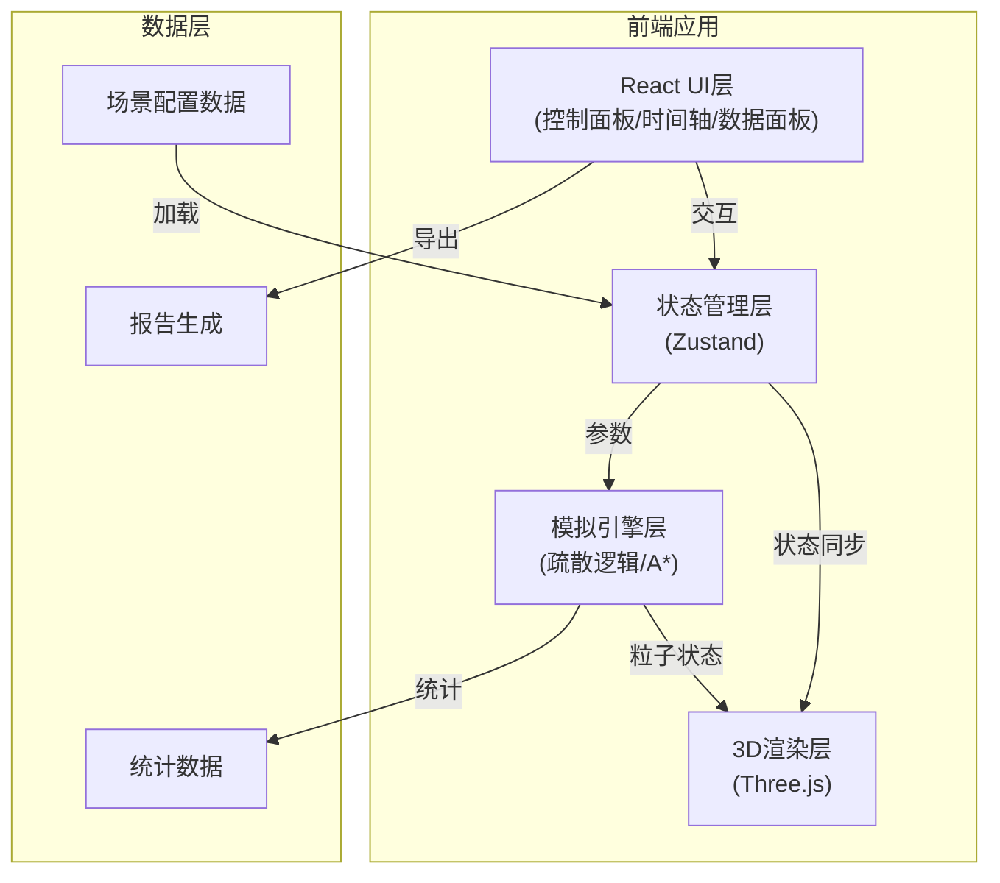

## 1. 架构设计



## 2. 技术描述

- **前端框架**: React@18 + TypeScript
- **构建工具**: Vite@5
- **样式方案**: TailwindCSS@3
- **3D引擎**: Three.js@0.160 + @react-three/fiber@8 + @react-three/drei@9
- **状态管理**: Zustand@4
- **数据可视化**: recharts@2
- **报告导出**: jsPDF@2 + html2canvas@1

## 3. 目录结构

```
src/
├── components/
│   ├── ui/                 # 基础UI组件
│   ├── panels/             # 面板组件
│   │   ├── ControlPanel.tsx
│   │   ├── StatsPanel.tsx
│   │   └── Timeline.tsx
│   └── viewer/             # 3D视口组件
│       ├── SceneViewer.tsx
│       ├── StationModel.tsx
│       ├── ParticleSystem.tsx
│       └── BottleneckMarkers.tsx
├── store/
│   └── useSimulationStore.ts
├── simulation/
│   ├── types.ts
│   ├── engine.ts           # 模拟引擎核心
│   ├── pathfinding.ts      # A*寻路
│   └── particles.ts        # 粒子系统
├── data/
│   └── scenes/             # 内置场景配置
│       ├── normal.json
│       ├── conflict.json
│       └── empty.json
├── utils/
│   ├── reportGenerator.ts
│   └── helpers.ts
├── App.tsx
├── main.tsx
└── index.css
```

## 4. 数据模型

### 4.1 场景配置

```typescript
interface StationScene {
  id: string;
  name: string;
  description: string;
  layout: {
    width: number;
    height: number;
    walls: Wall[];
    stairs: Stair[];
    gates: Gate[];
    exits: Exit[];
    platforms: Platform[];
  };
  passengerBatches: PassengerBatch[];
  closedAreas: ClosedArea[];
}

interface Wall {
  x: number; y: number; width: number; height: number;
}

interface Stair {
  id: string;
  x: number; y: number;
  width: number; height: number;
  direction: 'up' | 'down';
  capacity: number;
}

interface Gate {
  id: string;
  x: number; y: number;
  type: 'entry' | 'exit' | 'both';
  status: 'open' | 'closed';
  speed: number;
}

interface Exit {
  id: string;
  x: number; y: number;
  width: number;
  name: string;
}

interface PassengerBatch {
  id: string;
  startTime: number;
  count: number;
  spawnX: number;
  spawnY: number;
  speed: number;
}

interface ClosedArea {
  id: string;
  x: number; y: number;
  width: number; height: number;
  reason: string;
}
```

### 4.2 模拟状态

```typescript
interface SimulationState {
  isPlaying: boolean;
  currentTime: number;
  speed: number;
  passengers: Passenger[];
  bottlenecks: Bottleneck[];
  statistics: Statistics;
}

interface Passenger {
  id: string;
  x: number; y: number;
  targetX: number; targetY: number;
  status: 'moving' | 'waiting' | 'stuck' | 'exited';
  speed: number;
  path: Point[];
}

interface Bottleneck {
  id: string;
  type: 'stair' | 'gate' | 'corridor';
  x: number; y: number;
  severity: 'low' | 'medium' | 'high';
  queueLength: number;
  avgWaitTime: number;
}

interface Statistics {
  totalPassengers: number;
  exitedCount: number;
  avgEvacuationTime: number;
  maxWaitTime: number;
  bottleneckRanking: Bottleneck[];
  timeSeriesData: TimePoint[];
}
```

## 5. 核心算法

### 5.1 A*寻路算法
- 网格大小: 0.5m × 0.5m
- 障碍物: 墙壁、封闭区域、闸机关闭状态
- 动态避障: 考虑其他乘客位置

### 5.2 疏散模拟引擎
- 时间步长: 100ms
- 粒子密度检测: 半径1m范围内人数
- 瓶颈判定: 单位面积人数 > 阈值时标记

## 6. 性能优化

1. **粒子渲染**: 使用 InstancedMesh 批量渲染，单draw call
2. **LOD策略**: 远距离粒子简化渲染
3. **空间分区**: 网格分区加速碰撞检测
4. **WebWorker**: 模拟计算与渲染分离
