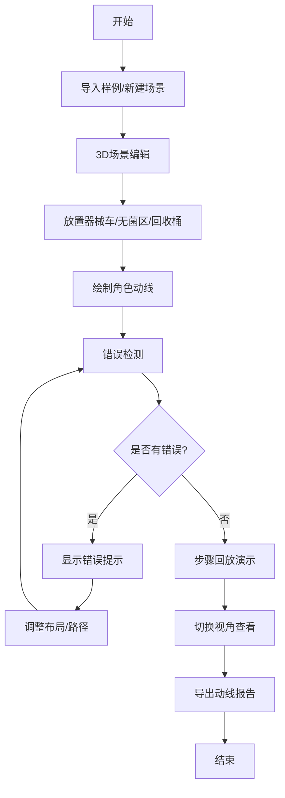

## 1. 产品概述
手术室器械动线排布3D可视化系统，帮助护士长在培训前演示手术间器械车、无菌区和污染回收的动线，避免新人走错。通过交互式3D场景让学员理解正确的操作流程，减少无菌区穿越、器械车碰撞、回收路线交叉等常见错误。

- **核心目的**：手术培训动线演示与错误预防
- **目标用户**：护士长、手术室培训人员、新入职医护人员
- **产品价值**：将抽象的动线规则转化为可交互、可回放的3D可视化体验，提高培训效率和准确性

## 2. 核心功能

### 2.1 用户角色
| 角色 | 登录方式 | 核心权限 |
|------|----------|----------|
| 培训师 | 无需登录 | 创建/编辑场景、导入样例、导出报告、控制回放 |
| 学员 | 无需登录 | 查看场景、观看回放、切换视角 |

### 2.2 功能模块
1. **3D场景编辑器**：手术间平面布局、器械车/无菌区/回收桶放置、角色路径绘制
2. **时间轴控制面板**：步骤回放、播放控制、时间点跳转
3. **错误检测系统**：无菌区穿越检测、器械车碰撞检测、路线交叉检测
4. **样例管理**：导入预设样例、保存当前布局
5. **报告导出**：生成动线报告（PDF/JSON）

### 2.3 页面详情
| 页面名称 | 模块名称 | 功能描述 |
|-----------|-------------|---------------------|
| 主页面 | 3D画布区域 | 渲染手术间3D场景，支持拖拽、旋转、缩放 |
| 主页面 | 左侧工具栏 | 器械车、无菌区、回收桶、人员角色等元素选择 |
| 主页面 | 右侧属性面板 | 选中元素属性编辑、路径设置 |
| 主页面 | 底部时间轴 | 步骤列表、播放控制、时间滑块 |
| 主页面 | 顶部菜单栏 | 导入样例、重置场景、导出报告、视角切换 |
| 主页面 | 错误提示层 | 实时显示碰撞、穿越、交叉等错误信息 |

## 3. 核心流程

## 4. 用户界面设计

### 4.1 设计风格
- **主色调**：专业医疗蓝 (#165DFF)，代表专业、信任、洁净
- **辅助色**：警示红 (#F53F3F) 用于错误提示，成功绿 (#00B42A) 用于正确状态
- **中性色**：深灰 (#1D2129)、中灰 (#4E5969)、浅灰 (#C9CDD4)、白色 (#FFFFFF)
- **按钮样式**：圆角矩形，悬停有轻微缩放和阴影效果
- **字体**：Inter - 现代无衬线字体，专业清晰易读
- **布局风格**：模块化卡片布局，左侧工具栏 + 中央3D画布 + 右侧属性面板 + 底部时间轴
- **图标风格**：线性简约图标，统一24px尺寸

### 4.2 页面设计概述
| 页面名称 | 模块名称 | UI元素 |
|-----------|-------------|-------------|
| 主页面 | 3D画布区域 | 半透明手术间平面、立体器械车模型、高亮无菌区、红色回收桶、角色小人模型、路径线（正确为绿色，错误为红色虚线） |
| 主页面 | 左侧工具栏 | 垂直图标列表，hover展开文字说明，选中项蓝色高亮 |
| 主页面 | 右侧属性面板 | 白色卡片，包含名称输入、位置坐标、旋转角度、路径点列表 |
| 主页面 | 底部时间轴 | 深色背景条，步骤节点可点击，播放/暂停/上一步/下一步按钮 |
| 主页面 | 顶部菜单栏 | 白色背景，左侧logo，右侧操作按钮组 |
| 主页面 | 错误提示层 | 右上角红色toast提示，场景内红色高亮错误区域 |

### 4.3 响应式
- **桌面端优先**：1920×1080及以上分辨率完整显示所有面板
- **平板适配**：1024-1920分辨率，面板可折叠收起
- **触控优化**：支持触控拖拽、双指缩放旋转

### 4.4 3D场景指导
- **环境/HDRI**：简洁明亮的手术室内环境，无影灯照明效果
- **光照设置**：主方向光 + 环境光，确保模型清晰可见，阴影柔和
- **相机设置**：默认45度俯视视角，支持环绕旋转、平移、缩放
- **视角切换**：预设俯视、正视、侧视、第一人称等视角快捷切换
- **交互与动画**：拖拽物体有吸附效果，路径绘制有实时预览，回放时角色沿路径平滑移动
- **后处理效果**：轻微泛光，错误区域红色辉光效果
- **性能预算**：控制模型面数，确保60fps流畅运行
