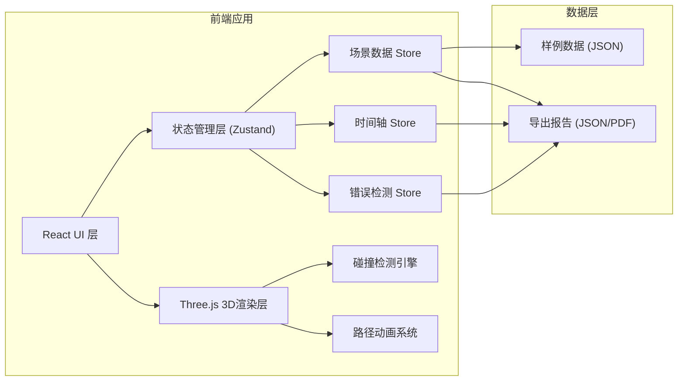

## 1. 架构设计


## 2. 技术描述
- **前端框架**: React@18 + TypeScript
- **构建工具**: Vite@5
- **样式方案**: TailwindCSS@3
- **3D渲染**: Three.js + @react-three/fiber + @react-three/drei
- **状态管理**: Zustand
- **报告导出**: html2canvas + jsPDF
- **图标库**: lucide-react

## 3. 路由定义
| 路由 | 用途 |
|-------|---------|
| / | 主页面 - 3D场景编辑器 + 控制面板 |

## 4. 数据模型

### 4.1 场景元素类型定义
```typescript
// 元素基础类型
interface BaseElement {
  id: string;
  type: 'instrumentCart' | 'sterileZone' | 'recycleBin' | 'staff';
  name: string;
  position: { x: number; y: number; z: number };
  rotation: { x: number; y: number; z: number };
  scale: { x: number; y: number; z: number };
}

// 器械车
interface InstrumentCart extends BaseElement {
  type: 'instrumentCart';
  width: number;
  depth: number;
  height: number;
}

// 无菌区
interface SterileZone extends BaseElement {
  type: 'sterileZone';
  width: number;
  depth: number;
  color: string;
}

// 回收桶
interface RecycleBin extends BaseElement {
  type: 'recycleBin';
  radius: number;
}

// 人员角色
interface Staff extends BaseElement {
  type: 'staff';
  role: 'nurse' | 'doctor' | 'anesthetist';
  path: PathPoint[];
  color: string;
}

// 路径点
interface PathPoint {
  id: string;
  position: { x: number; y: number; z: number };
  timestamp: number; // 秒
  action?: string;
}

// 时间轴步骤
interface TimelineStep {
  id: string;
  name: string;
  startTime: number;
  endTime: number;
  description: string;
  staffId: string;
}

// 错误类型
interface ErrorItem {
  id: string;
  type: 'sterileCross' | 'collision' | 'routeCross';
  severity: 'warning' | 'error';
  message: string;
  position?: { x: number; y: number; z: number };
  timestamp?: number;
  elementIds: string[];
}

// 场景数据
interface SceneData {
  name: string;
  roomSize: { width: number; depth: number };
  elements: (InstrumentCart | SterileZone | RecycleBin | Staff)[];
  timeline: TimelineStep[];
  errors: ErrorItem[];
}
```

### 4.2 Store 状态定义
```typescript
interface AppState {
  // 场景状态
  sceneData: SceneData;
  selectedElementId: string | null;
  isPlaying: boolean;
  currentTime: number;
  totalDuration: number;
  
  // 编辑模式
  editMode: 'select' | 'translate' | 'rotate' | 'drawPath';
  
  // 视角
  cameraView: 'top' | 'front' | 'side' | 'free';
  
  // 操作方法
  setSelectedElement: (id: string | null) => void;
  updateElement: (id: string, updates: Partial<BaseElement>) => void;
  addElement: (element: BaseElement) => void;
  removeElement: (id: string) => void;
  addPathPoint: (staffId: string, point: PathPoint) => void;
  setPlayState: (playing: boolean) => void;
  setCurrentTime: (time: number) => void;
  setCameraView: (view: CameraView) => void;
  loadSample: (sampleId: string) => void;
  resetScene: () => void;
  exportReport: () => void;
  detectErrors: () => void;
}
```

## 5. 核心组件结构
```
src/
├── components/
│   ├── Canvas3D/           # 3D画布组件
│   │   ├── index.tsx
│   │   ├── Scene.tsx       # 3D场景
│   │   ├── OperatingRoom.tsx  # 手术间模型
│   │   ├── InstrumentCart.tsx # 器械车
│   │   ├── SterileZone.tsx    # 无菌区
│   │   ├── RecycleBin.tsx     # 回收桶
│   │   ├── Staff.tsx          # 人员角色
│   │   └── PathLine.tsx       # 路径线
│   ├── Toolbar/            # 左侧工具栏
│   │   └── index.tsx
│   ├── PropertyPanel/      # 右侧属性面板
│   │   └── index.tsx
│   ├── Timeline/           # 底部时间轴
│   │   └── index.tsx
│   ├── TopMenu/            # 顶部菜单
│   │   └── index.tsx
│   └── ErrorToast/         # 错误提示
│       └── index.tsx
├── store/                  # 状态管理
│   └── useAppStore.ts
├── utils/                  # 工具函数
│   ├── collision.ts        # 碰撞检测
│   ├── pathUtils.ts        # 路径处理
│   └── exportReport.ts     # 报告导出
├── data/                   # 样例数据
│   └── samples.ts
├── types/                  # 类型定义
│   └── index.ts
├── App.tsx
├── main.tsx
└── index.css
```

## 6. 核心算法

### 6.1 碰撞检测算法
```
1. AABB包围盒碰撞检测 (器械车之间)
2. 点与多边形区域检测 (无菌区穿越)
3. 线段相交检测 (路径交叉)
```

### 6.2 路径动画算法
```
1. Catmull-Rom 样条插值平滑路径
2. 根据时间戳计算当前位置
3. 四元数插值实现角色朝向平滑过渡
```

### 6.3 错误检测逻辑
```
- 无菌区穿越: 检测人员路径是否穿过无菌区边界
- 器械车碰撞: 检测器械车包围盒是否重叠
- 路线交叉: 检测不同人员路径是否在同一时间区间内相交
```
