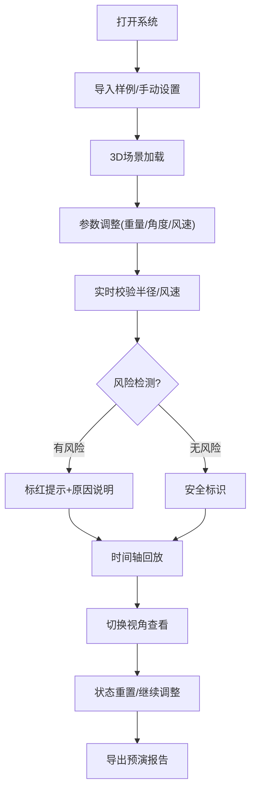

## 1. 产品概述

塔吊吊装半径预演系统是一个基于WebGL的3D交互工具，帮助施工经理在吊装前直观展示塔吊作业范围、楼体遮挡和地面警戒区。系统通过实时可视化和风险校验，解决超半径吊装、风速超限、警戒区占用等常见安全问题，替代传统CAD截图方式。

- **目标用户**：施工经理、现场安全员、吊装班组
- **核心价值**：降低吊装作业风险、提高班组理解效率、留存可追溯的预演报告

## 2. 核心功能

### 2.1 用户角色
| 角色 | 权限描述 |
|------|----------|
| 施工经理 | 完整功能：导入样例、参数调整、预演操作、导出报告 |
| 班组人员 | 查看模式：浏览3D场景、查看风险点、阅读预演报告 |

### 2.2 功能模块
1. **主场景页面**：3D工地场景、参数控制面板、时间轴、风险提示
2. **报告预览**：预演结果展示、风险统计、导出功能

### 2.3 页面详情
| 页面名称 | 模块名称 | 功能描述 |
|----------|----------|----------|
| 主场景页面 | 3D场景渲染 | 塔吊模型、楼体模型、地面警戒区、吊装半径可视化 |
| 主场景页面 | 参数控制面板 | 吊物重量调节、风速设置、塔吊旋转控制 |
| 主场景页面 | 时间轴控件 | 吊装过程回放、关键帧切换、暂停/播放 |
| 主场景页面 | 视角切换 | 顶视图、侧视图、自由视角、第一人称视角 |
| 主场景页面 | 风险检测 | 超半径标红、风速超限警告、警戒区占用提示 |
| 报告预览 | 报告生成 | 预演数据汇总、风险统计、导出PDF/图片 |
| 报告预览 | 样例导入 | 预设场景加载、自定义场景参数 |

## 3. 核心流程

用户打开系统后，可选择导入样例场景或手动设置参数。通过拖拽或滑块调整吊物重量、旋转角度等参数，系统实时计算并显示吊装范围和风险点。完成预演后可导出包含可视化截图和数据的报告。

## 4. 用户界面设计

### 4.1 设计风格
- **主色调**：工业蓝色 (#165DFF)，代表专业和安全
- **辅助色**：警示红 (#FF4D4F) 用于风险标红，成功绿 (#52C41A) 用于安全状态
- **中性色**：深灰背景 (#1F1F1F)，浅灰文字 (#E0E0E0)，符合工程软件专业感
- **按钮风格**：直角矩形，轻微阴影，hover时有颜色渐变
- **字体**：使用 monospace 字体显示数值参数，sans-serif 用于普通文本
- **布局风格**：分区明确的控制面板，固定在边缘不遮挡3D场景
- **图标风格**：线性图标，简洁专业，符合工程软件风格

### 4.2 页面设计概述
| 页面名称 | 模块名称 | UI 元素 |
|----------|----------|----------|
| 主场景页面 | 顶部工具栏 | logo、样例导入、视角切换、重置按钮、导出按钮 |
| 主场景页面 | 左侧参数面板 | 重量滑块、风速输入、塔吊高度、最大半径 |
| 主场景页面 | 底部时间轴 | 进度条、播放/暂停、上一帧/下一帧、时间刻度 |
| 主场景页面 | 右侧风险面板 | 风险列表、严重程度、风险详情 |
| 主场景页面 | 中心3D区域 | 塔吊、楼体、地面、半径指示、警戒区 |

### 4.3 响应式设计
- **桌面端**：左右侧边栏展开，底部时间轴完整显示
- **窄屏/平板**：左右侧边栏可折叠，时间轴压缩显示
- **触控优化**：滑块和按钮增大触控区域，支持双指缩放旋转3D场景
- **布局约束**：所有UI控件保证不遮挡3D场景核心区域，采用半透明背景增强层次感

### 4.4 3D 场景指导
- **环境**：工业工地环境，使用柔和的天空盒，地面带网格线辅助定位
- **光照**：主方向光模拟日光，配合环境光和轻微阴影，保证模型清晰可见
- **相机**：默认透视相机，支持轨道控制旋转缩放，预设多个视角快捷切换
- **动画效果**：吊臂旋转平滑过渡，半径范围实时更新，风险出现时有闪烁警示
- **后期处理**：轻微抗锯齿，边缘发光效果突出警戒线和风险区域
- **性能优化**：模型使用低多边形，LOD策略，保证60fps流畅运行
