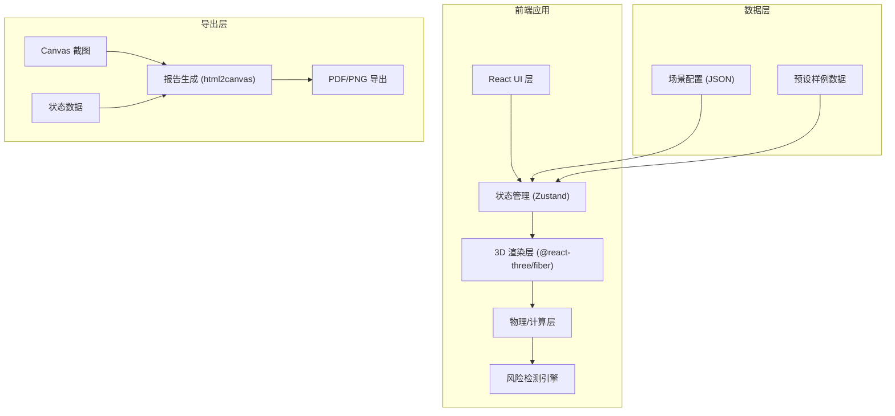

## 1. 架构设计



## 2. 技术描述

- **前端框架**: React@18 + TypeScript + Vite
- **3D 引擎**: three.js + @react-three/fiber + @react-three/drei
- **状态管理**: Zustand (轻量级状态管理)
- **样式方案**: TailwindCSS@3
- **导出功能**: html2canvas + jspdf
- **动画库**: framer-motion (UI动画) + gsap (时间轴控制)

## 3. 路由定义

| 路由 | 用途 |
|------|------|
| / | 主场景页面 - 3D交互与参数控制 |

## 4. 数据模型

### 4.1 场景配置数据结构

```typescript
// 塔吊配置
interface TowerCraneConfig {
  id: string;
  name: string;
  position: { x: number; z: number };
  height: number;           // 塔身高度
  maxRadius: number;        // 最大作业半径
  minRadius: number;        // 最小作业半径
  maxWeight: number;        // 最大起重量
  weightRadiusCurve: Array<{radius: number; maxWeight: number}>; // 重量-半径曲线
  currentAngle: number;     // 当前吊臂角度
  currentRadius: number;    // 当前作业半径
}

// 楼体配置
interface Building {
  id: string;
  name: string;
  position: { x: number; z: number };
  dimensions: { width: number; depth: number; height: number };
  color: string;
}

// 警戒区配置
interface DangerZone {
  id: string;
  name: string;
  type: 'restricted' | 'warning' | 'safe';
  shape: 'circle' | 'rectangle';
  position: { x: number; z: number };
  radius?: number;
  dimensions?: { width: number; depth: number };
  occupied: boolean;        // 是否被占用
}

// 吊物配置
interface LiftObject {
  weight: number;           // 重量 (吨)
  startPosition: { x: number; z: number };
  endPosition: { x: number; z: number };
  currentProgress: number;  // 0-1 吊装进度
}

// 环境配置
interface Environment {
  windSpeed: number;        // 风速 (m/s)
  maxAllowedWindSpeed: number; // 允许最大风速
  timeOfDay: 'day' | 'night';
}

// 风险检测结果
interface Risk {
  id: string;
  type: 'radius_exceeded' | 'weight_exceeded' | 'wind_exceeded' | 'zone_occupied' | 'collision';
  severity: 'low' | 'medium' | 'high' | 'critical';
  message: string;
  timestamp: number;
}

// 完整场景状态
interface SceneState {
  crane: TowerCraneConfig;
  buildings: Building[];
  dangerZones: DangerZone[];
  liftObject: LiftObject;
  environment: Environment;
  risks: Risk[];
  isPlaying: boolean;
  currentTime: number;
  selectedView: 'free' | 'top' | 'side' | 'firstPerson';
}
```

### 4.2 预设样例数据

系统内置3个典型场景样例：
1. **标准住宅楼吊装** - 常规场景，无明显风险
2. **超高层办公楼吊装** - 存在楼体遮挡风险
3. **复杂工地多警戒区** - 多个警戒区，需谨慎规划路径

## 5. 核心组件结构

```
src/
├── components/
│   ├── Scene3D/           # 3D场景容器
│   │   ├── TowerCrane.tsx    # 塔吊模型
│   │   ├── Building.tsx      # 楼体模型
│   │   ├── DangerZone.tsx    # 警戒区
│   │   ├── RadiusIndicator.tsx # 半径指示
│   │   └── LiftPath.tsx      # 吊装路径
│   ├── UI/
│   │   ├── TopToolbar.tsx    # 顶部工具栏
│   │   ├── LeftPanel.tsx     # 左侧参数面板
│   │   ├── RightPanel.tsx    # 右侧风险面板
│   │   ├── Timeline.tsx      # 底部时间轴
│   │   └── ViewSwitcher.tsx  # 视角切换器
│   └── Modals/
│       └── ReportModal.tsx   # 报告导出弹窗
├── store/
│   └── useSceneStore.ts    # Zustand 状态管理
├── utils/
│   ├── riskDetection.ts    # 风险检测逻辑
│   ├── cranePhysics.ts     # 塔吊物理计算
│   └── exportReport.ts     # 报告生成工具
├── data/
│   └── sampleScenes.ts     # 预设样例数据
├── types/
│   └── index.ts            # TypeScript 类型定义
└── App.tsx
```

## 6. 关键技术实现

### 6.1 风险检测引擎
- **超半径检测**: 实时计算当前半径与最大半径对比
- **重量-半径校验**: 根据重量-半径曲线判断是否超载
- **风速检测**: 对比当前风速与安全阈值
- **警戒区检测**: 判断吊装路径是否经过占用警戒区
- **碰撞检测**: 简单AABB碰撞检测预判楼体遮挡

### 6.2 时间轴控制
- 使用 gsap 实现关键帧动画
- 支持播放/暂停/进度拖拽
- 吊装过程分为：起升 → 旋转 → 变幅 → 下落 四个阶段

### 6.3 报告导出
- 使用 html2canvas 捕获3D场景截图
- 组合场景参数、风险统计、时间轴信息
- 支持导出 PDF 或 PNG 格式

### 6.4 响应式布局
- 使用 TailwindCSS 响应式工具类
- 移动端侧边栏可通过抽屉形式展开
- 3D场景始终占据核心可视区域
