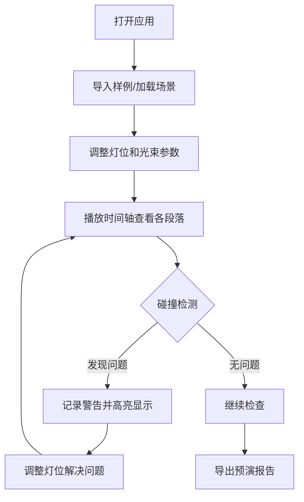
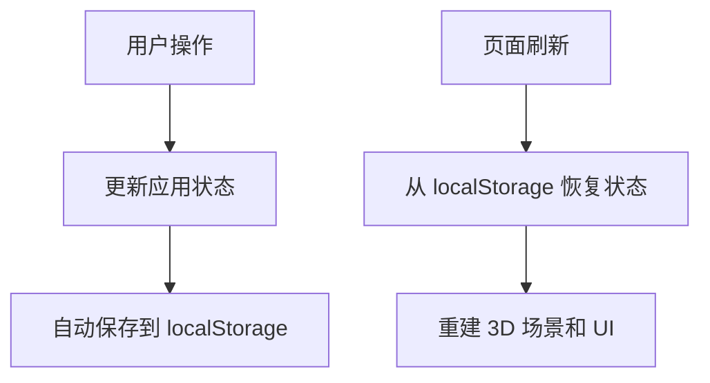

## 1. 产品概述

舞台灯光束预演系统是一款面向剧场灯光师的 3D 交互可视化工具，解决传统 Excel 灯位表无法直观预览光束效果的痛点。通过实时模拟灯光束在舞台空间中的投射路径，帮助灯光师在换场时预判灯束是否会打到观众区或遮住字幕屏，提前发现灯位坐标偏移、光束穿过禁区、节目段落切换漏更新等常见问题。

## 2. 核心功能

### 2.1 用户角色
| 角色 | 核心权限 |
|------|----------|
| 灯光师 | 导入样例、调整灯位、控制时间轴、导出预演报告 |

### 2.2 功能模块
1. **3D 舞台场景**：舞台模型、灯具、光束角、字幕屏、观众区的可视化展示
2. **灯光控制**：拖拽调整灯位、筛选灯具、光束参数调节
3. **时间轴控制**：节目段落切换、播放/暂停、视角切换
4. **碰撞检测**：实时检测光束是否进入禁区（观众区、字幕屏区域）
5. **场景管理**：场景保存/加载、状态重置、刷新不丢失筛选和关键状态
6. **报告导出**：导出包含碰撞警告的预演报告

### 2.3 页面详情
| 页面名称 | 模块名称 | 功能描述 |
|---------|----------|----------|
| 主页面 | 3D 视口 | Three.js 渲染的舞台场景，支持旋转、缩放、平移 |
| 主页面 | 左侧面板 | 灯具列表筛选、灯位参数调节 |
| 主页面 | 右侧面板 | 碰撞提示、实时状态显示 |
| 主页面 | 底部时间轴 | 节目段落切换、播放控制、时间进度 |
| 主页面 | 顶部工具栏 | 导入样例、保存场景、导出报告、重置、视角切换 |

## 3. 核心流程

### 3.1 灯光预演工作流


### 3.2 状态持久化流程


## 4. 用户界面设计

### 4.1 设计风格
- **主色调**：深色主题 (#0a0a0f) 配合专业蓝色 (#0066ff) 作为强调色
- **辅助色**：警告橙色 (#ff9500)、危险红色 (#ff3b30)、成功绿色 (#34c759)
- **按钮样式**：方形微圆角，悬停有微妙发光效果
- **字体**：使用 JetBrains Mono 作为等宽字体，Inter 作为界面字体
- **布局风格**：深色专业工具风格，边框采用细灰线，面板半透明毛玻璃效果
- **图标风格**：线性简洁图标，配合微妙的色彩点缀

### 4.2 页面设计概述
| 页面名称 | 模块名称 | UI 元素 |
|---------|----------|---------|
| 主页面 | 3D 视口 | 居中全屏渲染，辅助网格线，视角控制 |
| 主页面 | 左侧面板 | 折叠式灯具列表，参数滑块，搜索筛选框 |
| 主页面 | 右侧面板 | 碰撞警告卡片列表，实时状态指标 |
| 主页面 | 底部时间轴 | 分段式时间条，播放控制按钮，段落标签 |
| 主页面 | 顶部工具栏 | 图标按钮组，下拉菜单，状态指示器 |

### 4.3 响应式
- 桌面端优先设计，适配 1920×1080 及以上分辨率
- 左侧和右侧面板可折叠，最大化 3D 视口空间
- 时间轴支持拖拽调整高度

### 4.4 3D 场景指南
- **环境**：深色舞台背景，微妙的环境光营造专业氛围
- **光照**：使用 Three.js 聚光灯模拟真实舞台灯具，添加半透明光束效果
- **相机**：默认透视相机，支持预设视角切换（舞台正面、俯视、侧视）
- **交互**：OrbitControls 支持旋转、缩放、平移，灯具支持拖拽调整位置
- **后处理**：轻微泛光效果增强光束视觉效果，抗锯齿处理
- **性能**：使用 InstancedMesh 优化多灯具渲染，光束使用 ShaderMaterial 实现

## 5. 数据模型

### 5.1 灯具数据结构
```typescript
interface Light {
  id: string;
  name: string;
  type: 'spot' | 'par' | 'moving';
  position: { x: number; y: number; z: number };
  target: { x: number; y: number; z: number };
  beamAngle: number;
  intensity: number;
  color: string;
  enabled: boolean;
  group: string;
}
```

### 5.2 节目段落数据结构
```typescript
interface ProgramSegment {
  id: string;
  name: string;
  startTime: number;
  endTime: number;
  lightStates: { lightId: string; position: Vector3; target: Vector3; intensity: number }[];
}
```

### 5.3 碰撞区域数据结构
```typescript
interface ForbiddenZone {
  id: string;
  name: string;
  type: 'audience' | 'subtitle';
  bounds: { min: Vector3; max: Vector3 };
  color: string;
}
```
