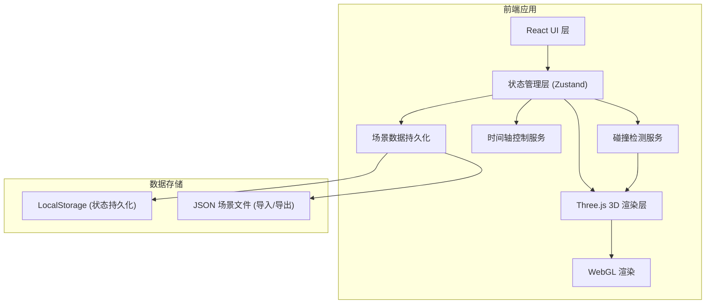

## 1. 架构设计



## 2. 技术描述

- **前端框架**: React@18 + TypeScript
- **构建工具**: Vite@5
- **3D 引擎**: three@0.160 + @react-three/fiber@8 + @react-three/drei@9
- **状态管理**: zustand@4
- **样式方案**: tailwindcss@3
- **图标库**: lucide-react@0.294
- **动画库**: framer-motion@10
- **数据持久化**: localStorage + JSON 文件导入导出
- **后端**: 纯前端应用，无需后端服务

## 3. 目录结构

```
src/
├── components/
│   ├── Stage3D/           # 3D 舞台渲染组件
│   │   ├── index.tsx
│   │   ├── Stage.tsx      # 舞台模型
│   │   ├── Light.tsx      # 灯具组件
│   │   ├── LightBeam.tsx  # 光束效果
│   │   └── ForbiddenZone.tsx  # 禁区显示
│   ├── Controls/
│   │   ├── LightPanel.tsx     # 左侧灯具控制面板
│   │   ├── Timeline.tsx       # 底部时间轴
│   │   ├── Toolbar.tsx        # 顶部工具栏
│   │   └── CollisionPanel.tsx # 右侧碰撞面板
│   └── ui/                # 通用 UI 组件
├── store/
│   ├── useSceneStore.ts   # 场景状态管理
│   └── useTimelineStore.ts # 时间轴状态
├── services/
│   ├── collision.ts       # 碰撞检测逻辑
│   ├── exportReport.ts    # 报告导出服务
│   └── sampleData.ts      # 样例数据
├── types/
│   └── index.ts           # TypeScript 类型定义
├── utils/
│   └── threeHelpers.ts    # Three.js 辅助函数
├── App.tsx
└── main.tsx
```

## 4. 核心组件设计

### 4.1 3D 场景组件
- **Stage3D/index.tsx**: Canvas 容器，初始化 Three.js 场景
- **Light.tsx**: 可拖拽的灯具组件，支持位置和目标点调整
- **LightBeam.tsx**: 使用自定义 Shader 实现半透明光束效果
- **ForbiddenZone.tsx**: 半透明禁区箱体，碰撞时高亮

### 4.2 状态管理 (Zustand)
```typescript
interface SceneState {
  lights: Light[];
  forbiddenZones: ForbiddenZone[];
  selectedLightId: string | null;
  filters: { group: string; search: string };
  collisionWarnings: CollisionWarning[];
  setSelectedLight: (id: string | null) => void;
  updateLight: (id: string, updates: Partial<Light>) => void;
  addLight: (light: Light) => void;
  setFilters: (filters: Partial<{ group: string; search: string }>) => void;
  checkCollisions: () => void;
  saveScene: () => void;
  loadScene: () => boolean;
  resetScene: () => void;
}
```

### 4.3 碰撞检测服务
- 使用光线投射 (Raycaster) 检测光束与禁区的相交
- 计算光束在禁区内的路径长度
- 实时更新碰撞警告列表

## 5. 数据持久化方案

### 5.1 localStorage 自动保存
- 触发时机：每次状态变更后延迟 500ms 防抖保存
- 保存内容：灯具状态、筛选条件、当前时间轴位置
- 恢复时机：应用初始化时自动加载

### 5.2 JSON 场景文件
- 导出：将完整场景序列化为 JSON 文件下载
- 导入：解析 JSON 文件重建场景状态

## 6. 报告导出

使用浏览器打印 API 生成 PDF 报告，包含：
- 场景基本信息
- 碰撞警告列表（带位置和时间戳）
- 各节目段落灯具状态
- 3D 场景截图
