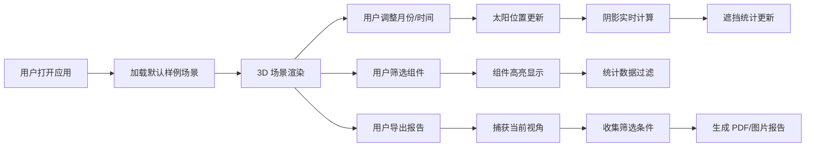

## 1. 产品概述

院落光伏阴影分析工具是一个基于 Web 的 3D 可视化应用，帮助社区业主在安装光伏发电系统前，直观地了解不同月份树木阴影和女儿墙对光伏组件的遮挡影响。通过交互式的 3D 场景模拟和数据统计，用户可以做出更科学的安装决策。

- **核心价值**：解决光伏安装前的阴影评估痛点，降低投资风险，提高发电收益预测准确性
- **目标用户**：社区业主、光伏安装工程师、房产开发商

## 2. 核心功能

### 2.1 功能模块

1. **3D 场景可视化**：屋顶模型、树木、光伏组件、太阳轨迹实时渲染
2. **时间控制**：月份滑块、时间轴播放、太阳位置实时更新
3. **阴影分析**：实时阴影渲染、遮挡时长统计、组件遮挡率计算
4. **组件管理**：组件分组、筛选、高亮显示
5. **报告导出**：生成包含当前视角、筛选条件、统计数据的分析报告
6. **视角控制**：预设视角切换、自由旋转、缩放、平移
7. **状态管理**：场景重置、样例导入、参数保存

### 2.2 页面详情

| 页面名称 | 模块名称 | 功能描述 |
|---------|---------|---------|
| 主页面 | 3D 场景视图 | 渲染屋顶、树木、光伏组件、太阳轨迹，支持鼠标交互 |
| 主页面 | 顶部工具栏 | 样例导入、视角切换、状态重置、报告导出按钮 |
| 主页面 | 左侧控制面板 | 月份滑块、时间轴播放控制、播放速度调节 |
| 主页面 | 右侧信息面板 | 组件列表、筛选条件、遮挡统计数据、分组管理 |
| 主页面 | 底部状态栏 | 当前时间、太阳高度角、方位角、总遮挡时长显示 |

## 3. 核心流程

## 4. 用户界面设计

### 4.1 设计风格

- **主色调**：深青色 (#0F766E) 代表科技与环保，橙色 (#F97316) 作为太阳能主题强调色
- **背景**：深空灰渐变背景，营造专业科技感
- **按钮风格**：圆角矩形，微立体效果，hover 时有轻微上浮动画
- **字体**：展示字体使用 Noto Sans SC，正文字体使用 system-ui
- **布局风格**：深色科技风，半透明面板，毛玻璃效果，清晰的功能分区
- **图标风格**：线性图标，统一 24px 尺寸，与主题色一致

### 4.2 页面设计概述

| 页面名称 | 模块名称 | UI 元素 |
|---------|---------|---------|
| 主页面 | 3D 场景视图 | 全屏 Canvas，Three.js 渲染，轨道控制器，天空盒环境 |
| 主页面 | 顶部工具栏 | 固定高度 56px，半透明背景，图标按钮水平排列，右侧操作区 |
| 主页面 | 左侧控制面板 | 宽度 280px，可折叠，月份滑块、播放控制、太阳参数显示 |
| 主页面 | 右侧信息面板 | 宽度 320px，可折叠，选项卡切换（组件列表/统计数据/报告） |
| 主页面 | 底部状态栏 | 高度 32px，半透明，显示关键数据指标 |

### 4.3 响应式设计

- **桌面端（>1200px）**：完整布局，左右面板同时展开
- **平板端（768px-1200px）**：左右面板可折叠，默认只展开一个
- **移动端（<768px）**：面板改为底部抽屉式，简化控制界面

### 4.4 3D 场景指导

- **环境**：程序生成天空盒，根据时间动态调整天空颜色和光照
- **光照**：主光源模拟太阳光，随时间变化位置和强度；环境光补充
- **相机**：初始透视相机，视角 60°，初始距离场景中心 30 米
- **交互**：OrbitControls 支持旋转、缩放、平移；阻尼效果提升手感
- **动画**：太阳移动平滑过渡，阴影实时更新，组件选中高亮动画
- **性能**：阴影贴图优化，LOD 策略，目标帧率 60fps

## 5. 数据一致性保证

- **单一数据源**：所有 UI 控件和 3D 场景共享同一状态管理
- **实时同步**：月份、时间、筛选条件变更立即反映到场景和统计
- **报告快照**：导出时捕获完整状态快照，确保报告与当前视图一致
- **状态校验**：导出前校验数据完整性，防止不一致数据进入报告
