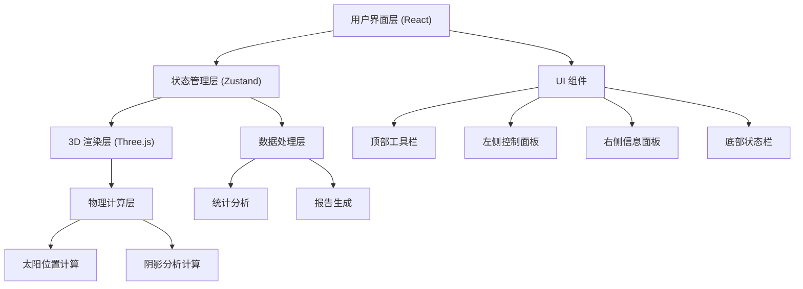

## 1. 架构设计



## 2. 技术描述

### 2.1 前端技术栈

| 技术 | 版本 | 用途 |
|------|------|------|
| React | ^18.2.0 | UI 框架 |
| TypeScript | ^5.0.0 | 类型安全 |
| Vite | ^5.0.0 | 构建工具 |
| Three.js | ^0.160.0 | 3D 渲染引擎 |
| @types/three | ^0.160.0 | Three.js 类型定义 |
| Tailwind CSS | ^3.4.0 | 样式框架 |
| Zustand | ^4.4.0 | 状态管理 |
| Lucide React | ^0.300.0 | 图标库 |
| html2canvas | ^1.4.1 | 截图导出 |
| jspdf | ^2.5.1 | PDF 报告生成 |

### 2.2 目录结构

```
src/
├── components/
│   ├── layout/
│   │   ├── Toolbar.tsx        # 顶部工具栏
│   │   ├── LeftPanel.tsx      # 左侧控制面板
│   │   ├── RightPanel.tsx     # 右侧信息面板
│   │   └── StatusBar.tsx      # 底部状态栏
│   ├── controls/
│   │   ├── MonthSlider.tsx    # 月份滑块
│   │   ├── TimeAxis.tsx       # 时间轴
│   │   └── PlayControls.tsx   # 播放控制
│   ├── scene/
│   │   ├── SceneCanvas.tsx    # 3D 场景画布
│   │   └── SceneHUD.tsx       # 场景 HUD
│   └── panels/
│       ├── ComponentList.tsx  # 组件列表
│       ├── Statistics.tsx     # 统计数据
│       └── ReportExport.tsx   # 报告导出
├── hooks/
│   ├── useThreeScene.ts       # Three.js 场景 Hook
│   ├── useSolarCalculation.ts # 太阳计算 Hook
│   └── useShadowAnalysis.ts   # 阴影分析 Hook
├── store/
│   ├── useSceneStore.ts       # 场景状态
│   ├── useTimeStore.ts        # 时间状态
│   └── useReportStore.ts      # 报告状态
├── utils/
│   ├── solarMath.ts           # 太阳位置计算
│   ├── shadowUtils.ts         # 阴影计算工具
│   └── reportGenerator.ts     # 报告生成器
├── types/
│   └── index.ts               # 类型定义
├── data/
│   └── sampleScenes.ts        # 样例场景数据
├── App.tsx
├── main.tsx
└── index.css
```

## 3. 核心类型定义

```typescript
// 光伏组件
interface PVComponent {
  id: string;
  name: string;
  group: string;
  position: { x: number; y: number; z: number };
  size: { width: number; height: number };
  rotation: number;
  isSelected: boolean;
  isFiltered: boolean;
  shadowStats: ShadowStats;
}

// 阴影统计
interface ShadowStats {
  totalHours: number;
  shadowHours: number;
  shadowRate: number;
  monthlyData: MonthShadowData[];
}

// 月度阴影数据
interface MonthShadowData {
  month: number;
  shadowHours: number;
  peakShadowHours: number;
}

// 树木
interface Tree {
  id: string;
  position: { x: number; y: number; z: number };
  height: number;
  radius: number;
}

// 屋顶
interface Roof {
  width: number;
  depth: number;
  height: number;
  parapetHeight: number;
  slope: number;
}

// 太阳位置
interface SolarPosition {
  altitude: number;
  azimuth: number;
  x: number;
  y: number;
  z: number;
}

// 场景状态
interface SceneState {
  roof: Roof;
  trees: Tree[];
  components: PVComponent[];
  cameraPosition: { x: number; y: number; z: number };
  cameraTarget: { x: number; y: number; z: number };
}

// 时间状态
interface TimeState {
  month: number;
  day: number;
  hour: number;
  isPlaying: boolean;
  playSpeed: number;
  selectedMonth: number;
}

// 筛选条件
interface FilterCondition {
  groups: string[];
  shadowRateMin: number;
  shadowRateMax: number;
}
```

## 4. 太阳位置计算算法

### 4.1 核心公式

```typescript
// 计算太阳赤纬角
function calculateDeclination(dayOfYear: number): number {
  return 23.45 * Math.sin((360 / 365) * (dayOfYear - 81) * Math.PI / 180);
}

// 计算时角
function calculateHourAngle(hour: number): number {
  return (hour - 12) * 15;
}

// 计算太阳高度角
function calculateAltitude(lat: number, dec: number, ha: number): number {
  const sinAlt = Math.sin(lat) * Math.sin(dec) + 
                 Math.cos(lat) * Math.cos(dec) * Math.cos(ha);
  return Math.asin(sinAlt) * 180 / Math.PI;
}

// 计算太阳方位角
function calculateAzimuth(lat: number, dec: number, ha: number, alt: number): number {
  const cosAz = (Math.sin(dec) - Math.sin(lat) * Math.sin(alt)) / 
                (Math.cos(lat) * Math.cos(alt));
  return Math.acos(Math.max(-1, Math.min(1, cosAz))) * 180 / Math.PI;
}
```

## 5. 阴影分析算法

### 5.1 GPU 加速阴影检测

使用 Three.js 的阴影贴图技术：
- DirectionalLight 模拟太阳光
- ShadowMapSize: 2048x2048 保证精度
- PCFSoftShadowMap 软阴影效果

### 5.2 组件遮挡率计算

```typescript
// 对每个组件采样多个点检测遮挡
function calculateComponentShadowRate(
  component: PVComponent,
  sunPosition: SolarPosition,
  scene: THREE.Scene
): number {
  const samplePoints = generateSamplePoints(component, 5); // 5x5 采样网格
  let shadowedCount = 0;
  
  for (const point of samplePoints) {
    const raycaster = new THREE.Raycaster();
    const direction = new THREE.Vector3(
      -sunPosition.x,
      -sunPosition.y,
      -sunPosition.z
    ).normalize();
    
    raycaster.set(point, direction);
    const intersects = raycaster.intersectObjects(scene.children);
    
    if (intersects.length > 0 && intersects[0].distance < 100) {
      shadowedCount++;
    }
  }
  
  return shadowedCount / samplePoints.length;
}
```

## 6. 状态管理设计

### 6.1 时间状态 Store

```typescript
export const useTimeStore = create<TimeState & TimeActions>((set, get) => ({
  month: 6,
  day: 15,
  hour: 12,
  isPlaying: false,
  playSpeed: 1,
  selectedMonth: 6,
  
  setMonth: (month) => set({ month }),
  setDay: (day) => set({ day }),
  setHour: (hour) => set({ hour }),
  togglePlay: () => set({ isPlaying: !get().isPlaying }),
  setPlaySpeed: (speed) => set({ playSpeed: speed }),
  reset: () => set({
    month: 6,
    day: 15,
    hour: 12,
    isPlaying: false,
    playSpeed: 1
  })
}));
```

### 6.2 场景状态 Store

```typescript
export const useSceneStore = create<SceneState & SceneActions>((set, get) => ({
  roof: defaultRoof,
  trees: [],
  components: [],
  filter: { groups: [], shadowRateMin: 0, shadowRateMax: 100 },
  selectedComponents: [],
  
  setRoof: (roof) => set({ roof }),
  addTree: (tree) => set({ trees: [...get().trees, tree] }),
  removeTree: (id) => set({ trees: get().trees.filter(t => t.id !== id) }),
  setFilter: (filter) => set({ filter }),
  toggleComponentSelection: (id) => {
    const selected = get().selectedComponents;
    const index = selected.indexOf(id);
    if (index > -1) {
      set({ selectedComponents: selected.filter(s => s !== id) });
    } else {
      set({ selectedComponents: [...selected, id] });
    }
  },
  loadSample: (sample) => set({
    roof: sample.roof,
    trees: sample.trees,
    components: sample.components
  }),
  reset: () => set({
    roof: defaultRoof,
    trees: [],
    components: [],
    filter: { groups: [], shadowRateMin: 0, shadowRateMax: 100 },
    selectedComponents: []
  })
}));
```

## 7. 报告导出机制

### 7.1 状态快照

导出时捕获完整状态快照：
- 当前相机位置和视角
- 当前月份和时间
- 筛选条件
- 选中的组件
- 统计数据

### 7.2 报告生成流程

```typescript
async function generateReport(): Promise<Blob> {
  // 1. 捕获 3D 场景截图
  const sceneImage = await captureSceneScreenshot();
  
  // 2. 获取当前状态快照
  const snapshot = {
    time: useTimeStore.getState(),
    scene: useSceneStore.getState(),
    statistics: calculateStatistics(),
    timestamp: new Date().toISOString()
  };
  
  // 3. 生成 PDF
  const doc = new jsPDF();
  doc.setFontSize(20);
  doc.text('光伏阴影分析报告', 105, 20, { align: 'center' });
  
  // 添加场景截图
  doc.addImage(sceneImage, 'PNG', 15, 35, 180, 100);
  
  // 添加统计数据
  doc.setFontSize(12);
  doc.text(`生成时间: ${snapshot.timestamp}`, 15, 150);
  doc.text(`月份: ${snapshot.time.month}月`, 15, 160);
  doc.text(`时间: ${snapshot.time.hour}:00`, 15, 170);
  
  // 添加组件统计表格
  const stats = snapshot.statistics;
  doc.text(`组件总数: ${stats.totalComponents}`, 15, 185);
  doc.text(`平均遮挡率: ${stats.averageShadowRate.toFixed(1)}%`, 15, 195);
  
  return doc.output('blob');
}
```

## 8. 性能优化策略

1. **阴影优化**：使用较低分辨率阴影贴图，限制阴影投射距离
2. **LOD 策略**：远处树木使用简化模型
3. **计算节流**：阴影统计计算使用 requestAnimationFrame 分批处理
4. **内存管理**：及时清理 Three.js 对象，防止内存泄漏
5. **Web Worker**：复杂的太阳轨迹计算移至 Worker 线程
