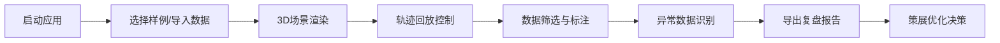

## 1. 产品概述

博物馆展厅参观动线复盘系统，基于WebGL的3D交互可视化平台，帮助策展人分析观众在展厅中的行为轨迹、停留时长和人流分布，解决传统二维曲线难以解释空间行为的问题。

- 核心目标：通过3D可视化直观展示观众参观行为，辅助策展决策
- 目标用户：博物馆策展人、展厅设计师、运营分析人员
- 核心价值：将抽象的行为数据转化为可交互的3D空间场景，提升数据分析的直观性和准确性

## 2. 核心功能

### 2.1 用户角色

| 角色 | 注册方式 | 核心权限 |
|------|----------|----------|
| 策展人 | 无需注册（本地应用） | 导入数据、查看3D场景、轨迹回放、导出报告 |

### 2.2 功能模块

1. **3D展厅场景**：展厅模型渲染、展柜标注、空间交互
2. **轨迹回放系统**：时间轴控制、多批次人流、单观众轨迹追踪
3. **热力标注系统**：停留时长热力图、拥堵区域标注、展柜停留统计
4. **数据筛选面板**：展柜筛选、时间范围、批次选择、异常数据高亮
5. **报告导出模块**：可视化报告生成、数据一致性校验、PDF/JSON导出
6. **样例数据系统**：内置多组样例（正常/冲突/空结果）、一键切换演示

### 2.3 页面详情

| 页面名称 | 模块名称 | 功能描述 |
|----------|----------|----------|
| 主场景页 | 3D视口 | 展厅模型渲染、轨道相机控制、视角切换、点击交互 |
| 主场景页 | 顶部工具栏 | 样例导入、视角预设、状态重置、报告导出 |
| 主场景页 | 左侧控制面板 | 展柜筛选列表、批次选择、异常数据开关 |
| 主场景页 | 底部时间轴 | 播放控制、进度拖拽、速度调节、时间刻度 |
| 主场景页 | 右侧信息面板 | 选中展柜详情、停留统计、异常提示 |

## 3. 核心流程

用户打开应用 → 选择内置样例或导入自定义数据 → 3D场景加载渲染 → 通过时间轴回放参观轨迹 → 使用筛选器聚焦特定展柜/批次 → 观察热力图识别热点区域 → 发现轨迹断点/编号错位等异常 → 导出包含可视化截图和数据的复盘报告

## 4. 用户界面设计

### 4.1 设计风格
- **主色调**：深空蓝 (#0a1628) 作为场景背景，科技感十足
- **强调色**：青蓝色 (#00d4ff) 用于轨迹和交互元素，橙红色 (#ff6b35) 用于异常警告
- **热力色谱**：蓝→青→黄→红渐变，表示停留时长从短到长
- **按钮风格**：半透明玻璃态、圆角8px、微妙边框发光
- **字体**：标题使用 Orbitron（科技感），正文使用 Roboto（可读性）
- **布局风格**：沉浸式3D场景为中心，控制面板悬浮于四周
- **图标风格**：线性细边图标、霓虹发光效果

### 4.2 页面设计概述

| 页面名称 | 模块名称 | UI元素 |
|----------|----------|--------|
| 主场景页 | 3D视口 | 展厅模型（线框+实体切换）、展柜（带编号标签）、轨迹线（动态流光）、热力点（脉冲动画）、相机轨道控制 |
| 主场景页 | 顶部工具栏 | 玻璃态悬浮栏、下拉选择器、图标按钮组、状态指示灯 |
| 主场景页 | 左侧面板 | 可折叠侧边栏、分类筛选标签、展柜列表（可勾选）、异常数据徽章 |
| 主场景页 | 底部时间轴 | 进度条（可拖拽）、播放/暂停/快进按钮、速度滑块、时间刻度标记 |
| 主场景页 | 右侧面板 | 信息卡片、统计图表（迷你柱状图）、异常提示列表、数据一致性校验结果 |

### 4.3 响应性
- 桌面端优先（1920×1080），支持1440p和4K自适应
- 侧边栏可折叠，最大化3D视口空间
- 触控设备支持手势缩放和旋转
- 控制面板支持拖拽重排

### 4.4 3D场景指导
- **环境**：暗色调展厅空间，柔和的环境光配合重点照明
- **光照设置**：AmbientLight (0.3) + DirectionalLight (0.8) + 展柜区域PointLight
- **相机设置**：PerspectiveCamera，默认45度俯视角度，支持轨道控制
- **动画效果**：轨迹线流光动画、热力点脉冲呼吸、展柜选中高亮放大
- **后期处理**：Bloom发光效果、轻微晕影、FXAA抗锯齿
- **性能优化**：展厅模型使用Low-poly，轨迹线使用BufferGeometry，热力图使用InstancedMesh
