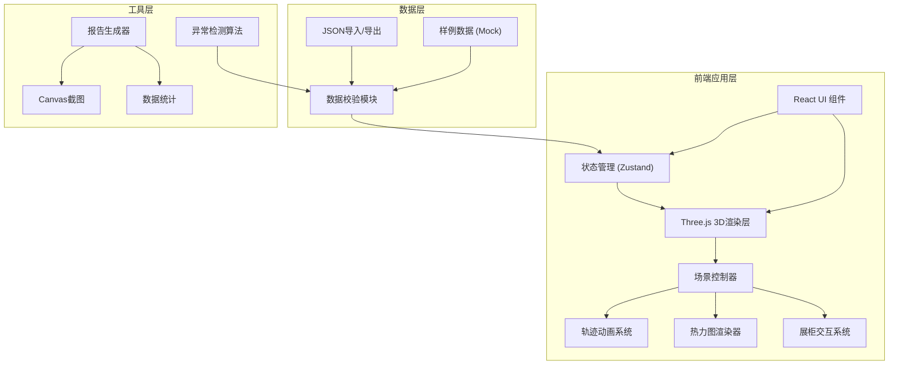

## 1. 架构设计



## 2. 技术描述

- **前端框架**：React@18 + TypeScript
- **构建工具**：Vite@5
- **样式方案**：TailwindCSS@3
- **3D渲染**：Three.js@0.160 + @react-three/fiber@8 + @react-three/drei@9
- **状态管理**：Zustand@4
- **动画系统**：@react-three/postprocessing + gsap
- **图表可视化**：recharts
- **报告导出**：html2canvas + jspdf
- **数据校验**：自定义算法检测轨迹断点、编号错位、拥堵混淆

## 3. 目录结构

```
src/
├── components/
│   ├── ui/                    # 基础UI组件
│   ├── layout/                # 布局组件
│   ├── panels/                # 控制面板
│   │   ├── TopToolbar.tsx     # 顶部工具栏
│   │   ├── LeftPanel.tsx      # 左侧筛选面板
│   │   ├── Timeline.tsx       # 底部时间轴
│   │   └── RightPanel.tsx     # 右侧信息面板
│   └── scene/                 # 3D场景组件
│       ├── ExhibitionHall.tsx # 展厅模型
│       ├── Showcase.tsx       # 展柜组件
│       ├── TrajectoryLine.tsx # 轨迹线
│       └── Heatmap.tsx        # 热力图
├── store/
│   └── useSceneStore.ts       # 场景状态管理
├── data/
│   ├── samples/               # 样例数据
│   │   ├── normal.json        # 正常参观数据
│   │   ├── conflict.json      # 冲突/异常数据
│   │   └── empty.json         # 空结果数据
│   └── types.ts               # 数据类型定义
├── utils/
│   ├── dataValidator.ts       # 数据校验
│   ├── reportGenerator.ts     # 报告生成
│   └── animationHelpers.ts    # 动画辅助函数
├── hooks/
│   └── useAnimationFrame.ts   # 自定义hooks
├── App.tsx
├── main.tsx
└── index.css
```

## 4. 数据模型

### 4.1 核心类型定义

```typescript
// 展厅数据
interface ExhibitionHall {
  id: string;
  name: string;
  dimensions: { width: number; height: number; depth: number };
  showcases: Showcase[];
  walls: Wall[];
}

// 展柜数据
interface Showcase {
  id: string;
  number: string;
  name: string;
  position: { x: number; y: number; z: number };
  size: { width: number; height: number; depth: number };
  category: string;
}

// 观众轨迹
interface VisitorTrajectory {
  visitorId: string;
  batchId: string;
  startTime: number;
  endTime: number;
  points: TrajectoryPoint[];
  stays: StayRecord[];
}

// 轨迹点
interface TrajectoryPoint {
  timestamp: number;
  position: { x: number; y: number; z: number };
  confidence: number;
}

// 停留记录
interface StayRecord {
  showcaseId: string;
  startTime: number;
  duration: number;
  isCongestion: boolean;
}

// 批次数据
interface BatchData {
  id: string;
  name: string;
  startTime: number;
  endTime: number;
  visitorCount: number;
}

// 异常报告
interface AnomalyReport {
  type: 'trajectory_break' | 'showcase_mismatch' | 'congestion_confusion';
  severity: 'low' | 'medium' | 'high';
  message: string;
  location?: { x: number; z: number };
  visitorId?: string;
}
```

### 4.2 状态结构

```typescript
interface SceneState {
  // 数据状态
  hallData: ExhibitionHall | null;
  trajectories: VisitorTrajectory[];
  batches: BatchData[];
  anomalies: AnomalyReport[];
  
  // 播放状态
  isPlaying: boolean;
  currentTime: number;
  playbackSpeed: number;
  totalDuration: number;
  
  // 筛选状态
  selectedBatch: string | null;
  selectedShowcases: string[];
  showHeatmap: boolean;
  showTrajectories: boolean;
  highlightAnomalies: boolean;
  
  // 视图状态
  cameraView: 'top' | 'perspective' | 'front' | 'side';
  selectedShowcase: string | null;
  selectedVisitor: string | null;
}
```

## 5. 核心算法

### 5.1 轨迹断点检测
- 检测相邻轨迹点时间间隔超过阈值（如5秒）
- 检测空间跳跃距离超过合理移动范围
- 标记置信度低于0.5的轨迹点

### 5.2 展柜编号错位检测
- 校验展柜位置与预设布局的偏差
- 检测停留记录与展柜位置的空间匹配度
- 对比历史数据中展柜编号的一致性

### 5.3 拥堵与停留区分
- 基于区域内同时存在的观众数量
- 结合移动速度方差判断拥堵状态
- 分析观众间距和移动方向一致性

### 5.4 热力图生成
- 基于核密度估计（KDE）计算空间热度
- 时间加权：近期停留权重更高
- 展柜关联：将停留点映射到最近展柜
