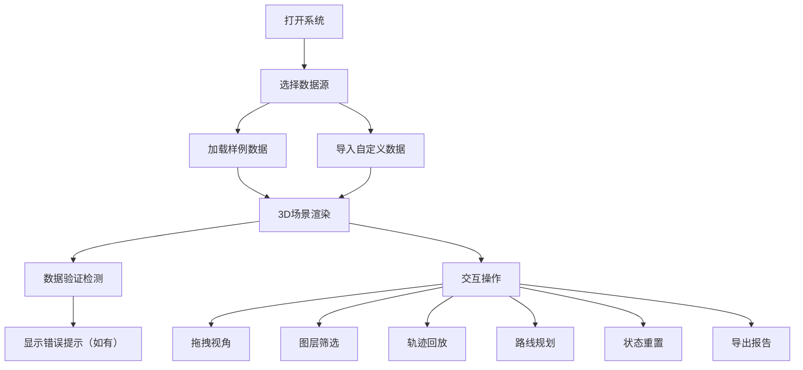

## 1. 产品概述

滑雪道风险路线回放系统是一款面向雪场安全员和教练的3D交互式可视化工具。系统将坡面高程、滑行轨迹、摔倒点、救援站、天气、风险报告等多源数据融合展示，支持在浏览器中进行操作和复盘，帮助雪场管理人员进行风险评估、救援路线规划和安全培训。

- **核心问题**：解决静态图无法直观展示动态滑雪轨迹、风险区域变化和救援路线有效性的问题
- **目标用户**：雪场安全员、滑雪教练、救援人员、雪场管理人员
- **产品价值**：提升雪场安全管理效率，降低事故率，优化救援响应时间

## 2. 核心特性

### 2.1 用户角色

| 角色 | 登录方式 | 核心权限 |
|------|----------|----------|
| 安全员 | 本地访问 | 导入数据、操作3D场景、导出报告 |
| 教练 | 本地访问 | 查看回放、筛选数据、导出报告 |

### 2.2 功能模块

1. **主页面**：3D地形可视化、控制面板、时间轴、信息面板
2. **数据导入模块**：样例数据加载、自定义数据导入
3. **交互控制模块**：拖拽、筛选、回放、视角切换、状态重置
4. **风险分析模块**：风险分层展示、路线规划、冲突检测
5. **报告导出模块**：PDF/JSON格式报告生成

### 2.3 页面详情

| 页面名称 | 模块名称 | 功能描述 |
|---------|---------|----------|
| 主页面 | 3D场景区域 | Three.js渲染的滑雪道地形，包含高程数据、轨迹线、摔倒点标记、救援站、风险区域 |
| 主页面 | 顶部工具栏 | 导入样例、重置状态、导出报告、视角切换按钮 |
| 主页面 | 左侧控制面板 | 图层筛选（轨迹/摔倒点/救援站/风险区）、数据统计信息 |
| 主页面 | 底部时间轴 | 轨迹回放控制（播放/暂停/快进）、时间刻度、进度条 |
| 主页面 | 右侧信息面板 | 选中元素详情、天气信息、风险报告摘要 |

## 3. 核心流程

用户打开系统后，可选择加载样例数据或导入自定义数据。系统将数据可视化到3D地形上，用户可以通过拖拽旋转视角、筛选图层、播放时间轴来回顾滑雪过程。系统自动检测高程单位错误、轨迹越界、救援路线穿过关闭区等问题。用户完成分析后可导出包含可视化截图和数据的完整报告。

## 4. 用户界面设计

### 4.1 设计风格
- **主色调**：冰蓝色 (#165DFF) 代表冰雪主题，深灰色背景提供专业感
- **辅助色**：红色 (#F53F3F) 标记高风险区域，橙色 (#FF7D00) 标记中风险，绿色 (#00B42A) 标记安全区域
- **按钮风格**：圆角矩形，轻微阴影，悬停时有颜色渐变效果
- **字体**：使用现代无衬线字体，标题使用具有科技感的字体
- **布局风格**：模块化卡片布局，深色主题，半透明面板增强3D景深效果
- **图标风格**：线性图标，简洁明了，与冰雪主题呼应

### 4.2 页面设计概述

| 页面名称 | 模块名称 | UI元素 |
|---------|---------|--------|
| 主页面 | 3D场景区域 | 全屏Three.js画布，雾效营造雪山氛围，方向辅助器 |
| 主页面 | 顶部工具栏 | 半透明深色背景，图标+文字按钮，分组布局 |
| 主页面 | 左侧控制面板 | 可折叠侧边栏，开关式筛选器，数据卡片 |
| 主页面 | 底部时间轴 | 渐变进度条，播放控制按钮，时间刻度 |
| 主页面 | 右侧信息面板 | 可折叠信息卡，标签页切换，数据可视化图表 |

### 4.3 响应式
- 桌面端优先设计，支持1920×1080及以上分辨率
- 侧边栏可折叠适配小屏幕
- 触控设备支持手势缩放和旋转

### 4.4 3D场景指导
- **环境**：雪山场景，蓝天背景，雾化效果增强距离感
- **光照**：环境光+方向光模拟日光，地形使用Lambert材质
- **相机**：PerspectiveCamera，初始视角为斜45度俯视
- **交互**：OrbitControls支持拖拽旋转、滚轮缩放、右键平移
- **动画**：轨迹回放使用平滑插值，风险区域有呼吸灯效果
- **后处理**：轻微抗锯齿，Bloom效果增强标记点视觉效果
- **性能**：地形使用LOD，轨迹线使用BufferGeometry优化
