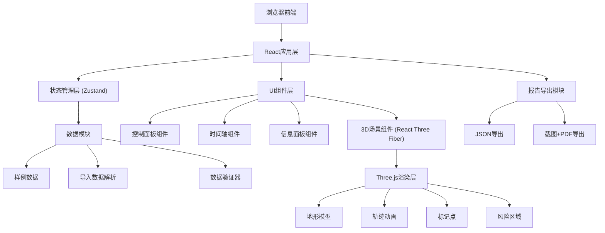
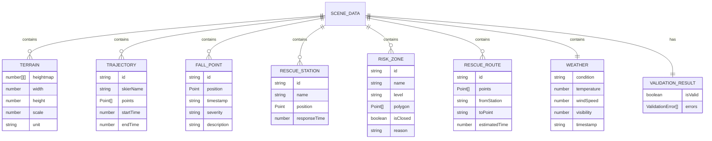

## 1. 架构设计



## 2. 技术描述

- **前端框架**: React@18 + TypeScript
- **构建工具**: Vite@5
- **3D引擎**: Three.js + @react-three/fiber + @react-three/drei
- **状态管理**: Zustand (轻量级，适合单页应用)
- **样式方案**: TailwindCSS@3 + CSS Modules
- **UI组件**: 自定义组件 + lucide-react图标
- **导出功能**: html2canvas (截图) + jsPDF (PDF生成)
- **后端**: 无（纯前端应用，数据本地处理）

## 3. 路由定义

| 路由 | 用途 |
|------|------|
| / | 主页面 - 3D可视化和控制面板 |

## 4. 数据模型

### 4.1 数据结构定义



### 4.2 核心TypeScript类型

```typescript
interface Point3D {
  x: number;
  y: number;
  z: number;
}

interface TrajectoryPoint extends Point3D {
  timestamp: number;
  speed?: number;
}

interface TerrainData {
  heightmap: number[][];
  width: number;
  depth: number;
  scale: number;
  unit: 'meter' | 'feet';
}

interface ValidationError {
  type: 'elevation_unit' | 'trajectory_out_of_bounds' | 'route_through_closed_zone';
  severity: 'error' | 'warning';
  message: string;
  location?: Point3D;
}
```

## 5. 核心模块说明

### 5.1 3D场景模块
- **地形渲染**: 使用PlaneGeometry + heightmap生成起伏地形
- **轨迹动画**: 使用CatmullRomCurve3进行路径平滑，使用TWEEN进行时间插值
- **标记系统**: 使用Sprite和Mesh组合实现可交互标记点
- **风险区域**: 使用ShapeGeometry绘制多边形区域，支持半透明填充

### 5.2 数据验证模块
- **高程单位检测**: 检查高度值范围，自动识别可能的单位错误
- **轨迹越界检测**: 检查轨迹点是否在地形边界内
- **救援路线检测**: 检查路线是否穿过关闭的风险区域

### 5.3 时间轴控制模块
- 支持播放/暂停/跳转
- 可调节播放速度 (0.5x, 1x, 2x, 4x)
- 实时同步3D场景和UI状态

### 5.4 导出模块
- **JSON导出**: 导出完整场景数据，支持再次导入
- **PDF报告**: 包含3D场景截图、数据统计、验证结果、风险分析
