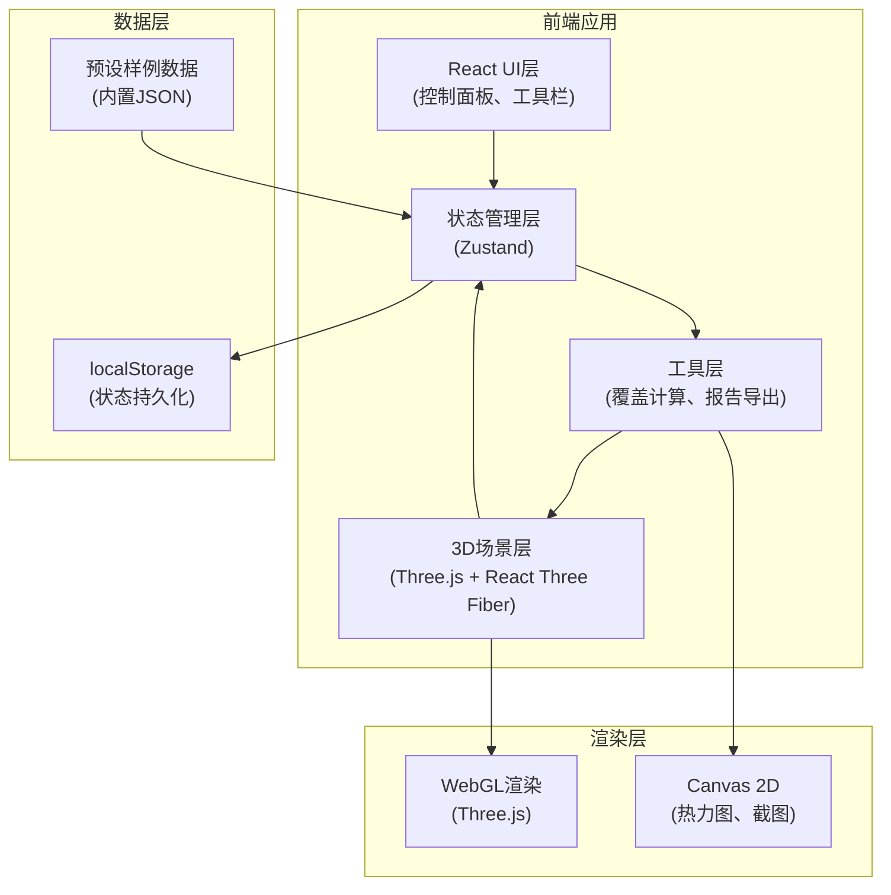

## 1. 架构设计



## 2. 技术描述

- **前端框架**: React@18 + TypeScript + Vite
- **3D引擎**: three@^0.160.0 + @react-three/fiber@^8.15.0 + @react-three/drei@^9.92.0
- **状态管理**: zustand@^4.4.0
- **样式方案**: tailwindcss@^3.4.0
- **UI组件**: lucide-react@^0.300.0
- **报告导出**: html2canvas + jspdf
- **无后端架构**: 纯前端应用，数据本地存储

## 3. 目录结构

```
src/
├── components/          # React组件
│   ├── ControlPanel/     # 控制面板
│   ├── Toolbar/        # 工具栏
│   ├── Timeline/         # 时间轴
│   └── ReportPanel/    # 报告面板
├── scene/             # 3D场景组件
│   ├── Field.tsx        # 农田地块
│   ├── Sprinkler.tsx    # 喷头
│   ├── Coverage.tsx       # 覆盖热力图
│   └── Scene.tsx        # 主场景
├── store/             # 状态管理
│   └── useStore.ts      # Zustand store
├── utils/             # 工具函数
│   ├── coverage.ts      # 覆盖计算算法
│   ├── export.ts        # 报告导出
│   └── presets.ts       # 预设样例
├── types/             # TypeScript类型定义
├── hooks/           # 自定义Hooks
├── App.tsx            # 主应用组件
└── main.tsx           # 入口文件
```

## 4. 核心数据模型

### 4.1 喷头模型
```typescript
interface Sprinkler {
  id: string;
  x: number;
  z: number;
  radius: number;      // 基础喷射半径
  flowRate: number;    // 流量
  pressure: number;      // 水压
  angle: number;       // 喷射角度
}
```

### 4.2 环境参数
```typescript
interface Environment {
  slope: number;      // 坡度 (0-45度)
  slopeDirection: number; // 坡向 (0-360度)
  windSpeed: number;   // 风速 (0-10 m/s)
  windDirection: number; // 风向 (0-360度)
  globalPressure: number; // 全局水压系数
}
```

### 4.3 覆盖计算结果
```typescript
interface CoverageResult {
  totalArea: number;       // 总面积
  coveredArea: number;       // 覆盖面积
  missedArea: number;      // 漏浇面积
  coverageRate: number;     // 覆盖率
  missedZones: Array<{x: number, z: number, area: number}[]>; // 漏浇区域
  heatmap: Float32Array;     // 热力图数据
}
```

## 5. 覆盖算法设计

### 5.1 单喷头覆盖计算
- 基础覆盖范围计算考虑因素：
1. **水压影响**：水压越低，喷射半径越小，呈线性关系
2. **风向影响**：顺风方向半径增大，逆风方向减小，呈余弦分布
3. **坡度影响**：上坡方向射程减小，下坡方向增大，考虑重力影响
4. **实际覆盖区域为椭圆形，长轴沿风向和坡向合成方向

### 5.2 多喷头叠加计算
- 采用网格采样法（20x20cm分辨率）
- 每个采样点累加所有喷头的覆盖强度
- 强度阈值判断是否有效覆盖

### 5.3 漏浇区域识别
- 连通域分析识别连续漏浇区域
- 计算每个漏浇区域的面积和位置
- 标记边角漏浇和喷头叠加不足区域
