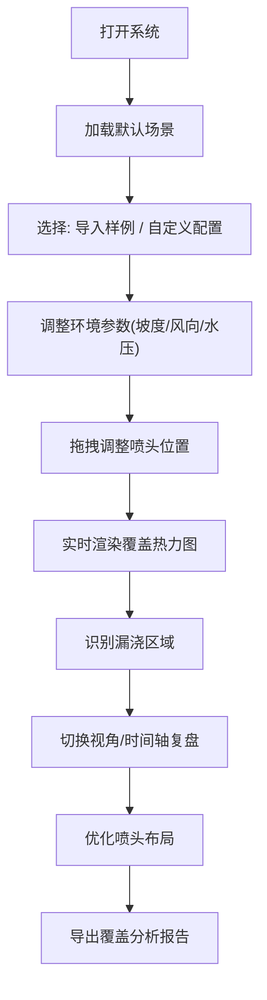

## 1. 产品概述

农田喷灌覆盖模拟WebGL交互系统，帮助农技员向农户直观演示喷灌系统的覆盖效果。系统通过3D可视化展示坡地、风向、水压等因素对喷灌覆盖的影响，重点呈现容易出现的漏浇区域问题。

- **核心价值**：将抽象的喷灌计算转化为直观的3D交互体验，降低农户理解门槛
- **目标用户**：农技员、农户、农业技术培训人员
- **解决问题**：喷头半径叠加误算、风向变化影响、边角漏浇等常见喷灌设计问题

## 2. 核心功能

### 2.1 用户角色
| 角色 | 登录方式 | 核心权限 |
|------|----------|----------|
| 农技员 | 无需登录 | 完整操作、导出报告、保存状态 |
| 农户 | 无需登录 | 查看演示、切换视角 |

### 2.2 功能模块
1. **主场景页面**：3D喷灌场景、交互控制面板、状态管理
2. **参数控制**：坡度调节、风向风速、水压控制、喷头管理
3. **数据展示**：覆盖热力图、漏浇区域高亮、实时统计
4. **报告系统**：覆盖分析报告生成、PDF/图片导出

### 2.3 页面详情
| 页面名称 | 模块名称 | 功能描述 |
|----------|----------|----------|
| 主场景页 | 3D视窗 | Three.js渲染的3D农田场景，支持旋转缩放 |
| 主场景页 | 控制面板 | 参数滑块、喷头管理、样例导入、视角切换 |
| 主场景页 | 时间轴 | 模拟喷灌过程的时间进度控制 |
| 主场景页 | 报告面板 | 覆盖统计、漏浇区域分析、导出按钮 |
| 主场景页 | 工具栏 | 状态重置、保存、截图功能 |

## 3. 核心流程

用户打开系统 → 选择预设样例或自定义配置 → 调整坡度/风向/水压参数 → 拖拽调整喷头位置 → 实时查看覆盖热力图 → 观察漏浇区域 → 切换视角和时间轴复盘 → 导出覆盖分析报告

## 4. 用户界面设计

### 4.1 设计风格
- **主色调**：农业绿色系 (#2D5A27, #4CAF50)，搭配土地棕色 (#8B4513)
- **辅助色**：水蓝色 (#2196F3) 表示喷灌覆盖，红色 (#F44336) 表示漏浇区域
- **按钮样式**：圆角矩形，微立体效果，悬停有阴影过渡
- **字体**：标题使用 Noto Sans SC Bold，正文使用 Noto Sans SC Regular
- **布局风格**：左侧3D场景为主区域，右侧垂直控制面板，底部时间轴
- **图标风格**：线性图标，农业主题（水滴、喷头、农田等）

### 4.2 页面设计概述
| 页面名称 | 模块名称 | UI元素 |
|----------|----------|--------|
| 主场景页 | 3D视窗 | 全屏3D画布、轨道控制器、视角指示器 |
| 主场景页 | 控制面板 | 分组卡片、滑块控件、数值显示、下拉选择 |
| 主场景页 | 时间轴 | 进度条、播放/暂停按钮、时间刻度 |
| 主场景页 | 报告面板 | 数据卡片、百分比圆环图、导出按钮组 |
| 主场景页 | 工具栏 | 图标按钮、工具提示、快捷操作 |

### 4.3 响应性
- **桌面优先**：针对大屏幕优化，3D场景占主要视觉空间
- **平板适配**：控制面板可折叠收起
- **触摸优化**：支持双指缩放旋转，滑块增大触摸区域

### 4.4 3D场景指导
- **环境氛围**：自然日光效果，天空盒使用淡蓝渐变，模拟户外农田环境
- **光照设置**：主光源（DirectionalLight）模拟太阳光 + 环境光（AmbientLight）
- **相机设置**：PerspectiveCamera，初始45度俯视角，支持OrbitControls环绕
- **构图焦点**：农田地块居中，喷头有明显的视觉标识
- **交互动画**：喷头喷水粒子动画，覆盖区域渐变过渡，参数变化平滑过渡
- **后处理效果**：轻微泛光（Bloom）增强水滴效果，抗锯齿
- **性能预算**：控制面数在5万以内，保持60fps流畅度
