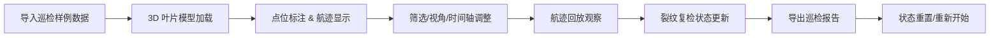

## 1. 产品概述

风机叶片巡检标注系统是一个基于 Three.js 的 3D 交互可视化工具，帮助风电检修团队在浏览器中完成叶片裂纹标注、航迹回放和巡检报告生成。解决照片方向错误、裂纹重复标注、复检状态丢失等痛点，实现可视化数据与导出报告的一致性。

**核心价值**
- 3D 叶片可视化交互，直观定位裂纹位置
- 照片点位与 3D 模型联动，避免方向错误
- 航迹时间轴回放，还原巡检过程
- 筛选条件、视角、时间轴与报告导出完全一致

## 2. 核心功能

### 2.1 用户角色

| 角色 | 描述 | 核心权限 |
|------|------|----------|
| 巡检员 | 叶片巡检操作人员 | 导入样例、标注裂纹、筛选数据、回放航迹 |
| 审核员 | 复检和审核人员 | 查看标注、更新复检状态、导出报告 |

### 2.2 功能模块

1. **3D 叶片视图**：Three.js 渲染叶片模型，支持旋转、缩放、平移
2. **点位标注**：裂纹位置标注、照片关联、等级标记
3. **筛选面板**：按裂纹等级、复检状态、时间范围筛选
4. **航迹回放**：无人机飞行路径时间轴回放
5. **报告导出**：与当前状态一致的 PDF/HTML 报告
6. **视角管理**：预设视角切换、状态重置

### 2.3 页面详情

| 页面名称 | 模块名称 | 功能描述 |
|---------|----------|----------|
| 主工作台 | 3D 场景区 | Three.js 渲染叶片模型，支持 OrbitControls 交互 |
| 主工作台 | 左侧控制面板 | 导入样例、筛选条件、裂纹列表 |
| 主工作台 | 底部时间轴 | 航迹回放控制、进度条、播放暂停 |
| 主工作台 | 顶部工具栏 | 视角切换、状态重置、导出报告 |
| 标注弹窗 | 点位编辑 | 裂纹等级设置、复检状态更新、照片预览 |

## 3. 核心流程

## 4. 用户界面设计

### 4.1 设计风格

- **主色调**：深蓝色 (#0F172A) 工业科技风，体现专业可靠
- **强调色**：青绿色 (#06B6D4) 标注正常状态，橙红色 (#F97316) 标记警告
- **危险色**：红色 (#EF4444) 标记严重裂纹
- **按钮风格**：圆角 6px，微妙阴影，hover 状态有轻微放大
- **字体**：Inter - 现代无衬线字体，清晰易读
- **布局**：深色背景仪表盘，玻璃态面板（backdrop-filter）
- **图标风格**：线性简约图标，统一 24px 尺寸

### 4.2 页面设计概述

| 页面名称 | 模块名称 | UI 元素 |
|---------|----------|---------|
| 主工作台 | 3D 场景区 | 全屏 Three.js Canvas，玻璃态控制面板悬浮 |
| 主工作台 | 左侧面板 | 280px 宽，半透明背景，分层次折叠菜单 |
| 主工作台 | 底部时间轴 | 全宽进度条，播放控制按钮居中 |
| 主工作台 | 顶部工具栏 | 左侧 Logo，右侧操作按钮组 |

### 4.3 响应式

- 桌面端优先设计（1920×1080）
- 平板端自适应面板宽度
- 不支持移动端（专业工具场景）

### 4.4 3D 场景指引

- **环境**：深色渐变背景 + 柔和环境光，突出叶片轮廓
- **光照**：DirectionalLight + HemisphereLight，边缘高光效果
- **相机**：PerspectiveCamera，初始距离 15，fov 50
- **交互**：OrbitControls，阻尼效果，限制极角防止翻转
- **标注点**：SphereGeometry + 发光材质，选中时放大动画
- **航迹线**：TubeGeometry，渐变色材质，动态流光效果
