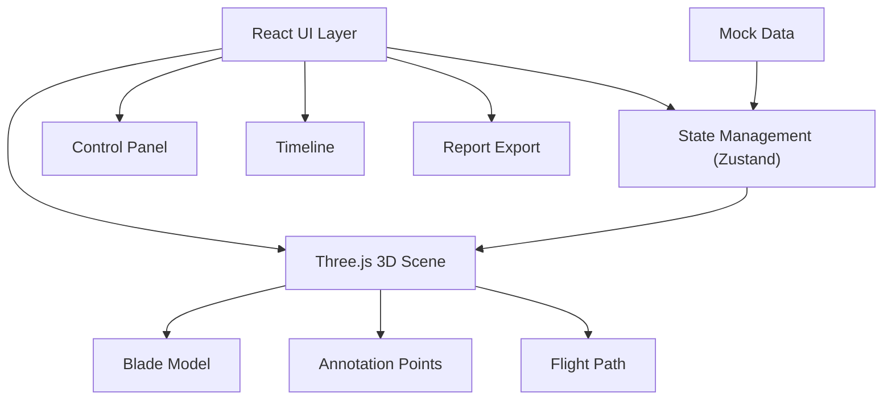

## 1. 架构设计



## 2. 技术栈说明

- **前端框架**: React@18 + TypeScript
- **构建工具**: Vite@5
- **样式方案**: TailwindCSS@3
- **3D 引擎**: three@0.160 + @react-three/fiber@8 + @react-three/drei@9
- **状态管理**: zustand@4
- **UI 组件**: lucide-react 图标库
- **报告导出**: html2canvas + jsPDF

## 3. 目录结构

```
src/
├── components/
│   ├── Scene3D/           # 3D 场景组件
│   │   ├── Blade.tsx      # 叶片模型
│   │   ├── Annotations.tsx # 标注点
│   │   └── FlightPath.tsx # 航迹线
│   ├── ControlPanel/      # 左侧控制面板
│   │   ├── FilterPanel.tsx
│   │   └── AnnotationList.tsx
│   ├── Timeline/          # 底部时间轴
│   ├── Toolbar/           # 顶部工具栏
│   └── Modal/             # 弹窗组件
├── store/
│   └── useInspectionStore.ts # 全局状态
├── types/
│   └── index.ts           # 类型定义
├── data/
│   └── mockData.ts        # 样例数据
├── utils/
│   ├── exporter.ts        # 报告导出工具
│   └── cameraPresets.ts   # 预设视角
├── App.tsx
└── main.tsx
```

## 4. 数据模型

```typescript
// 裂纹等级
enum CrackLevel {
  LIGHT = 'light',      // 轻微
  MODERATE = 'moderate', // 中等
  SEVERE = 'severe'      // 严重
}

// 复检状态
enum RecheckStatus {
  PENDING = 'pending',   // 待复检
  VERIFIED = 'verified', // 已确认
  RESOLVED = 'resolved'  // 已修复
}

// 标注点
interface Annotation {
  id: string;
  position: [number, number, number]; // 3D 坐标
  crackLevel: CrackLevel;
  recheckStatus: RecheckStatus;
  photoUrl: string;
  photoOrientation: number; // 照片朝向角度
  description: string;
  timestamp: number;
}

// 航迹点
interface FlightPoint {
  position: [number, number, number];
  timestamp: number;
  cameraAngle: [number, number, number];
}

// 巡检数据
interface InspectionData {
  bladeId: string;
  annotations: Annotation[];
  flightPath: FlightPoint[];
  startTime: number;
  endTime: number;
}
```

## 5. 状态管理

使用 Zustand 管理全局状态，确保 UI 与 3D 场景数据一致：

```typescript
interface InspectionState {
  // 数据
  inspectionData: InspectionData | null;
  // 筛选
  filterLevel: CrackLevel[];
  filterStatus: RecheckStatus[];
  // 时间轴
  currentTime: number;
  isPlaying: boolean;
  playbackSpeed: number;
  // 视角
  cameraPreset: string;
  // 选中
  selectedAnnotation: string | null;
  // 操作
  loadSampleData: () => void;
  setFilter: (levels: CrackLevel[], status: RecheckStatus[]) => void;
  setCurrentTime: (time: number) => void;
  togglePlay: () => void;
  selectAnnotation: (id: string | null) => void;
  updateAnnotation: (id: string, updates: Partial<Annotation>) => void;
  resetState: () => void;
  exportReport: () => void;
}
```
