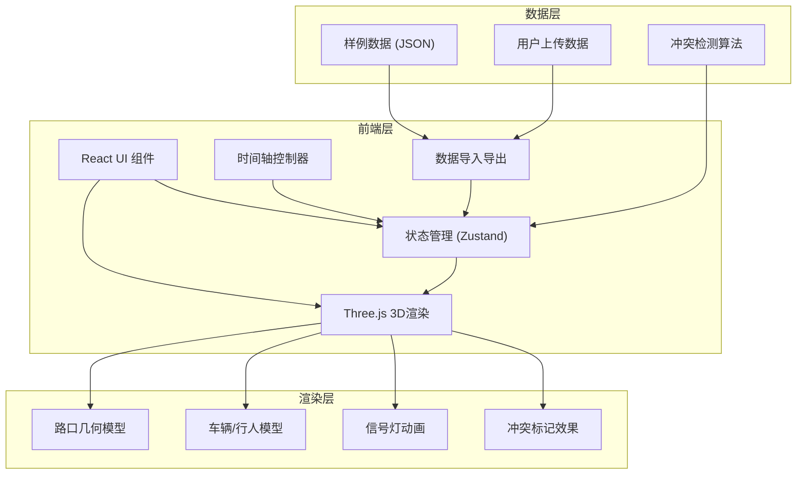

## 1. 架构设计



## 2. 技术描述

- **前端框架**：React@18 + TypeScript + Vite
- **3D渲染**：three@0.160 + @react-three/fiber@8 + @react-three/drei@9
- **状态管理**：zustand@4
- **样式方案**：tailwindcss@3
- **UI组件**：@headlessui/react + lucide-react（图标）
- **报告导出**：html2canvas + jspdf
- **后端**：无，纯前端应用

## 3. 目录结构

```
src/
├── components/
│   ├── Scene3D/          # 3D场景组件
│   ├── Timeline/         # 时间轴组件
│   ├── Toolbar/          # 工具栏组件
│   ├── PhasePanel/       # 相位面板
│   ├── ConflictPanel/    # 冲突检测面板
│   └── FilterPanel/      # 筛选面板
├── store/
│   └── useSceneStore.ts  # 场景状态管理
├── types/
│   └── index.ts          # TypeScript类型定义
├── data/
│   └── sampleData.ts     # 样例数据
├── utils/
│   ├── conflictDetector.ts # 冲突检测算法
│   └── reportGenerator.ts  # 报告生成工具
├── App.tsx
└── main.tsx
```

## 4. 核心数据模型

### 4.1 场景数据结构

```typescript
// 路口几何
interface IntersectionGeometry {
  id: string;
  lanes: Lane[];          // 车道
  crosswalks: Crosswalk[]; // 斑马线
  trafficLights: TrafficLight[];
}

// 信号相位
interface SignalPhase {
  id: string;
  direction: 'north' | 'south' | 'east' | 'west';
  timing: { startTime: number; endTime: number; state: 'red' | 'yellow' | 'green' }[];
}

// 车辆轨迹
interface VehicleTrajectory {
  id: string;
  type: 'car' | 'truck' | 'motorcycle';
  points: { time: number; x: number; y: number; angle: number }[];
  color: string;
}

// 行人轨迹
interface PedestrianTrajectory {
  id: string;
  points: { time: number; x: number; y: number }[];
}

// 事故点
interface AccidentPoint {
  id: string;
  time: number;
  x: number;
  y: number;
  type: string;
  description: string;
}

// 冲突记录
interface Conflict {
  id: string;
  time: number;
  type: 'phase_offset' | 'pedestrian_conflict' | 'trajectory_async';
  description: string;
  severity: 'low' | 'medium' | 'high';
  x: number;
  y: number;
}

// 场景状态
interface SceneState {
  currentTime: number;
  isPlaying: boolean;
  playSpeed: number;
  viewMode: '2d' | '3d';
  filters: {
    showVehicles: boolean;
    showPedestrians: boolean;
    showTrafficLights: boolean;
    showAccidentPoints: boolean;
  };
  selectedElement: string | null;
}
```

## 5. 核心功能实现要点

### 5.1 时间轴回放
- 使用 requestAnimationFrame 驱动动画循环
- 轨迹点之间使用线性插值实现平滑移动
- 支持 0.5x / 1x / 2x / 4x 倍速播放

### 5.2 冲突检测
- 相位偏移检测：比较实际信号灯切换时间与理论相位时间
- 行人冲突检测：计算行人与车辆轨迹的时空距离阈值
- 轨迹不同步检测：校验轨迹点时间戳连续性

### 5.3 报告导出
- 捕获当前3D场景截图
- 生成包含时间点、相位状态、冲突列表的HTML报告
- 支持导出为PDF格式

## 6. 性能优化策略

1. **模型优化**：使用低多边形车辆/行人模型
2. **实例化渲染**：同类型车辆使用 InstancedMesh
3. **视锥体剔除**：只渲染可见范围内的元素
4. **LOD策略**：远距离元素降低细节级别
5. **时间分片**：大数据量轨迹分段加载
