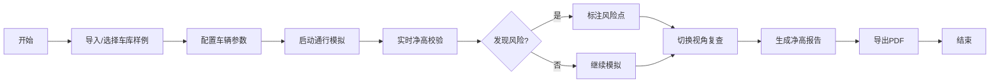

## 1. 产品概述
停车库坡道净高检查交互可视化系统，帮助商场运营和保安人员识别高车入口风险点。通过3D可视化技术实现车库场景浏览、车辆模拟通行、净高校验、风险标注和报告导出，解决坡道转折处最低点遗漏、单位混淆、标识缺失等常见问题。
- 核心目标：提供可操作、可复盘的净高检查工具，而非静态图片
- 目标用户：商场运营人员、保安团队、物业管理者

## 2. 核心 Features

### 2.1 用户角色
| 角色 | 注册方式 | 核心权限 |
|------|----------|----------|
| 运营人员 | 无需注册 | 导入样例、3D浏览、车辆模拟、风险检查、导出报告 |
| 保安人员 | 无需注册 | 查看风险点、切换视角、阅读净高报告 |

### 2.2 Feature Module
1. **主操作界面**：3D场景视图、控制面板、时间轴、信息面板
2. **车库浏览模块**：自由视角、预设视角切换、入口筛选
3. **车辆模拟模块**：车辆参数设置、拖拽调整、通行模拟
4. **净高校验模块**：实时净高检测、风险点自动标注、颜色预警
5. **报告管理模块**：净高报告生成、PDF导出、数据一致性校验

### 2.3 Page Details
| 页面名称 | 模块名称 | Feature 描述 |
|----------|----------|--------------|
| 主界面 | 3D场景视图 | Three.js渲染车库模型、坡道、梁底、入口标识，支持旋转缩放 |
| 主界面 | 左侧控制面板 | 导入样例、车辆参数、视角切换、状态重置 |
| 主界面 | 底部时间轴 | 车辆通行进度控制、关键节点跳转 |
| 主界面 | 右侧信息面板 | 净高数据、风险列表、报告预览 |
| 主界面 | 风险标注 | 坡道转折处自动标红、悬浮显示详细数据 |

## 3. 核心流程

用户打开系统 → 导入车库样例或使用默认模型 → 选择/配置车辆高度 → 启动模拟或手动拖拽 → 系统自动检测净高点 → 标注风险区域（红/黄/绿）→ 切换视角复查 → 导出净高报告

## 4. 用户界面设计

### 4.1 设计风格
- 主色调：工业深蓝 (#165DFF) 搭配警示红 (#F53F3F)、安全绿 (#00B42A)
- 按钮风格：圆角矩形，悬浮微放大效果，图标+文字
- 字体：思源黑体 (Source Han Sans)，标题16px/正文14px/数据12px
- 布局风格：四栏浮动布局，四周控件不遮挡中央3D场景
- 图标风格：线性简约图标，统一24px尺寸

### 4.2 Page Design Overview
| 页面名称 | 模块名称 | UI Elements |
|----------|----------|-------------|
| 主界面 | 3D场景视图 | 全屏居中，半透明网格地面，冷色调环境光 |
| 主界面 | 左侧控制面板 | 固定宽度280px，白色背景，阴影悬浮，分组折叠 |
| 主界面 | 底部时间轴 | 高度60px，深灰背景，进度条可拖拽 |
| 主界面 | 右侧信息面板 | 固定宽度320px，半透明背景，可最小化 |
| 主界面 | 风险标注 | 3D空间中红色警示框，悬浮卡片显示数据 |

### 4.3 Responsiveness
- 桌面端 (≥1200px)：四栏完整布局，所有控件展开
- 平板端 (768-1199px)：左右面板可收起为图标栏，时间轴保持
- 移动端 (<768px)：上下堆叠布局，3D场景占上半屏，控件分组标签切换
- 触控优化：按钮最小44x44px，手势支持双指缩放旋转

### 4.4 3D Scene Guidance
- 环境：车库工业风格，冷白色主光 + 暖黄色补光模拟顶灯
- 光照：Three.js DirectionalLight + AmbientLight，阴影开启
- 相机：PerspectiveCamera，默认俯视角45度，支持OrbitControls
- 交互：鼠标拖拽旋转、滚轮缩放、双击重置视角
- 动画：车辆通行平滑动画，风险点脉冲闪烁
- 性能：模型面数控制在5万以内，Lod优化远处细节
