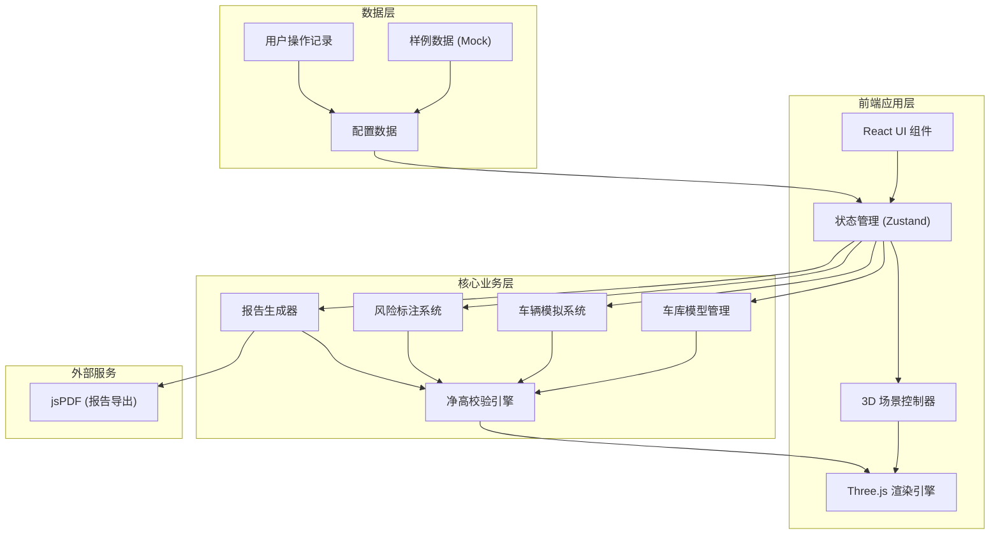

## 1. 架构设计



## 2. 技术描述
- 前端框架：React@18 + TypeScript + Vite
- 3D引擎：Three.js@0.160 + @react-three/fiber@8 + @react-three/drei@9
- 样式方案：TailwindCSS@3 + CSS Modules
- 状态管理：Zustand@4
- 报告导出：jsPDF@2
- 无后端，纯前端应用，使用Mock数据

## 3. 目录结构
```
src/
├── components/
│   ├── ControlPanel/      # 左侧控制面板
│   ├── InfoPanel/         # 右侧信息面板
│   ├── Timeline/          # 底部时间轴
│   └── RiskMarker/        # 风险标注组件
├── store/
│   └── useAppStore.ts     # 全局状态管理
├── scenes/
│   ├── GarageScene.tsx    # 车库3D场景
│   ├── Vehicle.tsx        # 车辆模型
│   └── Ramp.tsx           # 坡道模型
├── engine/
│   ├── HeightChecker.ts   # 净高校验引擎
│   └── Simulation.ts      # 模拟控制系统
├── data/
│   └── mockGarages.ts     # 样例车库数据
├── utils/
│   ├── reportGenerator.ts # 报告生成
│   └── constants.ts       # 常量定义
└── types/
    └── index.ts           # 类型定义
```

## 4. 核心数据模型

### 4.1 车库数据结构
```typescript
interface Garage {
  id: string;
  name: string;
  entrances: Entrance[];
  ramps: Ramp[];
  beams: Beam[];
  signs: Sign[];
}

interface Entrance {
  id: string;
  name: string;
  position: [number, number, number];
  minHeight: number;
  hasSign: boolean;
}

interface Ramp {
  id: string;
  points: [number, number, number][];
  width: number;
  slope: number;
  transitionPoints: TransitionPoint[];
}

interface TransitionPoint {
  id: string;
  position: [number, number, number];
  measuredHeight: number;
  riskLevel: 'safe' | 'warning' | 'danger';
}

interface Beam {
  id: string;
  position: [number, number, number];
  size: [number, number, number];
  bottomHeight: number;
}

interface Sign {
  id: string;
  entranceId: string;
  position: [number, number, number];
  height: number;
  text: string;
}
```

### 4.2 车辆数据结构
```typescript
interface Vehicle {
  id: string;
  name: string;
  type: 'car' | 'suv' | 'van' | 'truck';
  height: number;
  width: number;
  length: number;
  unit: 'm' | 'cm';
}
```

### 4.3 检查报告结构
```typescript
interface HeightReport {
  garageId: string;
  vehicleId: string;
  checkTime: Date;
  overallResult: 'pass' | 'fail' | 'warning';
  riskPoints: RiskPoint[];
  measurements: Measurement[];
  missingSigns: string[];
}

interface RiskPoint {
  id: string;
  location: string;
  position: [number, number, number];
  clearHeight: number;
  vehicleHeight: number;
  delta: number;
  level: 'warning' | 'danger';
  description: string;
}
```

## 5. 核心算法

### 5.1 净高校验算法
```
输入：车辆位置、车辆高度、车库结构数据
输出：风险点列表、实时净高值

算法步骤：
1. 获取车辆顶部空间坐标
2. 沿车辆前进方向采样N个检测点
3. 对每个检测点：
   a. 计算坡道地面高度
   b. 查找上方最近梁底/结构
   c. 计算实际净高 = 梁底高度 - 地面高度
   d. 比较净高与车辆高度
   e. 判断风险等级（间隙<0.3m危险, <0.5m警告）
4. 特别检查坡道转折处（曲率最大点）
5. 返回所有风险点按严重程度排序
```

### 5.2 车辆通行模拟
```
输入：起点、终点、速度、坡道路径
输出：车辆实时位置、姿态

算法步骤：
1. 根据坡道中心线生成路径曲线
2. 按时间参数t∈[0,1]插值位置
3. 计算切线方向作为车辆朝向
4. 计算地面法线调整车辆倾斜
5. 每帧触发净高校验
```
