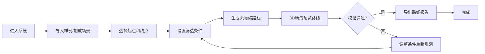

## 1. 产品概述
校园无障碍路线规划系统，帮助轮椅同学预览从宿舍到教学楼的无障碍路线，包含坡道、电梯和施工绕行等关键信息。系统提供交互式3D场景，支持路径规划、状态切换和报告导出，确保可视化与导出数据的一致性。

- **核心目标**：解决轮椅用户校园出行中的无障碍路线规划问题，提前规避电梯停用、坡度超限、施工围挡等风险
- **目标用户**：轮椅学生、校园无障碍设施管理人员、学生事务处工作人员
- **产品价值**：提高校园出行安全性和可预见性，为无障碍设施优化提供数据支持

## 2. 核心功能

### 2.1 用户角色
| 角色 | 核心权限 |
|------|----------|
| 普通用户 | 查看3D场景、规划路线、导出报告 |
| 管理员 | 编辑设施状态、管理施工信息 |

### 2.2 功能模块
1. **3D校园场景**：校园建筑、道路、无障碍设施的三维可视化
2. **路径规划**：起点终点选择、无障碍路径算法、实时路线预览
3. **设施状态**：电梯启用/停用、坡度校验、施工围挡状态
4. **交互控制**：视角切换、时间轴、状态重置、筛选条件
5. **报告导出**：路线报告PDF导出，包含当前视角和筛选条件

### 2.3 页面详情
| 页面名称 | 模块名称 | 功能描述 |
|----------|----------|----------|
| 主场景页面 | 3D视图区 | Three.js渲染的校园场景，支持拖拽旋转、缩放、平移 |
| 主场景页面 | 控制面板 | 起点/终点选择、设施筛选、时间轴控制 |
| 主场景页面 | 信息面板 | 显示路线详情、坡度数据、电梯状态 |
| 主场景页面 | 报告导出 | 生成包含当前状态的PDF路线报告 |

## 3. 核心流程

用户流程说明：
1. 用户进入系统后，可选择导入预设样例或加载自定义场景
2. 通过点击地图或下拉菜单选择起点（如宿舍楼）和终点（如教学楼）
3. 设置筛选条件：是否避开施工、优先电梯/坡道、最大坡度限制等
4. 系统自动计算最优无障碍路线并在3D场景中高亮显示
5. 用户可通过时间轴沿路线移动，切换不同视角观察关键节点
6. 系统自动校验路线安全性（坡度超限、电梯停用、施工阻挡）
7. 校验通过后可导出PDF报告，包含路线图、设施状态、风险提示等

## 4. 用户界面设计

### 4.1 设计风格
- **主色调**：科技蓝 (#165DFF) - 代表可靠、专业
- **辅助色**：安全绿 (#00B42A)、警告黄 (#FF7D00)、危险红 (#F53F3F)
- **中性色**：深灰背景 (#1D2129)、浅灰文字 (#C9CDD4)、白色 (#FFFFFF)
- **整体风格**：科技感、专业、简洁明了，适合政务/校园场景
- **按钮风格**：圆角矩形、微阴影、hover状态颜色加深
- **字体**：Inter - 现代无衬线字体，清晰易读
- **布局**：左侧控制面板 + 中央3D场景 + 右侧信息面板的三栏布局

### 4.2 页面设计概述
| 页面名称 | 模块名称 | UI元素 |
|----------|----------|--------|
| 主场景 | 3D视图 | 全屏WebGL渲染、网格地面、建筑模型、路线高亮 |
| 主场景 | 控制面板 | 下拉选择器、滑块、开关按钮、时间轴控件 |
| 主场景 | 信息面板 | 卡片式布局、数据指标、状态标签、进度条 |
| 主场景 | 顶部导航 | Logo、标题、导入/导出按钮、帮助按钮 |

### 4.3 响应式
- **桌面端优先**：1920px及以上，完整三栏布局
- **平板适配**：1024-1920px，控制面板可折叠
- **移动端**：768px以下，单栏垂直布局，简化交互

### 4.4 3D场景指导
- **环境**：柔和的HDRI环境光，模拟日间校园场景
- **光照**：主方向光 + 环境光 + 补光，确保模型清晰可见
- **相机**：PerspectiveCamera，初始45度俯视角，支持OrbitControls
- **焦点元素**：路线使用发光TubeGeometry，无障碍设施使用特殊材质高亮
- **交互动画**：路径点悬浮效果、相机平滑过渡、设施状态切换动画
- **后期处理**：轻微Bloom效果增强科技感，SSAO提升空间感
- **性能预算**：模型面数控制在5万以内，保持60fps帧率

## 5. 数据一致性保障
- **状态快照机制**：导出报告时捕获当前完整状态（视角、筛选、时间轴位置）
- **唯一标识**：每个设施、路线节点都有唯一ID，确保引用一致
- **版本控制**：场景数据版本号，报告中包含版本信息
- **校验机制**：导出前后进行数据哈希校验，防止数据不一致
